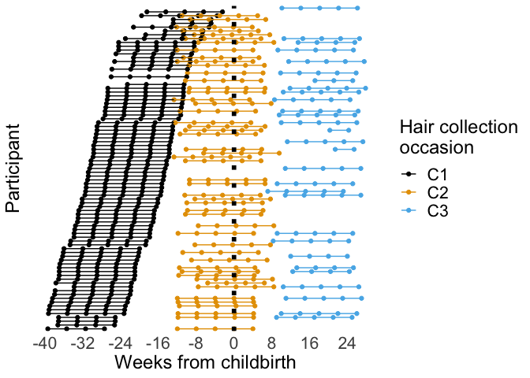
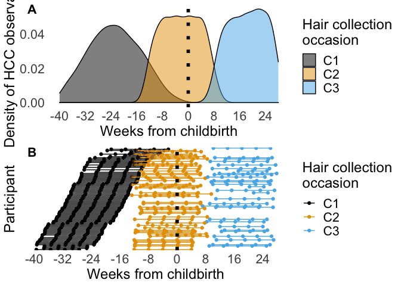
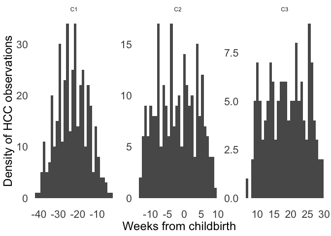
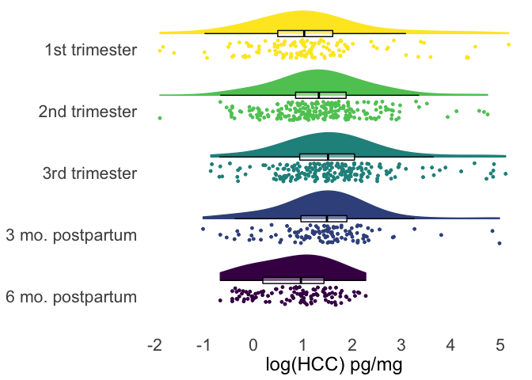
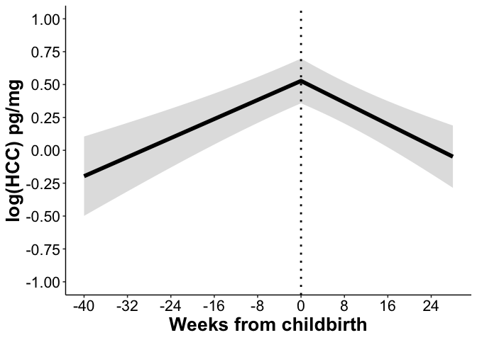

Analyses for **Hair cortisol concentration across the peripartum period:
Documenting changes and associations with depressive symptoms and recent
adversity**
================
Lucy King

-   [Environment](#environment)
-   [Read in data](#read-in-data)
-   [Descriptive statistics](#descriptive-statistics)
    -   [Total number of participants at each time point, prior to
        removing observations contemporaneous with corticosteroid
        use](#total-number-of-participants-at-each-time-point-prior-to-removing-observations-contemporaneous-with-corticosteroid-use)
    -   [Remove maternal observations contemporaneous with
        corticosteroid
        use](#remove-maternal-observations-contemporaneous-with-corticosteroid-use)
    -   [Final total number of participants and
        observations](#final-total-number-of-participants-and-observations)
    -   [Visualization of sampling
        approach](#visualization-of-sampling-approach)
    -   [Distributions](#distributions)
    -   [Internal consistency of CESD](#internal-consistency-of-cesd)
    -   [Demographics, means, SDs,
        ranges](#demographics-means-sds-ranges)
-   [Missing data analyses](#missing-data-analyses)
-   [Results](#results)
    -   [Reliability of segments 4- and 5-cm distal from
        scalp](#reliability-of-segments-4--and-5-cm-distal-from-scalp)
    -   [Fit piecewise linear mixed model of HCC, covarying for segment
        as a random
        effect](#fit-piecewise-linear-mixed-model-of-hcc-covarying-for-segment-as-a-random-effect)
    -   [Visualize piecewise model](#visualize-piecewise-model)
    -   [Examine effect of psychosocial
        adversity](#examine-effect-of-psychosocial-adversity)
    -   [Visualize effect of psychosocial
        adversity](#visualize-effect-of-psychosocial-adversity)
    -   [Examine effect of despressive
        symptoms](#examine-effect-of-despressive-symptoms)
    -   [Examine covariates](#examine-covariates)

# Environment

``` r
library(tidyverse)
```

    ## ── Attaching packages ─────────────────────────────────────── tidyverse 1.3.1 ──

    ## ✓ ggplot2 3.3.5     ✓ purrr   0.3.4
    ## ✓ tibble  3.1.5     ✓ dplyr   1.0.7
    ## ✓ tidyr   1.1.3     ✓ stringr 1.4.0
    ## ✓ readr   2.0.2     ✓ forcats 0.5.1

    ## ── Conflicts ────────────────────────────────────────── tidyverse_conflicts() ──
    ## x dplyr::filter() masks stats::filter()
    ## x dplyr::lag()    masks stats::lag()

``` r
library(janitor)
```

    ## 
    ## Attaching package: 'janitor'

    ## The following objects are masked from 'package:stats':
    ## 
    ##     chisq.test, fisher.test

``` r
library(lme4)
```

    ## Loading required package: Matrix

    ## 
    ## Attaching package: 'Matrix'

    ## The following objects are masked from 'package:tidyr':
    ## 
    ##     expand, pack, unpack

``` r
library(ggsci)
library(ggpubr)
library(lmerTest)
```

    ## 
    ## Attaching package: 'lmerTest'

    ## The following object is masked from 'package:lme4':
    ## 
    ##     lmer

    ## The following object is masked from 'package:stats':
    ## 
    ##     step

``` r
library(performance)
library(effectsize)
```

    ## Registered S3 methods overwritten by 'parameters':
    ##   method                           from      
    ##   as.double.parameters_kurtosis    datawizard
    ##   as.double.parameters_skewness    datawizard
    ##   as.double.parameters_smoothness  datawizard
    ##   as.numeric.parameters_kurtosis   datawizard
    ##   as.numeric.parameters_skewness   datawizard
    ##   as.numeric.parameters_smoothness datawizard
    ##   print.parameters_distribution    datawizard
    ##   print.parameters_kurtosis        datawizard
    ##   print.parameters_skewness        datawizard
    ##   summary.parameters_kurtosis      datawizard
    ##   summary.parameters_skewness      datawizard

``` r
library(sjPlot)
```

    ## Install package "strengejacke" from GitHub (`devtools::install_github("strengejacke/strengejacke")`) to load all sj-packages at once!

``` r
library(sjmisc)
```

    ## Learn more about sjmisc with 'browseVignettes("sjmisc")'.

    ## 
    ## Attaching package: 'sjmisc'

    ## The following objects are masked from 'package:janitor':
    ## 
    ##     remove_empty_cols, remove_empty_rows

    ## The following object is masked from 'package:purrr':
    ## 
    ##     is_empty

    ## The following object is masked from 'package:tidyr':
    ## 
    ##     replace_na

    ## The following object is masked from 'package:tibble':
    ## 
    ##     add_case

``` r
library(sjlabelled)
```

    ## 
    ## Attaching package: 'sjlabelled'

    ## The following object is masked from 'package:forcats':
    ## 
    ##     as_factor

    ## The following object is masked from 'package:dplyr':
    ## 
    ##     as_label

    ## The following object is masked from 'package:ggplot2':
    ## 
    ##     as_label

``` r
library(labelled)
```

    ## 
    ## Attaching package: 'labelled'

    ## The following objects are masked from 'package:sjlabelled':
    ## 
    ##     copy_labels, remove_labels, to_character, to_factor, val_labels

    ## The following objects are masked from 'package:sjmisc':
    ## 
    ##     to_character, to_factor

``` r
library(codebook)
```

    ## 
    ## Attaching package: 'codebook'

    ## The following object is masked from 'package:labelled':
    ## 
    ##     to_factor

    ## The following objects are masked from 'package:sjlabelled':
    ## 
    ##     as_factor, to_factor, val_labels

    ## The following object is masked from 'package:sjmisc':
    ## 
    ##     to_factor

``` r
# Files
home <- "~/Box/Mooddata_Coordinating/BABIES/Data/final_scored_data/"

hcc_data_file <- paste0(home, "hair_cortisol/hcc_mom_infant_cleaned_all.csv")
demo_file <- paste0(home, "demographics/demo_longitudinal_cleaned_final.csv")
prams_file <- paste0(home, "PRAMS/prams_alldata_cleaned.csv")
cesd_file <- paste0(home, "CESD/cesd_wf_20201001.csv")
crisys_file <- paste0(home, "CRISYS/crisys_scored_wf_complete.csv")

source("R_rainclouds.R")

theme_hcc <-
  theme_minimal() +
  theme(
    panel.grid = element_blank(),
    plot.title = element_text(size = 18, hjust = .5),
    axis.title = element_text(size = 18),
    axis.text = element_text(size = 16),
    legend.title = element_text(size = 18), 
    legend.text = element_text(size = 16),
    legend.position = "bottom"
  )

cbbPalette <- c("#000000", "#E69F00", "#56B4E9", "#009E73", "#F0E442", "#0072B2", "#D55E00", "#CC79A7")

options(scipen = 999)

knitr::opts_chunk$set(warning=FALSE, message=FALSE)
```

# Read in data

``` r
d <-
  read_csv(hcc_data_file) %>% 
  #retain only participants from prenatal cohort
  filter(ID >= 1000) %>% 
  left_join(
    read_csv(demo_file) %>% 
      select(
        ID,
        education_t1,
        education_t1_txt,
        mom_race,
        mom_latinx,
        annual_income_t1,
        annual_income_t1_txt,
        mom_age_t1,
        income_needs_t1,
        infant_age_t2 = age_scan_t2,
        infant_age_t3 = age_scan_t3
      ),
    by = "ID"
  ) %>% 
  left_join(
    read_csv(prams_file) %>% 
      select(
        ID,
        preg_previous,
        prev_preg_total,
        preg_weight_chg,
        labor_status,
        labor_mode,
        mom_preg_bmi,
        mom_newborn_bmi,
        preg_weight_chg,
        preg_weight_gain,
        preg_weight_loss,
        n_prenatal_cigarettes,
        n_newborn_cigarettes,
        n_prenatal_drinks,
        n_newborn_drinks,
        birth_weight_total_lbs
      ),
    by = "ID"
  )  %>% 
  left_join(
    read_csv(cesd_file) %>% 
      dplyr::select(
        ID,
        cesd_t1,
        cesd_t2,
        cesd_t3
      ), 
    by = "ID"
  ) %>% 
  left_join(
    read_csv(crisys_file) %>% 
      dplyr::select(
        ID,
        crisys_total_T1,
        crisys_total_T2,
        crisys_total_T3
      ), 
    by = "ID"
  ) %>% 
  mutate(
    # recale segment so bottom is 0
    segment = recode(
      segment,
      "1" = 0,
      "2" = 1,
      "3" = 2, 
      "4" = 3,
      "5" = 4
    ),
    season = as.factor(season),
    hair_chemexp_past5mo = factor(hair_chemexp_past5mo),
    phase = factor(
      phase,
      levels = c(
        "1st trimester",
        "2nd trimester",
        "3rd trimester",
        "3mo. postpartum",
        "6mo. postpartum"
      ),
      labels = c(
        "1st trimester",
        "2nd trimester",
        "3rd trimester",
        "3 mo. postpartum",
        "6 mo. postpartum"
      )
    ),
    cesd = case_when(
      timepoint == "T1" ~ cesd_t1,
      timepoint == "T2" ~ cesd_t2,
      timepoint == "T3" ~ cesd_t3
    ),
    crisys = case_when(
      timepoint == "T1" ~ crisys_total_T1,
      timepoint == "T2" ~ crisys_total_T2,
      timepoint == "T3" ~ crisys_total_T3,
    )
  ) %>% 
  group_by(ID) %>% 
  mutate(
    # mean cesd for each participant across timepoints
    cesd_mu = mean(cesd, na.rm = TRUE), 
     # person-mean-centered cesd (deviations from mean)
    cesd_pc = if_else(
      !is.na(cesd), cesd - cesd_mu, NA_real_
    ),
    crisys_mu = mean(crisys, na.rm = TRUE),
    crisys_pc = if_else(
      !is.na(crisys), crisys - crisys_mu, NA_real_
    ),
    # relabel timepoint variable levels
    timepoint = recode(
      timepoint,
      "T1" = "C1",
      "T2" = "C2",
      "T3" = "C3"
    )
  ) %>% 
  ungroup()
```

# Descriptive statistics

## Total number of participants at each time point, prior to removing observations contemporaneous with corticosteroid use

``` r
d %>% 
  filter(!is.na(hcc_log_m)) %>% 
  distinct(ID, timepoint) %>% 
  count(timepoint)
```

    ## # A tibble: 3 × 2
    ##   timepoint     n
    ##   <chr>     <int>
    ## 1 C1           84
    ## 2 C2           52
    ## 3 C3           31

## Remove maternal observations contemporaneous with corticosteroid use

Four participants did not provide information about recent
corticosteroid use

``` r
# number of participants
d %>% 
  distinct(ID, timepoint, steroid_recent) %>% 
  count(timepoint, steroid_recent)
```

    ## # A tibble: 7 × 3
    ##   timepoint steroid_recent     n
    ##   <chr>              <dbl> <int>
    ## 1 C1                     0    79
    ## 2 C1                     1     2
    ## 3 C1                    NA     4
    ## 4 C2                     0    50
    ## 5 C2                     1     2
    ## 6 C3                     0    29
    ## 7 C3                     1     2

``` r
# number of observations
d %>% 
  count(timepoint, steroid_recent)
```

    ## # A tibble: 7 × 3
    ##   timepoint steroid_recent     n
    ##   <chr>              <dbl> <int>
    ## 1 C1                     0   382
    ## 2 C1                     1    10
    ## 3 C1                    NA    19
    ## 4 C2                     0   250
    ## 5 C2                     1    10
    ## 6 C3                     0   138
    ## 7 C3                     1    10

``` r
d <-
  d %>% 
  mutate(
    hcc_m = case_when(
      steroid_recent == 1 ~ NA_real_, 
      is.na(steroid_recent) ~ hcc_m,
      steroid_recent == 0 ~ hcc_m, 
    ),
    hcc_log_m = case_when(
      steroid_recent == 1 ~ NA_real_, 
      is.na(steroid_recent) ~ hcc_log_m,
      steroid_recent == 0 ~ hcc_log_m, 
    )
  ) %>% 
  filter(!is.na(hcc_log_m))
```

## Final total number of participants and observations

### N

``` r
d %>% 
  distinct(ID) %>% 
  count()
```

    ## # A tibble: 1 × 1
    ##       n
    ##   <int>
    ## 1    85

### n

``` r
d %>% 
  count()
```

    ## # A tibble: 1 × 1
    ##       n
    ##   <int>
    ## 1   783

### N by timepoint

``` r
d %>% 
  distinct(ID, timepoint) %>% 
  count(timepoint)
```

    ## # A tibble: 3 × 2
    ##   timepoint     n
    ##   <chr>     <int>
    ## 1 C1           82
    ## 2 C2           50
    ## 3 C3           29

### n by timepoint

``` r
d %>% 
  count(timepoint)
```

    ## # A tibble: 3 × 2
    ##   timepoint     n
    ##   <chr>     <int>
    ## 1 C1          396
    ## 2 C2          249
    ## 3 C3          138

### N across timpoints

``` r
d %>% 
  distinct(ID, timepoint, hcc_log_m) %>% 
  mutate(
    hcc = !is.na(hcc_log_m)
  ) %>% 
  select(-hcc_log_m) %>% 
  distinct(ID, timepoint, hcc) %>% 
  spread(timepoint, hcc) %>% 
  count(C1, C2, C3)
```

    ## # A tibble: 6 × 4
    ##   C1    C2    C3        n
    ##   <lgl> <lgl> <lgl> <int>
    ## 1 TRUE  TRUE  TRUE     20
    ## 2 TRUE  TRUE  NA       28
    ## 3 TRUE  NA    TRUE      6
    ## 4 TRUE  NA    NA       28
    ## 5 NA    TRUE  TRUE      2
    ## 6 NA    NA    TRUE      1

### by phase

``` r
d %>% 
  distinct(ID, phase) %>% 
  count(phase)
```

    ## # A tibble: 5 × 2
    ##   phase                n
    ##   <fct>            <int>
    ## 1 1st trimester       60
    ## 2 2nd trimester       82
    ## 3 3rd trimester       61
    ## 4 3 mo. postpartum    57
    ## 5 6 mo. postpartum    29

``` r
d %>% 
  filter(!is.na(hcc_log_m)) %>% 
  distinct(ID, phase, hcc_log_m) %>% 
  mutate(
    hcc = !is.na(hcc_log_m)
  ) %>% 
  select(-hcc_log_m) %>% 
  distinct(ID, phase, hcc) %>% 
  spread(phase, hcc) 
```

    ## # A tibble: 85 × 6
    ##       ID `1st trimester` `2nd trimester` `3rd trimester` `3 mo. postpartum`
    ##    <dbl> <lgl>           <lgl>           <lgl>           <lgl>             
    ##  1  1001 TRUE            TRUE            TRUE            NA                
    ##  2  1002 NA              TRUE            TRUE            NA                
    ##  3  1003 TRUE            TRUE            NA              NA                
    ##  4  1004 TRUE            TRUE            NA              NA                
    ##  5  1005 TRUE            TRUE            TRUE            TRUE              
    ##  6  1007 TRUE            TRUE            TRUE            TRUE              
    ##  7  1008 TRUE            TRUE            NA              NA                
    ##  8  1010 NA              TRUE            TRUE            TRUE              
    ##  9  1011 TRUE            TRUE            TRUE            TRUE              
    ## 10  1013 TRUE            TRUE            NA              NA                
    ## # … with 75 more rows, and 1 more variable: 6 mo. postpartum <lgl>

``` r
d %>% 
  count(phase)
```

    ## # A tibble: 5 × 2
    ##   phase                n
    ##   <fct>            <int>
    ## 1 1st trimester      122
    ## 2 2nd trimester      228
    ## 3 3rd trimester      208
    ## 4 3 mo. postpartum   113
    ## 5 6 mo. postpartum   112

## Visualization of sampling approach

``` r
d_timepoint <-
  d %>% 
  mutate(ID = as.factor(ID)) %>% 
  select(
    ID,
    timepoint,
    seg_week_cent_birth
  ) %>% 
  mutate(
    seg_week_preg = if_else(
      timepoint == "C1",
      seg_week_cent_birth, NA_real_
    )
  )


approach_p <-
  d_timepoint %>% 
  ggplot(
    aes(
      seg_week_cent_birth, 
      fct_reorder2(ID,  seg_week_preg, seg_week_cent_birth, .desc = FALSE), 
      color = timepoint
    )
  ) +
  geom_point() +
  geom_path() +
  geom_vline(
    aes(xintercept = 0),
    linetype = "dotted",
    size = 2
  ) +
  scale_x_continuous(breaks = seq.int(-40, 28, 8), limits = c(-40, 28)) +
  scale_color_manual(values = cbbPalette) +
  theme_hcc +
  theme(
    legend.position = "right",
    axis.text.y = element_blank()
  ) +
  labs(
    color = "Hair collection\noccasion",
    x = "Weeks from childbirth",
    y = "Participant"
  )
approach_p
```

<!-- -->

``` r
ggsave(
  "~/Box/lucy_king_files/BABIES/hair_cortisol/plots/collection_method.png",
  width = 8,
  height = 6
)
```

## Distributions

### Weeks since conception

``` r
weeks_density_p <- 
  d %>% 
  ggplot(aes(seg_week_cent_birth, fill = timepoint)) +
  geom_density(alpha = 1/2) +
  geom_vline(
    aes(xintercept = 0),
    linetype = "dotted",
    size = 2
  ) +
  scale_x_continuous(breaks = seq.int(-40, 28, 8), limits = c(-40, 28)) +
  scale_fill_manual(values = cbbPalette) +
  theme_hcc +
  theme(
    legend.position = "right"
  ) +
  labs(
    fill = "Hair collection\noccasion",
    x = "Weeks from childbirth",
    y = "Density of HCC observations"
  )
weeks_density_p
```

<!-- -->

``` r
ggsave(
  "~/Box/lucy_king_files/BABIES/hair_cortisol/plots/hcc_timepoint_density.png",
  width = 8,
  height = 6
)
```

``` r
ggarrange(
  weeks_density_p, 
  approach_p, 
  nrow = 2, 
  labels = c("A", "B"), 
  hjust = -3,
  font.label = list(size = 16)
)
```

<!-- -->

``` r
ggsave(
  "~/Box/lucy_king_files/BABIES/hair_cortisol/plots/hcc_method_plots.png",
  dpi = 600,
  width = 10,
  height = 12
)
```

``` r
d %>% 
  ggplot(aes(seg_week_cent_birth)) +
  geom_histogram() +
  #scale_x_continuous(breaks = seq.int(-40, 28, 8), limits = c(-40, 28)) +
  scale_fill_manual(values = cbbPalette) +
  theme_hcc +
  theme(
    legend.position = "right"
  ) +
  labs(
    fill = "Assessment\ntimepoint",
    x = "Weeks from childbirth",
    y = "Density of HCC observations"
  ) +
  facet_wrap(.~timepoint, scale = "free")
```

<!-- -->

### HCC in each phase

``` r
d %>% 
  ggplot(aes(fct_rev(phase), hcc_log_m)) +
  geom_flat_violin(
    aes(color = fct_rev(phase), fill = fct_rev(phase)),
    position = position_nudge(x = .25, y = 0),
    adjust = 2,
    trim = TRUE
  ) +
  geom_point(
    aes(color = fct_rev(phase), fill = fct_rev(phase)),
    position = position_jitter(width = .15),
    size = 1
  ) +
  geom_boxplot(
    aes(x = as.numeric(fct_rev(phase)) + .25, y = hcc_log_m, group = fct_rev(phase)),
    color = "black",
    alpha = 1/3,
    width = .1,
    outlier.shape = NA
  ) +
  scale_y_continuous(breaks = seq.int(-2, 5, 1)) +
  scale_fill_viridis_d() +
  scale_color_viridis_d() +
  theme_hcc +
  theme(
    legend.position = "none",
    plot.caption = element_text(hjust = .5, size = 15)
  ) +
  labs(
    x = NULL,
    y = "log(HCC) pg/mg"
  ) +
  coord_flip()
```

<!-- -->

``` r
ggsave(
  "~/Box/lucy_king_files/BABIES/hair_cortisol/plots/hcc_rain_clouds_phase.png",
  width = 8,
  height = 7
)
```

### CES-D scores at each timepoint

``` r
d %>% 
  ggplot(aes(cesd)) +
  geom_histogram(binwidth = 5) +
  theme_hcc +
  labs(
    fill = "Assessment\ntimepoint",
    x = "CES-D Score"
  ) +
  facet_grid(.~timepoint)
```

<!-- -->

### CRISYS scores at each timepoint

``` r
d %>% 
  ggplot(aes(crisys)) +
  geom_histogram(binwidth = 2) +
  theme_hcc +
  labs(
    fill = "Assessment\ntimepoint",
    x = "CRISYS Score"
  ) +
  facet_grid(.~timepoint)
```

<!-- -->

## Internal consistency of CESD

``` r
r <-
  read_csv(cesd_file) %>% 
  left_join(read_csv(crisys_file), by = "ID")
```

### CESD

``` r
r %>% 
  dplyr::select(
    contains("cesd")
  ) %>% 
  dplyr::select(
    ends_with("_T1"),
    -cesd_t1
  ) %>% 
  psych::alpha()
```

    ## 
    ## Reliability analysis   
    ## Call: psych::alpha(x = .)
    ## 
    ##   raw_alpha std.alpha G6(smc) average_r S/N   ase mean   sd median_r
    ##       0.89      0.89    0.93      0.29 8.2 0.012 0.51 0.42     0.28
    ## 
    ##  lower alpha upper     95% confidence boundaries
    ## 0.86 0.89 0.91 
    ## 
    ##  Reliability if an item is dropped:
    ##            raw_alpha std.alpha G6(smc) average_r S/N alpha se var.r med.r
    ## cesd_1_T1       0.88      0.89    0.93      0.29 7.9    0.012 0.020  0.28
    ## cesd_2_T1       0.88      0.89    0.92      0.29 7.9    0.012 0.020  0.28
    ## cesd_3_T1       0.88      0.88    0.92      0.29 7.6    0.012 0.020  0.28
    ## cesd_4_T1       0.89      0.89    0.93      0.30 8.1    0.012 0.020  0.29
    ## cesd_5_T1       0.88      0.89    0.93      0.29 7.9    0.012 0.020  0.28
    ## cesd_6_T1       0.87      0.88    0.92      0.28 7.2    0.013 0.017  0.27
    ## cesd_7_T1       0.88      0.89    0.93      0.30 8.0    0.012 0.021  0.29
    ## cesd_8_T1       0.88      0.89    0.93      0.30 8.0    0.012 0.021  0.29
    ## cesd_9_T1       0.88      0.89    0.93      0.29 7.9    0.012 0.020  0.28
    ## cesd_10_T1      0.88      0.89    0.93      0.30 8.0    0.012 0.020  0.29
    ## cesd_11_T1      0.88      0.89    0.93      0.29 7.9    0.012 0.021  0.29
    ## cesd_12_T1      0.88      0.89    0.92      0.29 7.7    0.012 0.020  0.28
    ## cesd_13_T1      0.88      0.89    0.92      0.29 7.9    0.012 0.020  0.28
    ## cesd_14_T1      0.87      0.88    0.92      0.28 7.3    0.013 0.019  0.27
    ## cesd_15_T1      0.88      0.89    0.93      0.30 8.1    0.012 0.020  0.29
    ## cesd_16_T1      0.88      0.89    0.92      0.29 7.8    0.012 0.019  0.29
    ## cesd_17_T1      0.88      0.88    0.92      0.28 7.5    0.013 0.019  0.28
    ## cesd_18_T1      0.87      0.88    0.92      0.28 7.3    0.013 0.018  0.27
    ## cesd_19_T1      0.88      0.89    0.92      0.30 8.0    0.012 0.020  0.29
    ## cesd_20_T1      0.88      0.89    0.92      0.29 7.8    0.012 0.021  0.28
    ## 
    ##  Item statistics 
    ##             n raw.r std.r r.cor r.drop mean   sd
    ## cesd_1_T1  89  0.55  0.54  0.51   0.49 0.57 0.72
    ## cesd_2_T1  89  0.52  0.54  0.52   0.46 0.29 0.66
    ## cesd_3_T1  89  0.63  0.64  0.63   0.58 0.39 0.68
    ## cesd_4_T1  89  0.41  0.44  0.40   0.34 0.27 0.69
    ## cesd_5_T1  89  0.55  0.52  0.48   0.46 0.98 1.01
    ## cesd_6_T1  89  0.79  0.79  0.80   0.75 0.43 0.74
    ## cesd_7_T1  89  0.52  0.49  0.45   0.43 0.84 0.95
    ## cesd_8_T1  89  0.51  0.50  0.46   0.43 0.47 0.80
    ## cesd_9_T1  89  0.52  0.54  0.52   0.49 0.11 0.35
    ## cesd_10_T1 89  0.49  0.49  0.46   0.43 0.46 0.71
    ## cesd_11_T1 89  0.55  0.52  0.48   0.45 1.25 1.08
    ## cesd_12_T1 89  0.57  0.59  0.58   0.52 0.31 0.60
    ## cesd_13_T1 89  0.51  0.53  0.51   0.45 0.38 0.65
    ## cesd_14_T1 89  0.77  0.77  0.78   0.73 0.58 0.78
    ## cesd_15_T1 89  0.43  0.45  0.41   0.37 0.26 0.59
    ## cesd_16_T1 89  0.54  0.56  0.55   0.48 0.28 0.60
    ## cesd_17_T1 89  0.68  0.67  0.66   0.62 0.61 0.82
    ## cesd_18_T1 89  0.78  0.78  0.78   0.74 0.76 0.83
    ## cesd_19_T1 89  0.47  0.49  0.47   0.40 0.34 0.64
    ## cesd_20_T1 89  0.59  0.58  0.56   0.53 0.57 0.74
    ## 
    ## Non missing response frequency for each item
    ##               0    1    2    3 miss
    ## cesd_1_T1  0.56 0.30 0.13 0.00 0.53
    ## cesd_2_T1  0.81 0.10 0.08 0.01 0.53
    ## cesd_3_T1  0.72 0.17 0.11 0.00 0.53
    ## cesd_4_T1  0.83 0.10 0.03 0.03 0.53
    ## cesd_5_T1  0.40 0.33 0.16 0.11 0.53
    ## cesd_6_T1  0.70 0.20 0.08 0.02 0.53
    ## cesd_7_T1  0.46 0.31 0.15 0.08 0.53
    ## cesd_8_T1  0.69 0.19 0.09 0.03 0.53
    ## cesd_9_T1  0.90 0.09 0.01 0.00 0.53
    ## cesd_10_T1 0.64 0.28 0.06 0.02 0.53
    ## cesd_11_T1 0.33 0.26 0.26 0.16 0.53
    ## cesd_12_T1 0.74 0.21 0.03 0.01 0.53
    ## cesd_13_T1 0.70 0.24 0.06 0.01 0.53
    ## cesd_14_T1 0.56 0.33 0.08 0.03 0.53
    ## cesd_15_T1 0.81 0.13 0.04 0.01 0.53
    ## cesd_16_T1 0.79 0.16 0.04 0.01 0.53
    ## cesd_17_T1 0.57 0.28 0.11 0.03 0.53
    ## cesd_18_T1 0.44 0.40 0.11 0.04 0.53
    ## cesd_19_T1 0.74 0.19 0.06 0.01 0.53
    ## cesd_20_T1 0.56 0.31 0.11 0.01 0.53

``` r
r %>% 
  dplyr::select(
    contains("cesd")
  ) %>% 
  dplyr::select(
    ends_with("_T2"),
    -cesd_t2
  ) %>% 
  psych::alpha()
```

    ## 
    ## Reliability analysis   
    ## Call: psych::alpha(x = .)
    ## 
    ##   raw_alpha std.alpha G6(smc) average_r S/N   ase mean   sd median_r
    ##       0.87      0.88    0.92      0.27 7.4 0.013 0.49 0.38     0.26
    ## 
    ##  lower alpha upper     95% confidence boundaries
    ## 0.85 0.87 0.9 
    ## 
    ##  Reliability if an item is dropped:
    ##            raw_alpha std.alpha G6(smc) average_r S/N alpha se var.r med.r
    ## cesd_1_T2       0.86      0.87    0.92      0.27 6.9    0.014 0.020  0.26
    ## cesd_2_T2       0.87      0.88    0.92      0.28 7.4    0.013 0.020  0.28
    ## cesd_3_T2       0.86      0.87    0.91      0.26 6.7    0.014 0.019  0.26
    ## cesd_4_T2       0.87      0.87    0.92      0.27 7.0    0.014 0.020  0.26
    ## cesd_5_T2       0.87      0.88    0.92      0.28 7.3    0.013 0.020  0.27
    ## cesd_6_T2       0.86      0.87    0.91      0.26 6.7    0.014 0.019  0.26
    ## cesd_7_T2       0.87      0.88    0.92      0.28 7.3    0.013 0.020  0.27
    ## cesd_8_T2       0.87      0.88    0.92      0.28 7.2    0.013 0.020  0.27
    ## cesd_9_T2       0.87      0.87    0.92      0.27 6.9    0.013 0.020  0.26
    ## cesd_10_T2      0.86      0.87    0.92      0.27 6.9    0.014 0.021  0.26
    ## cesd_11_T2      0.87      0.87    0.92      0.27 7.0    0.013 0.021  0.26
    ## cesd_12_T2      0.87      0.87    0.91      0.27 6.9    0.014 0.019  0.26
    ## cesd_13_T2      0.87      0.87    0.92      0.27 7.0    0.014 0.021  0.26
    ## cesd_14_T2      0.86      0.87    0.91      0.26 6.7    0.014 0.019  0.26
    ## cesd_15_T2      0.87      0.88    0.92      0.28 7.5    0.013 0.019  0.28
    ## cesd_16_T2      0.86      0.87    0.91      0.26 6.8    0.014 0.019  0.25
    ## cesd_17_T2      0.87      0.88    0.92      0.27 7.0    0.014 0.020  0.26
    ## cesd_18_T2      0.86      0.87    0.91      0.26 6.5    0.014 0.019  0.25
    ## cesd_19_T2      0.87      0.88    0.92      0.28 7.4    0.013 0.019  0.28
    ## cesd_20_T2      0.86      0.87    0.91      0.26 6.8    0.014 0.021  0.26
    ## 
    ##  Item statistics 
    ##             n raw.r std.r r.cor r.drop  mean   sd
    ## cesd_1_T2  66  0.60  0.59  0.58   0.54 0.530 0.66
    ## cesd_2_T2  66  0.37  0.40  0.34   0.33 0.136 0.39
    ## cesd_3_T2  66  0.64  0.67  0.68   0.60 0.273 0.54
    ## cesd_4_T2  66  0.58  0.57  0.54   0.50 0.530 0.88
    ## cesd_5_T2  66  0.44  0.41  0.37   0.33 0.848 0.90
    ## cesd_6_T2  66  0.68  0.70  0.70   0.64 0.273 0.57
    ## cesd_7_T2  66  0.45  0.42  0.37   0.35 0.970 0.89
    ## cesd_8_T2  66  0.43  0.46  0.41   0.37 0.364 0.60
    ## cesd_9_T2  66  0.55  0.58  0.56   0.51 0.136 0.39
    ## cesd_10_T2 66  0.59  0.59  0.57   0.53 0.424 0.70
    ## cesd_11_T2 66  0.59  0.57  0.54   0.49 1.136 1.08
    ## cesd_12_T2 66  0.57  0.59  0.59   0.51 0.470 0.61
    ## cesd_13_T2 66  0.56  0.55  0.53   0.49 0.470 0.73
    ## cesd_14_T2 66  0.67  0.68  0.67   0.61 0.530 0.75
    ## cesd_15_T2 66  0.29  0.34  0.30   0.26 0.076 0.27
    ## cesd_16_T2 66  0.66  0.65  0.66   0.60 0.500 0.69
    ## cesd_17_T2 66  0.55  0.55  0.52   0.48 0.515 0.79
    ## cesd_18_T2 66  0.76  0.75  0.75   0.71 0.697 0.70
    ## cesd_19_T2 66  0.37  0.37  0.33   0.30 0.273 0.57
    ## cesd_20_T2 66  0.64  0.62  0.61   0.57 0.621 0.74
    ## 
    ## Non missing response frequency for each item
    ##               0    1    2    3 miss
    ## cesd_1_T2  0.56 0.35 0.09 0.00 0.65
    ## cesd_2_T2  0.88 0.11 0.02 0.00 0.65
    ## cesd_3_T2  0.77 0.18 0.05 0.00 0.65
    ## cesd_4_T2  0.67 0.20 0.08 0.06 0.65
    ## cesd_5_T2  0.44 0.32 0.20 0.05 0.65
    ## cesd_6_T2  0.79 0.15 0.06 0.00 0.65
    ## cesd_7_T2  0.33 0.44 0.15 0.08 0.65
    ## cesd_8_T2  0.68 0.29 0.02 0.02 0.65
    ## cesd_9_T2  0.88 0.11 0.02 0.00 0.65
    ## cesd_10_T2 0.68 0.23 0.08 0.02 0.65
    ## cesd_11_T2 0.38 0.24 0.24 0.14 0.65
    ## cesd_12_T2 0.58 0.39 0.02 0.02 0.65
    ## cesd_13_T2 0.67 0.20 0.14 0.00 0.65
    ## cesd_14_T2 0.61 0.27 0.11 0.02 0.65
    ## cesd_15_T2 0.92 0.08 0.00 0.00 0.65
    ## cesd_16_T2 0.59 0.33 0.06 0.02 0.65
    ## cesd_17_T2 0.64 0.24 0.09 0.03 0.65
    ## cesd_18_T2 0.41 0.52 0.05 0.03 0.65
    ## cesd_19_T2 0.79 0.15 0.06 0.00 0.65
    ## cesd_20_T2 0.53 0.32 0.15 0.00 0.65

``` r
r %>% 
  dplyr::select(
    contains("cesd")
  ) %>% 
  dplyr::select(
    ends_with("_T3"),
    -cesd_t3
  ) %>% 
  psych::alpha()
```

    ## 
    ## Reliability analysis   
    ## Call: psych::alpha(x = .)
    ## 
    ##   raw_alpha std.alpha G6(smc) average_r S/N    ase mean   sd median_r
    ##       0.91      0.92    0.94      0.36  11 0.0089 0.51 0.47     0.34
    ## 
    ##  lower alpha upper     95% confidence boundaries
    ## 0.9 0.91 0.93 
    ## 
    ##  Reliability if an item is dropped:
    ##            raw_alpha std.alpha G6(smc) average_r S/N alpha se var.r med.r
    ## cesd_1_T3       0.91      0.91    0.94      0.36  11   0.0096 0.019  0.34
    ## cesd_2_T3       0.91      0.92    0.94      0.36  11   0.0093 0.018  0.35
    ## cesd_3_T3       0.91      0.91    0.94      0.35  10   0.0096 0.018  0.33
    ## cesd_4_T3       0.91      0.92    0.94      0.36  11   0.0091 0.018  0.36
    ## cesd_5_T3       0.91      0.92    0.94      0.37  11   0.0089 0.018  0.37
    ## cesd_6_T3       0.90      0.91    0.93      0.35  10   0.0098 0.017  0.33
    ## cesd_7_T3       0.91      0.91    0.94      0.36  11   0.0096 0.019  0.33
    ## cesd_8_T3       0.91      0.91    0.93      0.35  10   0.0094 0.017  0.34
    ## cesd_9_T3       0.91      0.92    0.94      0.37  11   0.0091 0.018  0.36
    ## cesd_10_T3      0.91      0.92    0.94      0.36  11   0.0093 0.018  0.34
    ## cesd_11_T3      0.92      0.92    0.94      0.37  11   0.0086 0.017  0.37
    ## cesd_12_T3      0.91      0.91    0.93      0.36  11   0.0093 0.016  0.34
    ## cesd_13_T3      0.91      0.92    0.94      0.36  11   0.0093 0.019  0.35
    ## cesd_14_T3      0.90      0.91    0.94      0.35  10   0.0099 0.018  0.33
    ## cesd_15_T3      0.91      0.92    0.94      0.37  11   0.0091 0.018  0.37
    ## cesd_16_T3      0.91      0.91    0.93      0.36  11   0.0093 0.016  0.34
    ## cesd_17_T3      0.91      0.91    0.94      0.36  11   0.0093 0.019  0.34
    ## cesd_18_T3      0.90      0.91    0.93      0.35  10   0.0099 0.017  0.33
    ## cesd_19_T3      0.91      0.91    0.94      0.36  11   0.0094 0.019  0.34
    ## cesd_20_T3      0.91      0.91    0.94      0.36  10   0.0096 0.018  0.34
    ## 
    ##  Item statistics 
    ##              n raw.r std.r r.cor r.drop mean   sd
    ## cesd_1_T3  156  0.68  0.66  0.64   0.63 0.72 0.82
    ## cesd_2_T3  156  0.56  0.56  0.54   0.51 0.28 0.66
    ## cesd_3_T3  156  0.73  0.74  0.73   0.70 0.31 0.64
    ## cesd_4_T3  156  0.54  0.56  0.53   0.48 0.35 0.73
    ## cesd_5_T3  156  0.55  0.51  0.47   0.47 1.15 1.04
    ## cesd_6_T3  156  0.76  0.77  0.77   0.73 0.46 0.79
    ## cesd_7_T3  156  0.69  0.67  0.65   0.63 0.97 1.03
    ## cesd_8_T3  156  0.65  0.69  0.69   0.61 0.29 0.63
    ## cesd_9_T3  156  0.48  0.53  0.50   0.45 0.12 0.36
    ## cesd_10_T3 156  0.58  0.57  0.54   0.52 0.40 0.74
    ## cesd_11_T3 156  0.47  0.43  0.38   0.37 1.17 1.04
    ## cesd_12_T3 156  0.58  0.62  0.61   0.54 0.31 0.60
    ## cesd_13_T3 156  0.59  0.58  0.55   0.53 0.49 0.78
    ## cesd_14_T3 156  0.78  0.78  0.77   0.74 0.69 0.91
    ## cesd_15_T3 156  0.51  0.51  0.48   0.45 0.31 0.67
    ## cesd_16_T3 156  0.62  0.66  0.66   0.57 0.24 0.60
    ## cesd_17_T3 156  0.59  0.61  0.59   0.55 0.33 0.62
    ## cesd_18_T3 156  0.78  0.76  0.76   0.74 0.80 0.86
    ## cesd_19_T3 156  0.63  0.63  0.61   0.58 0.33 0.69
    ## cesd_20_T3 156  0.69  0.68  0.67   0.64 0.51 0.76
    ## 
    ## Non missing response frequency for each item
    ##               0    1    2    3 miss
    ## cesd_1_T3  0.47 0.37 0.12 0.04 0.18
    ## cesd_2_T3  0.81 0.13 0.04 0.03 0.18
    ## cesd_3_T3  0.78 0.15 0.06 0.01 0.18
    ## cesd_4_T3  0.77 0.13 0.07 0.03 0.18
    ## cesd_5_T3  0.33 0.34 0.19 0.15 0.18
    ## cesd_6_T3  0.69 0.21 0.07 0.04 0.18
    ## cesd_7_T3  0.42 0.33 0.13 0.13 0.18
    ## cesd_8_T3  0.79 0.14 0.06 0.01 0.18
    ## cesd_9_T3  0.90 0.09 0.01 0.00 0.18
    ## cesd_10_T3 0.72 0.19 0.06 0.03 0.18
    ## cesd_11_T3 0.31 0.36 0.17 0.15 0.18
    ## cesd_12_T3 0.75 0.19 0.05 0.01 0.18
    ## cesd_13_T3 0.65 0.23 0.08 0.03 0.18
    ## cesd_14_T3 0.55 0.27 0.12 0.06 0.18
    ## cesd_15_T3 0.78 0.17 0.02 0.03 0.18
    ## cesd_16_T3 0.84 0.10 0.05 0.01 0.18
    ## cesd_17_T3 0.73 0.22 0.04 0.01 0.18
    ## cesd_18_T3 0.42 0.42 0.10 0.06 0.18
    ## cesd_19_T3 0.76 0.17 0.03 0.03 0.18
    ## cesd_20_T3 0.63 0.26 0.08 0.03 0.18

## Demographics, means, SDs, ranges

### Age

``` r
d %>% 
  summarise_at(
    vars(
      mom_age_t1, 
      weeks_collect_t1, 
      weeks_collect_t2,
      weeks_collect_t3, 
      infant_age_t2,
      infant_age_t3,
      gestational_weeks_birth
    ),
    funs(mean, sd, min, max), na.rm  = TRUE
  )
```

    ## # A tibble: 1 × 28
    ##   mom_age_t1_mean weeks_collect_t1_mean weeks_collect_t2_mean weeks_collect_t3_…
    ##             <dbl>                 <dbl>                 <dbl>              <dbl>
    ## 1            32.7                  24.2                  45.1               65.9
    ## # … with 24 more variables: infant_age_t2_mean <dbl>, infant_age_t3_mean <dbl>,
    ## #   gestational_weeks_birth_mean <dbl>, mom_age_t1_sd <dbl>,
    ## #   weeks_collect_t1_sd <dbl>, weeks_collect_t2_sd <dbl>,
    ## #   weeks_collect_t3_sd <dbl>, infant_age_t2_sd <dbl>, infant_age_t3_sd <dbl>,
    ## #   gestational_weeks_birth_sd <dbl>, mom_age_t1_min <dbl>,
    ## #   weeks_collect_t1_min <dbl>, weeks_collect_t2_min <dbl>,
    ## #   weeks_collect_t3_min <dbl>, infant_age_t2_min <dbl>, …

### Segments

``` r
d %>% 
  group_by(ID, timepoint) %>% 
  count() %>% 
  ungroup() %>% 
  count(timepoint, (n == 5))
```

    ## # A tibble: 6 × 3
    ##   timepoint `(n == 5)`     n
    ##   <chr>     <lgl>      <int>
    ## 1 C1        FALSE         11
    ## 2 C1        TRUE          71
    ## 3 C2        FALSE          1
    ## 4 C2        TRUE          49
    ## 5 C3        FALSE          3
    ## 6 C3        TRUE          26

``` r
d %>% 
  group_by(ID, timepoint) %>% 
  count() %>% 
  ungroup() %>% 
  count(timepoint, n)
```

    ## # A tibble: 8 × 3
    ##   timepoint     n    nn
    ##   <chr>     <int> <int>
    ## 1 C1            3     3
    ## 2 C1            4     8
    ## 3 C1            5    71
    ## 4 C2            4     1
    ## 5 C2            5    49
    ## 6 C3            2     1
    ## 7 C3            3     2
    ## 8 C3            5    26

### HCC

``` r
d %>% 
  group_by(timepoint) %>% 
  summarise_at(
    vars(hcc_m),
    funs(mean, sd, min, max), na.rm = TRUE
  )
```

    ## # A tibble: 3 × 5
    ##   timepoint  mean    sd   min   max
    ##   <chr>     <dbl> <dbl> <dbl> <dbl>
    ## 1 C1         7.93 16.8   0.15 175. 
    ## 2 C2         9.93 22.9   0.43 165. 
    ## 3 C3         2.90  2.01  0.36   9.7

``` r
d %>% 
  group_by(phase) %>% 
  summarise_at(
    vars(hcc_m),
    funs(mean, sd, min, max), na.rm = TRUE
  )
```

    ## # A tibble: 5 × 5
    ##   phase             mean    sd   min   max
    ##   <fct>            <dbl> <dbl> <dbl> <dbl>
    ## 1 1st trimester     8.33 21.2   0.15 175. 
    ## 2 2nd trimester     7.01 13.3   0.15 114. 
    ## 3 3rd trimester    10.6  23.1   0.42 165. 
    ## 4 3 mo. postpartum  7.62 18.1   0.36 146. 
    ## 5 6 mo. postpartum  2.93  1.99  0.51   9.7

``` r
d %>% 
  group_by(phase) %>% 
  summarise_at(
    vars(hcc_log_m),
    funs(mean, sd, min, max), na.rm = TRUE
  )
```

    ## # A tibble: 5 × 5
    ##   phase             mean    sd    min   max
    ##   <fct>            <dbl> <dbl>  <dbl> <dbl>
    ## 1 1st trimester    1.12  1.21  -1.90   5.17
    ## 2 2nd trimester    1.37  0.968 -1.90   4.74
    ## 3 3rd trimester    1.60  1.06  -0.868  5.10
    ## 4 3 mo. postpartum 1.42  0.931 -1.02   4.98
    ## 5 6 mo. postpartum 0.833 0.727 -0.673  2.27

### Trimester at T1

``` r
d %>% 
  filter(timepoint == "T1", segment == 0) %>% 
  count(phase) 
```

    ## # A tibble: 0 × 2
    ## # … with 2 variables: phase <fct>, n <int>

### Weeks since conception and since birth

``` r
d %>% 
  group_by(timepoint) %>% 
  summarise_at(
    vars(seg_week),
    funs(mean, sd, min, max), na.rm = TRUE
  )
```

    ## # A tibble: 3 × 5
    ##   timepoint  mean    sd    min   max
    ##   <chr>     <dbl> <dbl>  <dbl> <dbl>
    ## 1 C1         16.4  7.85  0.143  37  
    ## 2 C2         37.2  5.82 26.6    49.3
    ## 3 C3         58.3  5.84 47.6    69.6

``` r
d %>% 
  group_by(timepoint) %>% 
  summarise_at(
    vars(seg_week_cent_birth),
    funs(mean, sd, min, max), na.rm = TRUE
  )
```

    ## # A tibble: 3 × 5
    ##   timepoint   mean    sd    min   max
    ##   <chr>      <dbl> <dbl>  <dbl> <dbl>
    ## 1 C1        -22.9   7.93 -41.1  -2.44
    ## 2 C2         -2.25  5.87 -12.7   9.57
    ## 3 C3         18.7   5.85   7.14 29.6

``` r
d %>% 
  group_by(phase) %>% 
  summarise_at(
    vars(seg_week),
    funs(mean, sd, min, max), na.rm = TRUE
  )
```

    ## # A tibble: 5 × 5
    ##   phase             mean    sd    min   max
    ##   <fct>            <dbl> <dbl>  <dbl> <dbl>
    ## 1 1st trimester     7.34  3.29  0.143  12  
    ## 2 2nd trimester    18.6   3.96 12.1    26  
    ## 3 3rd trimester    32.8   4.05 26.1    41.4
    ## 4 3 mo. postpartum 45.0   3.40 37.3    52  
    ## 5 6 mo. postpartum 60.2   4.63 52.3    69.6

``` r
d %>% 
  group_by(phase) %>% 
  summarise_at(
    vars(seg_week_post),
    funs(mean, sd, min, max), na.rm = TRUE
  )
```

    ## # A tibble: 5 × 5
    ##   phase               mean     sd    min    max
    ##   <fct>              <dbl>  <dbl>  <dbl>  <dbl>
    ## 1 1st trimester     0      0       0      0    
    ## 2 2nd trimester     0      0       0      0    
    ## 3 3rd trimester     0.0130 0.0653  0      0.429
    ## 4 3 mo. postpartum  5.72   3.32    0.429 14.4  
    ## 5 6 mo. postpartum 20.6    4.70   11.0   29.6

### Hair treatments, hair washing

``` r
d %>% 
  distinct(ID, timepoint, hair_chemexp_past5mo) %>% 
  count(timepoint, hair_chemexp_past5mo)
```

    ## # A tibble: 7 × 3
    ##   timepoint hair_chemexp_past5mo     n
    ##   <chr>     <fct>                <int>
    ## 1 C1        0                       61
    ## 2 C1        1                       17
    ## 3 C1        <NA>                     4
    ## 4 C2        0                       37
    ## 5 C2        1                       13
    ## 6 C3        0                       20
    ## 7 C3        1                        9

``` r
d %>% 
  distinct(ID, timepoint, hair_wash_freq) %>% 
  count(timepoint, hair_wash_freq)
```

    ## # A tibble: 14 × 3
    ##    timepoint hair_wash_freq     n
    ##    <chr>              <dbl> <int>
    ##  1 C1                     1     1
    ##  2 C1                     2     9
    ##  3 C1                     3    28
    ##  4 C1                     4    13
    ##  5 C1                    NA    31
    ##  6 C2                     1     2
    ##  7 C2                     2     7
    ##  8 C2                     3    19
    ##  9 C2                     4     4
    ## 10 C2                    NA    18
    ## 11 C3                     1     1
    ## 12 C3                     2     6
    ## 13 C3                     3    20
    ## 14 C3                     4     2

``` r
d %>% 
  distinct(ID, hair_wash_freq_mean) %>% 
  count(is.na(hair_wash_freq_mean))
```

    ## # A tibble: 2 × 2
    ##   `is.na(hair_wash_freq_mean)`     n
    ##   <lgl>                        <int>
    ## 1 FALSE                           76
    ## 2 TRUE                             9

``` r
d %>% 
  summarise_at(
    vars(hair_wash_freq_mean),
    funs(mean, sd, min, max), na.rm = TRUE
  )
```

    ## # A tibble: 1 × 4
    ##    mean    sd   min   max
    ##   <dbl> <dbl> <dbl> <dbl>
    ## 1  2.87 0.663     1     4

### CES-D scores

``` r
d %>% 
  distinct(ID, timepoint, cesd) %>% 
  count(timepoint, !is.na(cesd))
```

    ## # A tibble: 3 × 3
    ##   timepoint `!is.na(cesd)`     n
    ##   <chr>     <lgl>          <int>
    ## 1 C1        TRUE              82
    ## 2 C2        TRUE              50
    ## 3 C3        TRUE              29

``` r
d %>% 
  distinct(ID, timepoint, cesd) %>% 
  group_by(timepoint) %>% 
  summarise_at(
    vars(cesd),
    funs(mean, sd, min, max)
  )
```

    ## # A tibble: 3 × 5
    ##   timepoint  mean    sd   min   max
    ##   <chr>     <dbl> <dbl> <dbl> <dbl>
    ## 1 C1        10.1   8.15     0    35
    ## 2 C2         9.54  6.32     0    23
    ## 3 C3         9.90  9.22     0    31

``` r
d %>% 
  distinct(ID, timepoint, cesd) %>% 
  count(timepoint, cesd >=16)
```

    ## # A tibble: 6 × 3
    ##   timepoint `cesd >= 16`     n
    ##   <chr>     <lgl>        <int>
    ## 1 C1        FALSE           66
    ## 2 C1        TRUE            16
    ## 3 C2        FALSE           39
    ## 4 C2        TRUE            11
    ## 5 C3        FALSE           23
    ## 6 C3        TRUE             6

### CRISYS scores

``` r
d %>% 
  distinct(ID, timepoint, crisys) %>% 
  count(timepoint, !is.na(crisys))
```

    ## # A tibble: 4 × 3
    ##   timepoint `!is.na(crisys)`     n
    ##   <chr>     <lgl>            <int>
    ## 1 C1        FALSE                2
    ## 2 C1        TRUE                80
    ## 3 C2        TRUE                50
    ## 4 C3        TRUE                29

``` r
d %>% 
  distinct(ID, timepoint, crisys) %>% 
  group_by(timepoint) %>% 
  summarise_at(
    vars(crisys),
    funs(mean, sd, min, max), na.rm = TRUE
  )
```

    ## # A tibble: 3 × 5
    ##   timepoint  mean    sd   min   max
    ##   <chr>     <dbl> <dbl> <dbl> <dbl>
    ## 1 C1         5.53  3.88     0    24
    ## 2 C2         5.19  4.67     0    24
    ## 3 C3         5.63  3.78     0    16

### Race/ethnicity

``` r
d %>% 
  distinct(ID, mom_race) %>% 
  count(mom_race)
```

    ## # A tibble: 6 × 2
    ##   mom_race                                   n
    ##   <chr>                                  <int>
    ## 1 Asian                                     18
    ## 2 Black/African American                     3
    ## 3 Native Hawaiian/Other Pacific Islander     2
    ## 4 Other                                      8
    ## 5 White                                     53
    ## 6 <NA>                                       1

``` r
d %>% 
  distinct(ID, mom_latinx) %>% 
  count(mom_latinx)
```

    ## # A tibble: 3 × 2
    ##   mom_latinx     n
    ##        <dbl> <int>
    ## 1          0    76
    ## 2          1     8
    ## 3         NA     1

### Income

``` r
d %>% 
  distinct(ID, annual_income_t1_txt) %>% 
  count(annual_income_t1_txt)
```

    ## # A tibble: 7 × 2
    ##   annual_income_t1_txt     n
    ##   <chr>                <int>
    ## 1 >$150,000               31
    ## 2 $0-5,000                 2
    ## 3 $15,001-30,000           1
    ## 4 30,001-60,000            8
    ## 5 60,001-90,000           13
    ## 6 90,001-150,000          29
    ## 7 <NA>                     1

# Missing data analyses

``` r
dm <-
  d %>% 
  dplyr::select(
    ID,
    timepoint,
    mom_age_t1,
    gestational_weeks_birth,
    cesd_t1:cesd_t3,
    crisys_total_T1:crisys_total_T3
  ) %>% 
  distinct(ID, timepoint, .keep_all = TRUE) %>% 
  mutate(
    T2_complete = if_else(timepoint == "C2", TRUE, FALSE),
    T3_complete = if_else(timepoint == "C3", TRUE, FALSE)
  ) %>% 
  group_by(ID) %>% 
  mutate(
    T2_complete = sum(T2_complete),
    T3_complete = sum(T3_complete)
  ) %>% 
  ungroup() %>% 
  distinct(ID, .keep_all = TRUE) 
```

``` r
t.test(dm$mom_age_t1 ~ dm$T2_complete)
```


        Welch Two Sample t-test

    data:  dm$mom_age_t1 by dm$T2_complete
    t = -0.2968, df = 69.528, p-value = 0.7675
    alternative hypothesis: true difference in means between group 0 and group 1 is not equal to 0
    95 percent confidence interval:
     -2.589270  1.918522
    sample estimates:
    mean in group 0 mean in group 1 
           32.45213        32.78751 

``` r
t.test(dm$gestational_weeks_birth ~ dm$T2_complete)
```


        Welch Two Sample t-test

    data:  dm$gestational_weeks_birth by dm$T2_complete
    t = -1.0832, df = 26.055, p-value = 0.2886
    alternative hypothesis: true difference in means between group 0 and group 1 is not equal to 0
    95 percent confidence interval:
     -1.4211139  0.4401615
    sample estimates:
    mean in group 0 mean in group 1 
           38.95238        39.44286 

``` r
t.test(dm$cesd_t1 ~ dm$T2_complete)
```


        Welch Two Sample t-test

    data:  dm$cesd_t1 by dm$T2_complete
    t = -0.68033, df = 75.84, p-value = 0.4984
    alternative hypothesis: true difference in means between group 0 and group 1 is not equal to 0
    95 percent confidence interval:
     -4.857433  2.383963
    sample estimates:
    mean in group 0 mean in group 1 
           9.457143       10.693878 

``` r
t.test(dm$cesd_t2 ~ dm$T2_complete)
```


        Welch Two Sample t-test

    data:  dm$cesd_t2 by dm$T2_complete
    t = 0.050094, df = 14.294, p-value = 0.9607
    alternative hypothesis: true difference in means between group 0 and group 1 is not equal to 0
    95 percent confidence interval:
     -5.286120  5.539453
    sample estimates:
    mean in group 0 mean in group 1 
           9.666667        9.540000 

``` r
t.test(dm$cesd_t3 ~ dm$T2_complete)
```


        Welch Two Sample t-test

    data:  dm$cesd_t3 by dm$T2_complete
    t = 0.16151, df = 25.209, p-value = 0.873
    alternative hypothesis: true difference in means between group 0 and group 1 is not equal to 0
    95 percent confidence interval:
     -5.831342  6.824199
    sample estimates:
    mean in group 0 mean in group 1 
           11.57143        11.07500 

``` r
t.test(dm$crisys_total_T1 ~ dm$T2_complete)
```


        Welch Two Sample t-test

    data:  dm$crisys_total_T1 by dm$T2_complete
    t = -0.51828, df = 78.474, p-value = 0.6057
    alternative hypothesis: true difference in means between group 0 and group 1 is not equal to 0
    95 percent confidence interval:
     -2.106107  1.235977
    sample estimates:
    mean in group 0 mean in group 1 
           5.198444        5.633509 

``` r
t.test(dm$crisys_total_T2 ~ dm$T2_complete)
```


        Welch Two Sample t-test

    data:  dm$crisys_total_T2 by dm$T2_complete
    t = 0.25191, df = 36.376, p-value = 0.8025
    alternative hypothesis: true difference in means between group 0 and group 1 is not equal to 0
    95 percent confidence interval:
     -1.697961  2.179792
    sample estimates:
    mean in group 0 mean in group 1 
           5.434500        5.193585 

``` r
t.test(dm$crisys_total_T3 ~ dm$T2_complete)
```


        Welch Two Sample t-test

    data:  dm$crisys_total_T3 by dm$T2_complete
    t = -1.1986, df = 26.093, p-value = 0.2415
    alternative hypothesis: true difference in means between group 0 and group 1 is not equal to 0
    95 percent confidence interval:
     -3.886141  1.023027
    sample estimates:
    mean in group 0 mean in group 1 
           4.355499        5.787055 

``` r
t.test(dm$mom_age_t1 ~ dm$T3_complete)
```


        Welch Two Sample t-test

    data:  dm$mom_age_t1 by dm$T3_complete
    t = -0.20776, df = 62.438, p-value = 0.8361
    alternative hypothesis: true difference in means between group 0 and group 1 is not equal to 0
    95 percent confidence interval:
     -2.465596  2.001283
    sample estimates:
    mean in group 0 mean in group 1 
           32.57021        32.80236 

``` r
t.test(dm$gestational_weeks_birth ~ dm$T3_complete)
```


        Welch Two Sample t-test

    data:  dm$gestational_weeks_birth by dm$T3_complete
    t = -1.8681, df = 66.64, p-value = 0.06615
    alternative hypothesis: true difference in means between group 0 and group 1 is not equal to 0
    95 percent confidence interval:
     -1.26696236  0.04200341
    sample estimates:
    mean in group 0 mean in group 1 
           39.04762        39.66010 

``` r
t.test(dm$cesd_t1 ~ dm$T3_complete)
```


        Welch Two Sample t-test

    data:  dm$cesd_t1 by dm$T3_complete
    t = 0.62547, df = 56.941, p-value = 0.5342
    alternative hypothesis: true difference in means between group 0 and group 1 is not equal to 0
    95 percent confidence interval:
     -2.594772  4.951915
    sample estimates:
    mean in group 0 mean in group 1 
          10.571429        9.392857 

``` r
t.test(dm$cesd_t2 ~ dm$T3_complete)
```


        Welch Two Sample t-test

    data:  dm$cesd_t2 by dm$T3_complete
    t = 1.6086, df = 54.515, p-value = 0.1135
    alternative hypothesis: true difference in means between group 0 and group 1 is not equal to 0
    95 percent confidence interval:
     -0.6616352  6.0389325
    sample estimates:
    mean in group 0 mean in group 1 
           10.64865         7.96000 

``` r
t.test(dm$cesd_t3 ~ dm$T3_complete)
```


        Welch Two Sample t-test

    data:  dm$cesd_t3 by dm$T3_complete
    t = 0.98333, df = 45.816, p-value = 0.3306
    alternative hypothesis: true difference in means between group 0 and group 1 is not equal to 0
    95 percent confidence interval:
     -2.956847  8.603744
    sample estimates:
    mean in group 0 mean in group 1 
          12.720000        9.896552 

``` r
t.test(dm$crisys_total_T1 ~ dm$T3_complete)
```


        Welch Two Sample t-test

    data:  dm$crisys_total_T1 by dm$T3_complete
    t = -1.1934, df = 44.971, p-value = 0.239
    alternative hypothesis: true difference in means between group 0 and group 1 is not equal to 0
    95 percent confidence interval:
     -3.0949247  0.7919276
    sample estimates:
    mean in group 0 mean in group 1 
           5.059922        6.211420 

``` r
t.test(dm$crisys_total_T2 ~ dm$T3_complete)
```


        Welch Two Sample t-test

    data:  dm$crisys_total_T2 by dm$T3_complete
    t = -0.80898, df = 55.887, p-value = 0.422
    alternative hypothesis: true difference in means between group 0 and group 1 is not equal to 0
    95 percent confidence interval:
     -3.066281  1.302214
    sample estimates:
    mean in group 0 mean in group 1 
           4.879283        5.761317 

``` r
t.test(dm$crisys_total_T3 ~ dm$T3_complete)
```


        Welch Two Sample t-test

    data:  dm$crisys_total_T3 by dm$T3_complete
    t = -0.4299, df = 45.006, p-value = 0.6693
    alternative hypothesis: true difference in means between group 0 and group 1 is not equal to 0
    95 percent confidence interval:
     -2.832256  1.835867
    sample estimates:
    mean in group 0 mean in group 1 
           5.136312        5.634506 

# Results

## Reliability of segments 4- and 5-cm distal from scalp

``` r
do5_T1T2 <-
  d %>% 
  select(
    ID, 
    timepoint,
    hcc_m,
    segment,
    seg_week
  ) %>% 
  filter(
    (segment == 0 & timepoint == "C1") |
    (segment == 4 & timepoint == "C2") 
  ) %>% 
  group_by(ID) %>% 
  mutate(
    n = n()
  ) %>% 
  filter(n == 2) %>% 
  arrange(ID, timepoint) %>% 
  group_by(ID) %>% 
  mutate(
    seg_week_diff = seg_week - lag(seg_week)
  ) %>% 
  group_by(ID) %>% 
  mutate(
    seg_week_diff = sum(seg_week_diff, na.rm = TRUE)
  ) %>% 
  filter(seg_week_diff < 4 & seg_week_diff >= -4) %>% 
  select(ID, timepoint, hcc_m) %>% 
  spread(timepoint, hcc_m) %>% 
  rename(
    proximal = C1,
    distal = C2
  ) %>% 
  ungroup()
```

``` r
do5_T2T3 <-
  d %>% 
  select(
    ID, 
    timepoint,
    hcc_m,
    segment,
    seg_week
  ) %>% 
  filter(
    (segment == 0 & timepoint == "C2") |
    (segment == 4 & timepoint == "C3") 
  ) %>% 
  group_by(ID) %>% 
  mutate(
    n = n()
  ) %>% 
  filter(n == 2) %>% 
  arrange(ID, timepoint) %>% 
  group_by(ID) %>% 
  mutate(
    seg_week_diff = seg_week - lag(seg_week)
  ) %>% 
  group_by(ID) %>% 
  mutate(
    seg_week_diff = sum(seg_week_diff, na.rm = TRUE)
  ) %>% 
  filter(seg_week_diff < 4 & seg_week_diff >= -4) %>% 
  select(ID, timepoint, hcc_m) %>% 
  spread(timepoint, hcc_m) %>% 
  rename(
    proximal = C2,
    distal = C3
  ) %>% 
  ungroup()
```

``` r
do4_T1T2 <-
  d %>% 
  select(
    ID, 
    timepoint,
    hcc_m,
    segment,
    seg_week
  ) %>% 
  filter(
    (segment == 0 & timepoint == "C1") |
    (segment == 3 & timepoint == "C2") 
  ) %>% 
  group_by(ID) %>% 
  mutate(
    n = n()
  ) %>% 
  filter(n == 2) %>% 
  arrange(ID, timepoint) %>% 
  group_by(ID) %>% 
  mutate(
    seg_week_diff = seg_week - lag(seg_week)
  ) %>% 
  group_by(ID) %>% 
  mutate(
    seg_week_diff = sum(seg_week_diff, na.rm = TRUE)
  ) %>% 
  filter(seg_week_diff < 3 & seg_week_diff >= -3) %>% 
  select(ID, timepoint, hcc_m) %>% 
  spread(timepoint, hcc_m) %>% 
  rename(
    proximal = C1,
    distal = C2
  ) %>% 
  ungroup() 
```

There are no overlapping T2, T3 segments for 3-4cm from scalp.

``` r
do <-
  do5_T1T2 %>% 
  bind_rows(do5_T2T3) %>% 
  bind_rows(do4_T1T2) %>% 
  mutate(
    proximal_log = log(proximal),
    distal_log = log(distal)
  ) 

do %>% 
  count()
```

    ## # A tibble: 1 × 1
    ##       n
    ##   <int>
    ## 1    30

``` r
do %>% 
  distinct(ID) %>% 
  count()
```

    ## # A tibble: 1 × 1
    ##       n
    ##   <int>
    ## 1    24

``` r
do %>% 
  select(proximal, distal) %>% 
  psych::ICC()
```

    ## Call: psych::ICC(x = .)
    ## 
    ## Intraclass correlation coefficients 
    ##                          type  ICC  F df1 df2                    p lower bound
    ## Single_raters_absolute   ICC1 0.93 29  29  30 0.000000000000004097        0.88
    ## Single_random_raters     ICC2 0.93 42  29  29 0.000000000000000065        0.82
    ## Single_fixed_raters      ICC3 0.95 42  29  29 0.000000000000000065        0.91
    ## Average_raters_absolute ICC1k 0.97 29  29  30 0.000000000000004097        0.94
    ## Average_random_raters   ICC2k 0.97 42  29  29 0.000000000000000065        0.90
    ## Average_fixed_raters    ICC3k 0.98 42  29  29 0.000000000000000065        0.96
    ##                         upper bound
    ## Single_raters_absolute         0.96
    ## Single_random_raters           0.97
    ## Single_fixed_raters            0.97
    ## Average_raters_absolute        0.98
    ## Average_random_raters          0.98
    ## Average_fixed_raters           0.99
    ## 
    ##  Number of subjects = 30     Number of Judges =  2
    ## See the help file for a discussion of the other 4 McGraw and Wong estimates,

``` r
cor.test(do$proximal, do$distal)
```


        Pearson's product-moment correlation

    data:  do$proximal and do$distal
    t = 16.984, df = 28, p-value = 0.000000000000000281
    alternative hypothesis: true correlation is not equal to 0
    95 percent confidence interval:
     0.9061503 0.9784550
    sample estimates:
          cor 
    0.9547377 

``` r
t.test(do$proximal, do$distal, paired = TRUE)
```


        Paired t-test

    data:  do$proximal and do$distal
    t = 3.7828, df = 29, p-value = 0.0007191
    alternative hypothesis: true difference in means is not equal to 0
    95 percent confidence interval:
     2.178480 7.306854
    sample estimates:
    mean of the differences 
                   4.742667 

``` r
do  %>% 
  ggplot(aes(log(proximal), log(distal))) +
  geom_point(size = 4) +
  geom_smooth(method = "lm", size = 3) +
  theme_hcc +
  labs(
    x = "log(HCC) in proximal hair\n(0-1cm from scalp)",
    y = "log(HCC) in distal hair\n(3-5cm from scalp)"
  )
```

<!-- -->

``` r
ggsave(
  "~/Box/lucy_king_files/BABIES/hair_cortisol/plots/hcc_distal_validity.png",
  width = 7,
  height = 5
)
```

``` r
do  %>% 
  select(
    proximal_log:distal_log
  ) %>% 
  gather(
    sample,
    value,
    proximal_log:distal_log
  ) %>% 
  ggplot(aes(sample, log(value))) +
  geom_boxplot() +
  geom_point(alpha = 1/2) +
  theme_hcc +
  labs(
    y = "log(HCC) pg/mg",
    x = "Sample type"
  )
```

<!-- -->

``` r
ggsave(
  "~/Box/lucy_king_files/BABIES/hair_cortisol/plots/hcc_distal_validity_boxplot.png",
  width = 7,
  height = 5
)
```

## Fit piecewise linear mixed model of HCC, covarying for segment as a random effect

Piecewise model is centered at birth of infant (due date if birth date
never provided)

``` r
mlm1 <- lmer(
  scale(hcc_log_m) ~ 
    scale(seg_week_preg) +
    scale(seg_week_post) +
    (scale(seg_week_preg) + scale(seg_week_post) + scale(segment) | ID),
  data = d
)

summary(mlm1)
```

    ## Linear mixed model fit by REML. t-tests use Satterthwaite's method [
    ## lmerModLmerTest]
    ## Formula: scale(hcc_log_m) ~ scale(seg_week_preg) + scale(seg_week_post) +  
    ##     (scale(seg_week_preg) + scale(seg_week_post) + scale(segment) |  
    ##         ID)
    ##    Data: d
    ## 
    ## REML criterion at convergence: 1137.9
    ## 
    ## Scaled residuals: 
    ##     Min      1Q  Median      3Q     Max 
    ## -4.1924 -0.3954  0.0261  0.4134  3.0068 
    ## 
    ## Random effects:
    ##  Groups   Name                 Variance Std.Dev. Corr             
    ##  ID       (Intercept)          0.71213  0.8439                    
    ##           scale(seg_week_preg) 0.23099  0.4806   -0.15            
    ##           scale(seg_week_post) 0.04782  0.2187    0.11 -0.16      
    ##           scale(segment)       0.07840  0.2800    0.34  0.73  0.09
    ##  Residual                      0.10956  0.3310                    
    ## Number of obs: 783, groups:  ID, 85
    ## 
    ## Fixed effects:
    ##                      Estimate Std. Error       df t value    Pr(>|t|)    
    ## (Intercept)           0.18374    0.08983 84.03878   2.045       0.044 *  
    ## scale(seg_week_preg)  0.24371    0.04367 85.34686   5.581 0.000000277 ***
    ## scale(seg_week_post) -0.19689    0.04006 37.54835  -4.915 0.000017758 ***
    ## ---
    ## Signif. codes:  0 '***' 0.001 '**' 0.01 '*' 0.05 '.' 0.1 ' ' 1
    ## 
    ## Correlation of Fixed Effects:
    ##               (Intr) scl(sg_wk_pr)
    ## scl(sg_wk_pr) -0.464              
    ## scl(sg_wk_ps)  0.116 -0.336

``` r
performance(mlm1)
```

    ## # Indices of model performance
    ## 
    ## AIC      |      BIC | R2 (cond.) | R2 (marg.) |   ICC |  RMSE | Sigma
    ## ---------------------------------------------------------------------
    ## 1165.934 | 1231.218 |      0.903 |      0.041 | 0.899 | 0.283 | 0.331

``` r
tab_model(mlm1)
```

<table style="border-collapse:collapse; border:none;">
<tr>
<th style="border-top: double; text-align:center; font-style:normal; font-weight:bold; padding:0.2cm;  text-align:left; ">
 
</th>
<th colspan="3" style="border-top: double; text-align:center; font-style:normal; font-weight:bold; padding:0.2cm; ">
scale(hcc log m)
</th>
</tr>
<tr>
<td style=" text-align:center; border-bottom:1px solid; font-style:italic; font-weight:normal;  text-align:left; ">
Predictors
</td>
<td style=" text-align:center; border-bottom:1px solid; font-style:italic; font-weight:normal;  ">
Estimates
</td>
<td style=" text-align:center; border-bottom:1px solid; font-style:italic; font-weight:normal;  ">
CI
</td>
<td style=" text-align:center; border-bottom:1px solid; font-style:italic; font-weight:normal;  ">
p
</td>
</tr>
<tr>
<td style=" padding:0.2cm; text-align:left; vertical-align:top; text-align:left; ">
(Intercept)
</td>
<td style=" padding:0.2cm; text-align:left; vertical-align:top; text-align:center;  ">
0.18
</td>
<td style=" padding:0.2cm; text-align:left; vertical-align:top; text-align:center;  ">
0.01 – 0.36
</td>
<td style=" padding:0.2cm; text-align:left; vertical-align:top; text-align:center;  ">
<strong>0.041</strong>
</td>
</tr>
<tr>
<td style=" padding:0.2cm; text-align:left; vertical-align:top; text-align:left; ">
seg\_week\_preg
</td>
<td style=" padding:0.2cm; text-align:left; vertical-align:top; text-align:center;  ">
0.24
</td>
<td style=" padding:0.2cm; text-align:left; vertical-align:top; text-align:center;  ">
0.16 – 0.33
</td>
<td style=" padding:0.2cm; text-align:left; vertical-align:top; text-align:center;  ">
<strong>&lt;0.001</strong>
</td>
</tr>
<tr>
<td style=" padding:0.2cm; text-align:left; vertical-align:top; text-align:left; ">
seg\_week\_post
</td>
<td style=" padding:0.2cm; text-align:left; vertical-align:top; text-align:center;  ">
-0.20
</td>
<td style=" padding:0.2cm; text-align:left; vertical-align:top; text-align:center;  ">
-0.28 – -0.12
</td>
<td style=" padding:0.2cm; text-align:left; vertical-align:top; text-align:center;  ">
<strong>&lt;0.001</strong>
</td>
</tr>
<tr>
<td colspan="4" style="font-weight:bold; text-align:left; padding-top:.8em;">
Random Effects
</td>
</tr>
<tr>
<td style=" padding:0.2cm; text-align:left; vertical-align:top; text-align:left; padding-top:0.1cm; padding-bottom:0.1cm;">
σ<sup>2</sup>
</td>
<td style=" padding:0.2cm; text-align:left; vertical-align:top; padding-top:0.1cm; padding-bottom:0.1cm; text-align:left;" colspan="3">
0.11
</td>
<tr>
<td style=" padding:0.2cm; text-align:left; vertical-align:top; text-align:left; padding-top:0.1cm; padding-bottom:0.1cm;">
τ<sub>00</sub> <sub>ID</sub>
</td>
<td style=" padding:0.2cm; text-align:left; vertical-align:top; padding-top:0.1cm; padding-bottom:0.1cm; text-align:left;" colspan="3">
0.71
</td>
<tr>
<td style=" padding:0.2cm; text-align:left; vertical-align:top; text-align:left; padding-top:0.1cm; padding-bottom:0.1cm;">
τ<sub>11</sub> <sub>ID.scale(seg\_week\_preg)</sub>
</td>
<td style=" padding:0.2cm; text-align:left; vertical-align:top; padding-top:0.1cm; padding-bottom:0.1cm; text-align:left;" colspan="3">
0.23
</td>
<tr>
<td style=" padding:0.2cm; text-align:left; vertical-align:top; text-align:left; padding-top:0.1cm; padding-bottom:0.1cm;">
τ<sub>11</sub> <sub>ID.scale(seg\_week\_post)</sub>
</td>
<td style=" padding:0.2cm; text-align:left; vertical-align:top; padding-top:0.1cm; padding-bottom:0.1cm; text-align:left;" colspan="3">
0.05
</td>
<tr>
<td style=" padding:0.2cm; text-align:left; vertical-align:top; text-align:left; padding-top:0.1cm; padding-bottom:0.1cm;">
τ<sub>11</sub> <sub>ID.scale(segment)</sub>
</td>
<td style=" padding:0.2cm; text-align:left; vertical-align:top; padding-top:0.1cm; padding-bottom:0.1cm; text-align:left;" colspan="3">
0.08
</td>
<tr>
<td style=" padding:0.2cm; text-align:left; vertical-align:top; text-align:left; padding-top:0.1cm; padding-bottom:0.1cm;">
ρ<sub>01</sub>
</td>
<td style=" padding:0.2cm; text-align:left; vertical-align:top; padding-top:0.1cm; padding-bottom:0.1cm; text-align:left;" colspan="3">
-0.15
</td>
<tr>
<td style=" padding:0.2cm; text-align:left; vertical-align:top; text-align:left; padding-top:0.1cm; padding-bottom:0.1cm;">
</td>
<td style=" padding:0.2cm; text-align:left; vertical-align:top; padding-top:0.1cm; padding-bottom:0.1cm; text-align:left;" colspan="3">
0.11
</td>
<tr>
<td style=" padding:0.2cm; text-align:left; vertical-align:top; text-align:left; padding-top:0.1cm; padding-bottom:0.1cm;">
</td>
<td style=" padding:0.2cm; text-align:left; vertical-align:top; padding-top:0.1cm; padding-bottom:0.1cm; text-align:left;" colspan="3">
0.34
</td>
<tr>
<td style=" padding:0.2cm; text-align:left; vertical-align:top; text-align:left; padding-top:0.1cm; padding-bottom:0.1cm;">
ICC
</td>
<td style=" padding:0.2cm; text-align:left; vertical-align:top; padding-top:0.1cm; padding-bottom:0.1cm; text-align:left;" colspan="3">
0.90
</td>
<tr>
<td style=" padding:0.2cm; text-align:left; vertical-align:top; text-align:left; padding-top:0.1cm; padding-bottom:0.1cm;">
N <sub>ID</sub>
</td>
<td style=" padding:0.2cm; text-align:left; vertical-align:top; padding-top:0.1cm; padding-bottom:0.1cm; text-align:left;" colspan="3">
85
</td>
<tr>
<td style=" padding:0.2cm; text-align:left; vertical-align:top; text-align:left; padding-top:0.1cm; padding-bottom:0.1cm; border-top:1px solid;">
Observations
</td>
<td style=" padding:0.2cm; text-align:left; vertical-align:top; padding-top:0.1cm; padding-bottom:0.1cm; text-align:left; border-top:1px solid;" colspan="3">
783
</td>
</tr>
<tr>
<td style=" padding:0.2cm; text-align:left; vertical-align:top; text-align:left; padding-top:0.1cm; padding-bottom:0.1cm;">
Marginal R<sup>2</sup> / Conditional R<sup>2</sup>
</td>
<td style=" padding:0.2cm; text-align:left; vertical-align:top; padding-top:0.1cm; padding-bottom:0.1cm; text-align:left;" colspan="3">
0.041 / 0.903
</td>
</tr>
</table>

``` r
check_heteroscedasticity(mlm1)
```

    ## OK: Error variance appears to be homoscedastic (p = 0.767).

### Sensitivity analysis using observations only from first 3-cm of hair

``` r
d3 <-
  d %>% 
  filter(segment <= 2)

mlm1_3 <- lmer(
  scale(hcc_log_m) ~ 
    scale(seg_week_preg) +
    scale(seg_week_post) +
    (scale(seg_week_preg) + scale(seg_week_post) + scale(segment) | ID),
  data = d3
)

summary(mlm1_3)
```

    ## Linear mixed model fit by REML. t-tests use Satterthwaite's method [
    ## lmerModLmerTest]
    ## Formula: scale(hcc_log_m) ~ scale(seg_week_preg) + scale(seg_week_post) +  
    ##     (scale(seg_week_preg) + scale(seg_week_post) + scale(segment) |  
    ##         ID)
    ##    Data: d3
    ## 
    ## REML criterion at convergence: 825.8
    ## 
    ## Scaled residuals: 
    ##     Min      1Q  Median      3Q     Max 
    ## -3.5435 -0.3647  0.0025  0.3838  3.1390 
    ## 
    ## Random effects:
    ##  Groups   Name                 Variance Std.Dev. Corr             
    ##  ID       (Intercept)          0.66336  0.8145                    
    ##           scale(seg_week_preg) 0.17416  0.4173   -0.31            
    ##           scale(seg_week_post) 0.09482  0.3079    0.04 -0.07      
    ##           scale(segment)       0.04579  0.2140    0.14  0.52  0.58
    ##  Residual                      0.10177  0.3190                    
    ## Number of obs: 482, groups:  ID, 85
    ## 
    ## Fixed effects:
    ##                      Estimate Std. Error       df t value  Pr(>|t|)    
    ## (Intercept)           0.06670    0.09219 82.62520   0.723   0.47142    
    ## scale(seg_week_preg)  0.15066    0.05092 75.55199   2.959   0.00413 ** 
    ## scale(seg_week_post) -0.21525    0.04828 42.73172  -4.458 0.0000589 ***
    ## ---
    ## Signif. codes:  0 '***' 0.001 '**' 0.01 '*' 0.05 '.' 0.1 ' ' 1
    ## 
    ## Correlation of Fixed Effects:
    ##               (Intr) scl(sg_wk_pr)
    ## scl(sg_wk_pr) -0.280              
    ## scl(sg_wk_ps)  0.044 -0.462

``` r
performance(mlm1_3)
```

    ## # Indices of model performance
    ## 
    ## AIC     |     BIC | R2 (cond.) | R2 (marg.) |   ICC |  RMSE | Sigma
    ## -------------------------------------------------------------------
    ## 853.841 | 912.332 |      0.904 |      0.032 | 0.901 | 0.246 | 0.319

``` r
tab_model(mlm1_3)
```

<table style="border-collapse:collapse; border:none;">
<tr>
<th style="border-top: double; text-align:center; font-style:normal; font-weight:bold; padding:0.2cm;  text-align:left; ">
 
</th>
<th colspan="3" style="border-top: double; text-align:center; font-style:normal; font-weight:bold; padding:0.2cm; ">
scale(hcc log m)
</th>
</tr>
<tr>
<td style=" text-align:center; border-bottom:1px solid; font-style:italic; font-weight:normal;  text-align:left; ">
Predictors
</td>
<td style=" text-align:center; border-bottom:1px solid; font-style:italic; font-weight:normal;  ">
Estimates
</td>
<td style=" text-align:center; border-bottom:1px solid; font-style:italic; font-weight:normal;  ">
CI
</td>
<td style=" text-align:center; border-bottom:1px solid; font-style:italic; font-weight:normal;  ">
p
</td>
</tr>
<tr>
<td style=" padding:0.2cm; text-align:left; vertical-align:top; text-align:left; ">
(Intercept)
</td>
<td style=" padding:0.2cm; text-align:left; vertical-align:top; text-align:center;  ">
0.07
</td>
<td style=" padding:0.2cm; text-align:left; vertical-align:top; text-align:center;  ">
-0.11 – 0.25
</td>
<td style=" padding:0.2cm; text-align:left; vertical-align:top; text-align:center;  ">
0.469
</td>
</tr>
<tr>
<td style=" padding:0.2cm; text-align:left; vertical-align:top; text-align:left; ">
seg\_week\_preg
</td>
<td style=" padding:0.2cm; text-align:left; vertical-align:top; text-align:center;  ">
0.15
</td>
<td style=" padding:0.2cm; text-align:left; vertical-align:top; text-align:center;  ">
0.05 – 0.25
</td>
<td style=" padding:0.2cm; text-align:left; vertical-align:top; text-align:center;  ">
<strong>0.003</strong>
</td>
</tr>
<tr>
<td style=" padding:0.2cm; text-align:left; vertical-align:top; text-align:left; ">
seg\_week\_post
</td>
<td style=" padding:0.2cm; text-align:left; vertical-align:top; text-align:center;  ">
-0.22
</td>
<td style=" padding:0.2cm; text-align:left; vertical-align:top; text-align:center;  ">
-0.31 – -0.12
</td>
<td style=" padding:0.2cm; text-align:left; vertical-align:top; text-align:center;  ">
<strong>&lt;0.001</strong>
</td>
</tr>
<tr>
<td colspan="4" style="font-weight:bold; text-align:left; padding-top:.8em;">
Random Effects
</td>
</tr>
<tr>
<td style=" padding:0.2cm; text-align:left; vertical-align:top; text-align:left; padding-top:0.1cm; padding-bottom:0.1cm;">
σ<sup>2</sup>
</td>
<td style=" padding:0.2cm; text-align:left; vertical-align:top; padding-top:0.1cm; padding-bottom:0.1cm; text-align:left;" colspan="3">
0.10
</td>
<tr>
<td style=" padding:0.2cm; text-align:left; vertical-align:top; text-align:left; padding-top:0.1cm; padding-bottom:0.1cm;">
τ<sub>00</sub> <sub>ID</sub>
</td>
<td style=" padding:0.2cm; text-align:left; vertical-align:top; padding-top:0.1cm; padding-bottom:0.1cm; text-align:left;" colspan="3">
0.66
</td>
<tr>
<td style=" padding:0.2cm; text-align:left; vertical-align:top; text-align:left; padding-top:0.1cm; padding-bottom:0.1cm;">
τ<sub>11</sub> <sub>ID.scale(seg\_week\_preg)</sub>
</td>
<td style=" padding:0.2cm; text-align:left; vertical-align:top; padding-top:0.1cm; padding-bottom:0.1cm; text-align:left;" colspan="3">
0.17
</td>
<tr>
<td style=" padding:0.2cm; text-align:left; vertical-align:top; text-align:left; padding-top:0.1cm; padding-bottom:0.1cm;">
τ<sub>11</sub> <sub>ID.scale(seg\_week\_post)</sub>
</td>
<td style=" padding:0.2cm; text-align:left; vertical-align:top; padding-top:0.1cm; padding-bottom:0.1cm; text-align:left;" colspan="3">
0.09
</td>
<tr>
<td style=" padding:0.2cm; text-align:left; vertical-align:top; text-align:left; padding-top:0.1cm; padding-bottom:0.1cm;">
τ<sub>11</sub> <sub>ID.scale(segment)</sub>
</td>
<td style=" padding:0.2cm; text-align:left; vertical-align:top; padding-top:0.1cm; padding-bottom:0.1cm; text-align:left;" colspan="3">
0.05
</td>
<tr>
<td style=" padding:0.2cm; text-align:left; vertical-align:top; text-align:left; padding-top:0.1cm; padding-bottom:0.1cm;">
ρ<sub>01</sub>
</td>
<td style=" padding:0.2cm; text-align:left; vertical-align:top; padding-top:0.1cm; padding-bottom:0.1cm; text-align:left;" colspan="3">
-0.31
</td>
<tr>
<td style=" padding:0.2cm; text-align:left; vertical-align:top; text-align:left; padding-top:0.1cm; padding-bottom:0.1cm;">
</td>
<td style=" padding:0.2cm; text-align:left; vertical-align:top; padding-top:0.1cm; padding-bottom:0.1cm; text-align:left;" colspan="3">
0.04
</td>
<tr>
<td style=" padding:0.2cm; text-align:left; vertical-align:top; text-align:left; padding-top:0.1cm; padding-bottom:0.1cm;">
</td>
<td style=" padding:0.2cm; text-align:left; vertical-align:top; padding-top:0.1cm; padding-bottom:0.1cm; text-align:left;" colspan="3">
0.14
</td>
<tr>
<td style=" padding:0.2cm; text-align:left; vertical-align:top; text-align:left; padding-top:0.1cm; padding-bottom:0.1cm;">
ICC
</td>
<td style=" padding:0.2cm; text-align:left; vertical-align:top; padding-top:0.1cm; padding-bottom:0.1cm; text-align:left;" colspan="3">
0.90
</td>
<tr>
<td style=" padding:0.2cm; text-align:left; vertical-align:top; text-align:left; padding-top:0.1cm; padding-bottom:0.1cm;">
N <sub>ID</sub>
</td>
<td style=" padding:0.2cm; text-align:left; vertical-align:top; padding-top:0.1cm; padding-bottom:0.1cm; text-align:left;" colspan="3">
85
</td>
<tr>
<td style=" padding:0.2cm; text-align:left; vertical-align:top; text-align:left; padding-top:0.1cm; padding-bottom:0.1cm; border-top:1px solid;">
Observations
</td>
<td style=" padding:0.2cm; text-align:left; vertical-align:top; padding-top:0.1cm; padding-bottom:0.1cm; text-align:left; border-top:1px solid;" colspan="3">
482
</td>
</tr>
<tr>
<td style=" padding:0.2cm; text-align:left; vertical-align:top; text-align:left; padding-top:0.1cm; padding-bottom:0.1cm;">
Marginal R<sup>2</sup> / Conditional R<sup>2</sup>
</td>
<td style=" padding:0.2cm; text-align:left; vertical-align:top; padding-top:0.1cm; padding-bottom:0.1cm; text-align:left;" colspan="3">
0.032 / 0.904
</td>
</tr>
</table>

## Visualize piecewise model

### Extract predicted values and SEs

``` r
# asymptotic covariance matrix (variances and covariances of fixed effects)
acov_mlm1 <- vcov(mlm1) 

pred_mlm1 <- expand.grid(
  seg_week_cent_birth = seq(-40, 30, 1)
) %>% 
  mutate(
    seg_week_preg = scale(
      if_else(
        seg_week_cent_birth <= 0, seg_week_cent_birth, 0
      )
    ),
    seg_week_post = scale(
      if_else(
        seg_week_cent_birth > 0, seg_week_cent_birth, 0
      )
    )
  ) 

xmat_mlm1 <-
  pred_mlm1 %>% 
  mutate(
    intercept = 1
  ) %>% 
  dplyr::select(
    intercept,
    seg_week_preg,
    seg_week_post
  ) %>% 
  as.matrix()

# predicted values
fixed_mlm1 <- summary(mlm1)$coefficients[,"Estimate"] 

pred_mlm1$fit <- 
  xmat_mlm1 %*% fixed_mlm1

# standard errors
pred_mlm1$se <- 
  xmat_mlm1 %*% acov_mlm1 %*% t(xmat_mlm1) %>% 
  diag() %>% 
  sqrt()

# CIs
pred_mlm1 <- 
  pred_mlm1 %>% 
  mutate(LL = fit - 2*se, UL = fit + 2*se)
```

### Plot fixed effects

``` r
mean_gestation_birth <- format(round(mean(d$gestational_weeks_birth, na.rm = TRUE), 2), nsmall = 2)
sd_gestation_birth <- format(round(sd(d$gestational_weeks_birth, na.rm = TRUE), 2), nsmall = 2)

pred_mlm1 %>% 
  ggplot(aes(seg_week_cent_birth, fit)) +
  geom_ribbon(
    aes(ymin = LL, ymax = UL),
    fill = "grey80",
    alpha = .6
  ) +
  geom_line(size = 2) +
  geom_vline(
    aes(xintercept = 0),
    linetype = "dotted",
    size = 1
  ) +
  scale_y_continuous(breaks = seq.int(-1, 1, .25), limits = c(-1, 1)) +
  scale_x_continuous(breaks = seq.int(-40, 28, 8), limits = c(-40, 28)) +
  theme_pubr() +
  theme(
    strip.text = element_text(size = 16),
    axis.title.y = element_text(size = 20, face = "bold"),
    axis.title.x = element_text(size = 20, face = "bold"),
    axis.text.y = element_text(size = 16),
    axis.text.x = element_text(size = 16),
    legend.title = element_text(size = 18),
    legend.text = element_text(size = 16),
    legend.position = "none"
  ) +
  labs(
    x = "Weeks from childbirth",
    y = "log(HCC) pg/mg"
  )
```

<!-- -->

``` r
ggsave(
  "~/Box/lucy_king_files/BABIES/hair_cortisol/plots/hcc_piecewise_average.png",
  width = 6,
  height = 5
)
```

### Plot with raw data

``` r
pred_mlm1 %>% 
  ggplot(aes(seg_week_cent_birth, fit)) +
  geom_ribbon(
    aes(ymin = LL, ymax = UL),
    fill = "grey80",
    alpha = .6
  ) +
  geom_line(size = 2) +
  geom_point(
    data = d, 
    aes( y= hcc_log_m),
    size = .5, 
    alpha = .3
  ) +
  geom_line(
    data = d , 
    aes(y = hcc_log_m, group = ID),
    size=.2, 
    alpha=.3
  ) +
  scale_y_continuous(breaks = seq.int(-2, 5, .5)) +
  scale_x_continuous(breaks = seq.int(-40, 28, 8), limits = c(-40, 28)) +
  theme_pubr() +
  theme(
    strip.text = element_text(size = 16),
    axis.title.y = element_text(size = 20, face = "bold"),
    axis.title.x = element_text(size = 20, face = "bold"),
    axis.text.y = element_text(size = 16),
    axis.text.x = element_text(size = 16),
    legend.title = element_text(size = 18),
    legend.text = element_text(size = 16),
    legend.position = "none"
  ) +
  labs(
    x = "Weeks from childbirth",
    y = "log(HCC) pg/mg"
  )
```

<!-- -->

``` r
ggsave(
  "~/Box/lucy_king_files/BABIES/hair_cortisol/plots/hcc_piecewise_id.png",
  width = 7,
  height = 5
)
```

## Examine effect of psychosocial adversity

### Main effects across peripartum period

``` r
mlm2 <- lmer(
  scale(hcc_log_m) ~ 
    scale(seg_week_preg) +
    scale(seg_week_post) +
    scale(crisys_mu, scale = FALSE) +
    crisys_pc +
    (scale(seg_week_preg) + scale(seg_week_post) + scale(segment) | ID),
  data = d
)

summary(mlm2)
```

    ## Linear mixed model fit by REML. t-tests use Satterthwaite's method [
    ## lmerModLmerTest]
    ## Formula: scale(hcc_log_m) ~ scale(seg_week_preg) + scale(seg_week_post) +  
    ##     scale(crisys_mu, scale = FALSE) + crisys_pc + (scale(seg_week_preg) +  
    ##     scale(seg_week_post) + scale(segment) | ID)
    ##    Data: d
    ## 
    ## REML criterion at convergence: 1124.5
    ## 
    ## Scaled residuals: 
    ##     Min      1Q  Median      3Q     Max 
    ## -4.1892 -0.3917  0.0355  0.4249  3.0155 
    ## 
    ## Random effects:
    ##  Groups   Name                 Variance Std.Dev. Corr             
    ##  ID       (Intercept)          0.71497  0.8456                    
    ##           scale(seg_week_preg) 0.21835  0.4673   -0.06            
    ##           scale(seg_week_post) 0.04464  0.2113    0.14 -0.16      
    ##           scale(segment)       0.07720  0.2779    0.42  0.73  0.09
    ##  Residual                      0.10871  0.3297                    
    ## Number of obs: 773, groups:  ID, 84
    ## 
    ## Fixed effects:
    ##                                  Estimate Std. Error        df t value
    ## (Intercept)                       0.19473    0.08813  82.60164   2.210
    ## scale(seg_week_preg)              0.25232    0.04348  82.86193   5.804
    ## scale(seg_week_post)             -0.19317    0.03910  35.72164  -4.940
    ## scale(crisys_mu, scale = FALSE)   0.01082    0.02166  80.65696   0.500
    ## crisys_pc                         0.04360    0.01613 309.40775   2.703
    ##                                    Pr(>|t|)    
    ## (Intercept)                         0.02990 *  
    ## scale(seg_week_preg)            0.000000115 ***
    ## scale(seg_week_post)            0.000018356 ***
    ## scale(crisys_mu, scale = FALSE)     0.61863    
    ## crisys_pc                           0.00724 ** 
    ## ---
    ## Signif. codes:  0 '***' 0.001 '**' 0.01 '*' 0.05 '.' 0.1 ' ' 1
    ## 
    ## Correlation of Fixed Effects:
    ##               (Intr) scl(sg_wk_pr) scl(sg_wk_ps) s(_s=F
    ## scl(sg_wk_pr) -0.423                                   
    ## scl(sg_wk_ps)  0.125 -0.340                            
    ## s(_,s=FALSE    0.030  0.002        -0.011              
    ## crisys_pc     -0.003  0.041         0.010        -0.026

``` r
performance(mlm2)
```

    ## # Indices of model performance
    ## 
    ## AIC      |      BIC | R2 (cond.) | R2 (marg.) |   ICC |  RMSE | Sigma
    ## ---------------------------------------------------------------------
    ## 1156.531 | 1230.935 |      0.903 |      0.046 | 0.898 | 0.282 | 0.330

``` r
tab_model(mlm2)
```

<table style="border-collapse:collapse; border:none;">
<tr>
<th style="border-top: double; text-align:center; font-style:normal; font-weight:bold; padding:0.2cm;  text-align:left; ">
 
</th>
<th colspan="3" style="border-top: double; text-align:center; font-style:normal; font-weight:bold; padding:0.2cm; ">
scale(hcc log m)
</th>
</tr>
<tr>
<td style=" text-align:center; border-bottom:1px solid; font-style:italic; font-weight:normal;  text-align:left; ">
Predictors
</td>
<td style=" text-align:center; border-bottom:1px solid; font-style:italic; font-weight:normal;  ">
Estimates
</td>
<td style=" text-align:center; border-bottom:1px solid; font-style:italic; font-weight:normal;  ">
CI
</td>
<td style=" text-align:center; border-bottom:1px solid; font-style:italic; font-weight:normal;  ">
p
</td>
</tr>
<tr>
<td style=" padding:0.2cm; text-align:left; vertical-align:top; text-align:left; ">
(Intercept)
</td>
<td style=" padding:0.2cm; text-align:left; vertical-align:top; text-align:center;  ">
0.19
</td>
<td style=" padding:0.2cm; text-align:left; vertical-align:top; text-align:center;  ">
0.02 – 0.37
</td>
<td style=" padding:0.2cm; text-align:left; vertical-align:top; text-align:center;  ">
<strong>0.027</strong>
</td>
</tr>
<tr>
<td style=" padding:0.2cm; text-align:left; vertical-align:top; text-align:left; ">
seg\_week\_preg
</td>
<td style=" padding:0.2cm; text-align:left; vertical-align:top; text-align:center;  ">
0.25
</td>
<td style=" padding:0.2cm; text-align:left; vertical-align:top; text-align:center;  ">
0.17 – 0.34
</td>
<td style=" padding:0.2cm; text-align:left; vertical-align:top; text-align:center;  ">
<strong>&lt;0.001</strong>
</td>
</tr>
<tr>
<td style=" padding:0.2cm; text-align:left; vertical-align:top; text-align:left; ">
seg\_week\_post
</td>
<td style=" padding:0.2cm; text-align:left; vertical-align:top; text-align:center;  ">
-0.19
</td>
<td style=" padding:0.2cm; text-align:left; vertical-align:top; text-align:center;  ">
-0.27 – -0.12
</td>
<td style=" padding:0.2cm; text-align:left; vertical-align:top; text-align:center;  ">
<strong>&lt;0.001</strong>
</td>
</tr>
<tr>
<td style=" padding:0.2cm; text-align:left; vertical-align:top; text-align:left; ">
crisys\_mu
</td>
<td style=" padding:0.2cm; text-align:left; vertical-align:top; text-align:center;  ">
0.01
</td>
<td style=" padding:0.2cm; text-align:left; vertical-align:top; text-align:center;  ">
-0.03 – 0.05
</td>
<td style=" padding:0.2cm; text-align:left; vertical-align:top; text-align:center;  ">
0.617
</td>
</tr>
<tr>
<td style=" padding:0.2cm; text-align:left; vertical-align:top; text-align:left; ">
crisys\_pc
</td>
<td style=" padding:0.2cm; text-align:left; vertical-align:top; text-align:center;  ">
0.04
</td>
<td style=" padding:0.2cm; text-align:left; vertical-align:top; text-align:center;  ">
0.01 – 0.08
</td>
<td style=" padding:0.2cm; text-align:left; vertical-align:top; text-align:center;  ">
<strong>0.007</strong>
</td>
</tr>
<tr>
<td colspan="4" style="font-weight:bold; text-align:left; padding-top:.8em;">
Random Effects
</td>
</tr>
<tr>
<td style=" padding:0.2cm; text-align:left; vertical-align:top; text-align:left; padding-top:0.1cm; padding-bottom:0.1cm;">
σ<sup>2</sup>
</td>
<td style=" padding:0.2cm; text-align:left; vertical-align:top; padding-top:0.1cm; padding-bottom:0.1cm; text-align:left;" colspan="3">
0.11
</td>
<tr>
<td style=" padding:0.2cm; text-align:left; vertical-align:top; text-align:left; padding-top:0.1cm; padding-bottom:0.1cm;">
τ<sub>00</sub> <sub>ID</sub>
</td>
<td style=" padding:0.2cm; text-align:left; vertical-align:top; padding-top:0.1cm; padding-bottom:0.1cm; text-align:left;" colspan="3">
0.71
</td>
<tr>
<td style=" padding:0.2cm; text-align:left; vertical-align:top; text-align:left; padding-top:0.1cm; padding-bottom:0.1cm;">
τ<sub>11</sub> <sub>ID.scale(seg\_week\_preg)</sub>
</td>
<td style=" padding:0.2cm; text-align:left; vertical-align:top; padding-top:0.1cm; padding-bottom:0.1cm; text-align:left;" colspan="3">
0.22
</td>
<tr>
<td style=" padding:0.2cm; text-align:left; vertical-align:top; text-align:left; padding-top:0.1cm; padding-bottom:0.1cm;">
τ<sub>11</sub> <sub>ID.scale(seg\_week\_post)</sub>
</td>
<td style=" padding:0.2cm; text-align:left; vertical-align:top; padding-top:0.1cm; padding-bottom:0.1cm; text-align:left;" colspan="3">
0.04
</td>
<tr>
<td style=" padding:0.2cm; text-align:left; vertical-align:top; text-align:left; padding-top:0.1cm; padding-bottom:0.1cm;">
τ<sub>11</sub> <sub>ID.scale(segment)</sub>
</td>
<td style=" padding:0.2cm; text-align:left; vertical-align:top; padding-top:0.1cm; padding-bottom:0.1cm; text-align:left;" colspan="3">
0.08
</td>
<tr>
<td style=" padding:0.2cm; text-align:left; vertical-align:top; text-align:left; padding-top:0.1cm; padding-bottom:0.1cm;">
ρ<sub>01</sub>
</td>
<td style=" padding:0.2cm; text-align:left; vertical-align:top; padding-top:0.1cm; padding-bottom:0.1cm; text-align:left;" colspan="3">
-0.06
</td>
<tr>
<td style=" padding:0.2cm; text-align:left; vertical-align:top; text-align:left; padding-top:0.1cm; padding-bottom:0.1cm;">
</td>
<td style=" padding:0.2cm; text-align:left; vertical-align:top; padding-top:0.1cm; padding-bottom:0.1cm; text-align:left;" colspan="3">
0.14
</td>
<tr>
<td style=" padding:0.2cm; text-align:left; vertical-align:top; text-align:left; padding-top:0.1cm; padding-bottom:0.1cm;">
</td>
<td style=" padding:0.2cm; text-align:left; vertical-align:top; padding-top:0.1cm; padding-bottom:0.1cm; text-align:left;" colspan="3">
0.42
</td>
<tr>
<td style=" padding:0.2cm; text-align:left; vertical-align:top; text-align:left; padding-top:0.1cm; padding-bottom:0.1cm;">
ICC
</td>
<td style=" padding:0.2cm; text-align:left; vertical-align:top; padding-top:0.1cm; padding-bottom:0.1cm; text-align:left;" colspan="3">
0.90
</td>
<tr>
<td style=" padding:0.2cm; text-align:left; vertical-align:top; text-align:left; padding-top:0.1cm; padding-bottom:0.1cm;">
N <sub>ID</sub>
</td>
<td style=" padding:0.2cm; text-align:left; vertical-align:top; padding-top:0.1cm; padding-bottom:0.1cm; text-align:left;" colspan="3">
84
</td>
<tr>
<td style=" padding:0.2cm; text-align:left; vertical-align:top; text-align:left; padding-top:0.1cm; padding-bottom:0.1cm; border-top:1px solid;">
Observations
</td>
<td style=" padding:0.2cm; text-align:left; vertical-align:top; padding-top:0.1cm; padding-bottom:0.1cm; text-align:left; border-top:1px solid;" colspan="3">
773
</td>
</tr>
<tr>
<td style=" padding:0.2cm; text-align:left; vertical-align:top; text-align:left; padding-top:0.1cm; padding-bottom:0.1cm;">
Marginal R<sup>2</sup> / Conditional R<sup>2</sup>
</td>
<td style=" padding:0.2cm; text-align:left; vertical-align:top; padding-top:0.1cm; padding-bottom:0.1cm; text-align:left;" colspan="3">
0.046 / 0.903
</td>
</tr>
</table>

### Effects on prenatal slope

``` r
dpreg <-
  d %>% 
  filter(phase == "1st trimester" | phase == "2nd trimester" | phase == "3rd trimester") %>% 
  group_by(ID) %>% 
  mutate(
    # mean cesd for each participant across timepoints
    cesd_mu_preg = mean(cesd, na.rm = TRUE), 
     # person-mean-centered cesd (deviations from mean)
    cesd_pc_preg = if_else(
      !is.na(cesd), cesd - cesd_mu, NA_real_
    ),
    crisys_mu_preg = mean(crisys, na.rm = TRUE),
    crisys_pc_preg = if_else(
      !is.na(crisys), crisys - crisys_mu, NA_real_
    )
  ) %>% 
  ungroup()
```

``` r
mlm2preg <- lmer(
  scale(hcc_log_m) ~ 
    scale(seg_week_preg) * scale(crisys_mu_preg, scale = FALSE) +
    scale(seg_week_preg) * scale(crisys_pc_preg, scale = FALSE) +
    (scale(seg_week_preg) + scale(segment) | ID),
  data = dpreg
)

summary(mlm2preg)
```

    ## Linear mixed model fit by REML. t-tests use Satterthwaite's method [
    ## lmerModLmerTest]
    ## Formula: scale(hcc_log_m) ~ scale(seg_week_preg) * scale(crisys_mu_preg,  
    ##     scale = FALSE) + scale(seg_week_preg) * scale(crisys_pc_preg,  
    ##     scale = FALSE) + (scale(seg_week_preg) + scale(segment) |      ID)
    ##    Data: dpreg
    ## 
    ## REML criterion at convergence: 794.3
    ## 
    ## Scaled residuals: 
    ##     Min      1Q  Median      3Q     Max 
    ## -4.4078 -0.3591  0.0350  0.3913  3.1891 
    ## 
    ## Random effects:
    ##  Groups   Name                 Variance Std.Dev. Corr       
    ##  ID       (Intercept)          0.71036  0.8428              
    ##           scale(seg_week_preg) 0.14926  0.3863   -0.32      
    ##           scale(segment)       0.07943  0.2818    0.15  0.73
    ##  Residual                      0.09057  0.3009              
    ## Number of obs: 548, groups:  ID, 83
    ## 
    ## Fixed effects:
    ##                                                             Estimate Std. Error
    ## (Intercept)                                                 0.050334   0.094472
    ## scale(seg_week_preg)                                        0.202122   0.037475
    ## scale(crisys_mu_preg, scale = FALSE)                        0.030833   0.025489
    ## scale(crisys_pc_preg, scale = FALSE)                        0.025330   0.034549
    ## scale(seg_week_preg):scale(crisys_mu_preg, scale = FALSE)  -0.003380   0.009893
    ## scale(seg_week_preg):scale(crisys_pc_preg, scale = FALSE)  -0.029999   0.020887
    ##                                                                   df t value
    ## (Intercept)                                                80.739999   0.533
    ## scale(seg_week_preg)                                       82.243721   5.394
    ## scale(crisys_mu_preg, scale = FALSE)                       80.824775   1.210
    ## scale(crisys_pc_preg, scale = FALSE)                       56.150980   0.733
    ## scale(seg_week_preg):scale(crisys_mu_preg, scale = FALSE)  79.026993  -0.342
    ## scale(seg_week_preg):scale(crisys_pc_preg, scale = FALSE) 456.661928  -1.436
    ##                                                              Pr(>|t|)    
    ## (Intercept)                                                     0.596    
    ## scale(seg_week_preg)                                      0.000000649 ***
    ## scale(crisys_mu_preg, scale = FALSE)                            0.230    
    ## scale(crisys_pc_preg, scale = FALSE)                            0.467    
    ## scale(seg_week_preg):scale(crisys_mu_preg, scale = FALSE)       0.734    
    ## scale(seg_week_preg):scale(crisys_pc_preg, scale = FALSE)       0.152    
    ## ---
    ## Signif. codes:  0 '***' 0.001 '**' 0.01 '*' 0.05 '.' 0.1 ' ' 1
    ## 
    ## Correlation of Fixed Effects:
    ##                                      (Intr) sc(__) scl(crsys_m_,s=FALSE)
    ## scl(sg_wk_)                          -0.467                             
    ## scl(crsys_m_,s=FALSE)                 0.000  0.014                      
    ## scl(crsys_p_,s=FALSE)                -0.017  0.091 -0.053               
    ## scl(sg_wk_prg):scl(crsys_m_,s=FALSE)  0.017 -0.021 -0.474               
    ## scl(sg_wk_prg):scl(crsys_p_,s=FALSE)  0.030 -0.023 -0.026               
    ##                                      scl(crsys_p_,s=FALSE)
    ## scl(sg_wk_)                                               
    ## scl(crsys_m_,s=FALSE)                                     
    ## scl(crsys_p_,s=FALSE)                                     
    ## scl(sg_wk_prg):scl(crsys_m_,s=FALSE) -0.009               
    ## scl(sg_wk_prg):scl(crsys_p_,s=FALSE) -0.260               
    ##                                      scl(sg_wk_prg):scl(crsys_m_,s=FALSE)
    ## scl(sg_wk_)                                                              
    ## scl(crsys_m_,s=FALSE)                                                    
    ## scl(crsys_p_,s=FALSE)                                                    
    ## scl(sg_wk_prg):scl(crsys_m_,s=FALSE)                                     
    ## scl(sg_wk_prg):scl(crsys_p_,s=FALSE) -0.050

``` r
performance(mlm2preg)
```

    ## # Indices of model performance
    ## 
    ## AIC     |     BIC | R2 (cond.) | R2 (marg.) |   ICC |  RMSE | Sigma
    ## -------------------------------------------------------------------
    ## 820.319 | 876.301 |      0.910 |      0.053 | 0.905 | 0.248 | 0.301

``` r
tab_model(mlm2preg)
```

<table style="border-collapse:collapse; border:none;">
<tr>
<th style="border-top: double; text-align:center; font-style:normal; font-weight:bold; padding:0.2cm;  text-align:left; ">
 
</th>
<th colspan="3" style="border-top: double; text-align:center; font-style:normal; font-weight:bold; padding:0.2cm; ">
scale(hcc log m)
</th>
</tr>
<tr>
<td style=" text-align:center; border-bottom:1px solid; font-style:italic; font-weight:normal;  text-align:left; ">
Predictors
</td>
<td style=" text-align:center; border-bottom:1px solid; font-style:italic; font-weight:normal;  ">
Estimates
</td>
<td style=" text-align:center; border-bottom:1px solid; font-style:italic; font-weight:normal;  ">
CI
</td>
<td style=" text-align:center; border-bottom:1px solid; font-style:italic; font-weight:normal;  ">
p
</td>
</tr>
<tr>
<td style=" padding:0.2cm; text-align:left; vertical-align:top; text-align:left; ">
(Intercept)
</td>
<td style=" padding:0.2cm; text-align:left; vertical-align:top; text-align:center;  ">
0.05
</td>
<td style=" padding:0.2cm; text-align:left; vertical-align:top; text-align:center;  ">
-0.13 – 0.24
</td>
<td style=" padding:0.2cm; text-align:left; vertical-align:top; text-align:center;  ">
0.594
</td>
</tr>
<tr>
<td style=" padding:0.2cm; text-align:left; vertical-align:top; text-align:left; ">
seg\_week\_preg
</td>
<td style=" padding:0.2cm; text-align:left; vertical-align:top; text-align:center;  ">
0.20
</td>
<td style=" padding:0.2cm; text-align:left; vertical-align:top; text-align:center;  ">
0.13 – 0.28
</td>
<td style=" padding:0.2cm; text-align:left; vertical-align:top; text-align:center;  ">
<strong>&lt;0.001</strong>
</td>
</tr>
<tr>
<td style=" padding:0.2cm; text-align:left; vertical-align:top; text-align:left; ">
crisys\_mu\_preg
</td>
<td style=" padding:0.2cm; text-align:left; vertical-align:top; text-align:center;  ">
0.03
</td>
<td style=" padding:0.2cm; text-align:left; vertical-align:top; text-align:center;  ">
-0.02 – 0.08
</td>
<td style=" padding:0.2cm; text-align:left; vertical-align:top; text-align:center;  ">
0.226
</td>
</tr>
<tr>
<td style=" padding:0.2cm; text-align:left; vertical-align:top; text-align:left; ">
crisys\_pc\_preg
</td>
<td style=" padding:0.2cm; text-align:left; vertical-align:top; text-align:center;  ">
0.03
</td>
<td style=" padding:0.2cm; text-align:left; vertical-align:top; text-align:center;  ">
-0.04 – 0.09
</td>
<td style=" padding:0.2cm; text-align:left; vertical-align:top; text-align:center;  ">
0.463
</td>
</tr>
<tr>
<td style=" padding:0.2cm; text-align:left; vertical-align:top; text-align:left; ">
seg\_week\_preg \*<br>crisys\_mu\_preg
</td>
<td style=" padding:0.2cm; text-align:left; vertical-align:top; text-align:center;  ">
-0.00
</td>
<td style=" padding:0.2cm; text-align:left; vertical-align:top; text-align:center;  ">
-0.02 – 0.02
</td>
<td style=" padding:0.2cm; text-align:left; vertical-align:top; text-align:center;  ">
0.733
</td>
</tr>
<tr>
<td style=" padding:0.2cm; text-align:left; vertical-align:top; text-align:left; ">
seg\_week\_preg \*<br>crisys\_pc\_preg
</td>
<td style=" padding:0.2cm; text-align:left; vertical-align:top; text-align:center;  ">
-0.03
</td>
<td style=" padding:0.2cm; text-align:left; vertical-align:top; text-align:center;  ">
-0.07 – 0.01
</td>
<td style=" padding:0.2cm; text-align:left; vertical-align:top; text-align:center;  ">
0.151
</td>
</tr>
<tr>
<td colspan="4" style="font-weight:bold; text-align:left; padding-top:.8em;">
Random Effects
</td>
</tr>
<tr>
<td style=" padding:0.2cm; text-align:left; vertical-align:top; text-align:left; padding-top:0.1cm; padding-bottom:0.1cm;">
σ<sup>2</sup>
</td>
<td style=" padding:0.2cm; text-align:left; vertical-align:top; padding-top:0.1cm; padding-bottom:0.1cm; text-align:left;" colspan="3">
0.09
</td>
<tr>
<td style=" padding:0.2cm; text-align:left; vertical-align:top; text-align:left; padding-top:0.1cm; padding-bottom:0.1cm;">
τ<sub>00</sub> <sub>ID</sub>
</td>
<td style=" padding:0.2cm; text-align:left; vertical-align:top; padding-top:0.1cm; padding-bottom:0.1cm; text-align:left;" colspan="3">
0.71
</td>
<tr>
<td style=" padding:0.2cm; text-align:left; vertical-align:top; text-align:left; padding-top:0.1cm; padding-bottom:0.1cm;">
τ<sub>11</sub> <sub>ID.scale(seg\_week\_preg)</sub>
</td>
<td style=" padding:0.2cm; text-align:left; vertical-align:top; padding-top:0.1cm; padding-bottom:0.1cm; text-align:left;" colspan="3">
0.15
</td>
<tr>
<td style=" padding:0.2cm; text-align:left; vertical-align:top; text-align:left; padding-top:0.1cm; padding-bottom:0.1cm;">
τ<sub>11</sub> <sub>ID.scale(segment)</sub>
</td>
<td style=" padding:0.2cm; text-align:left; vertical-align:top; padding-top:0.1cm; padding-bottom:0.1cm; text-align:left;" colspan="3">
0.08
</td>
<tr>
<td style=" padding:0.2cm; text-align:left; vertical-align:top; text-align:left; padding-top:0.1cm; padding-bottom:0.1cm;">
ρ<sub>01</sub>
</td>
<td style=" padding:0.2cm; text-align:left; vertical-align:top; padding-top:0.1cm; padding-bottom:0.1cm; text-align:left;" colspan="3">
-0.32
</td>
<tr>
<td style=" padding:0.2cm; text-align:left; vertical-align:top; text-align:left; padding-top:0.1cm; padding-bottom:0.1cm;">
</td>
<td style=" padding:0.2cm; text-align:left; vertical-align:top; padding-top:0.1cm; padding-bottom:0.1cm; text-align:left;" colspan="3">
0.15
</td>
<tr>
<td style=" padding:0.2cm; text-align:left; vertical-align:top; text-align:left; padding-top:0.1cm; padding-bottom:0.1cm;">
ICC
</td>
<td style=" padding:0.2cm; text-align:left; vertical-align:top; padding-top:0.1cm; padding-bottom:0.1cm; text-align:left;" colspan="3">
0.90
</td>
<tr>
<td style=" padding:0.2cm; text-align:left; vertical-align:top; text-align:left; padding-top:0.1cm; padding-bottom:0.1cm;">
N <sub>ID</sub>
</td>
<td style=" padding:0.2cm; text-align:left; vertical-align:top; padding-top:0.1cm; padding-bottom:0.1cm; text-align:left;" colspan="3">
83
</td>
<tr>
<td style=" padding:0.2cm; text-align:left; vertical-align:top; text-align:left; padding-top:0.1cm; padding-bottom:0.1cm; border-top:1px solid;">
Observations
</td>
<td style=" padding:0.2cm; text-align:left; vertical-align:top; padding-top:0.1cm; padding-bottom:0.1cm; text-align:left; border-top:1px solid;" colspan="3">
548
</td>
</tr>
<tr>
<td style=" padding:0.2cm; text-align:left; vertical-align:top; text-align:left; padding-top:0.1cm; padding-bottom:0.1cm;">
Marginal R<sup>2</sup> / Conditional R<sup>2</sup>
</td>
<td style=" padding:0.2cm; text-align:left; vertical-align:top; padding-top:0.1cm; padding-bottom:0.1cm; text-align:left;" colspan="3">
0.053 / 0.910
</td>
</tr>
</table>

### Effects on postnatal slope

``` r
dpost <-
  d %>% 
  filter(phase == "3 mo. postpartum" | phase == "6 mo. postpartum") %>% 
  group_by(ID) %>% 
  mutate(
    # mean cesd for each participant across timepoints
    cesd_mu_post = mean(cesd, na.rm = TRUE), 
     # person-mean-centered cesd (deviations from mean)
    cesd_pc_post = if_else(
      !is.na(cesd), cesd - cesd_mu, NA_real_
    ),
    crisys_mu_post = mean(crisys, na.rm = TRUE),
    crisys_pc_post = if_else(
      !is.na(crisys), crisys - crisys_mu, NA_real_
    )
  ) %>% 
  ungroup()
```

``` r
mlm2post <- lmer(
  scale(hcc_log_m) ~ 
    scale(seg_week_post) * scale(crisys_mu_post, scale = FALSE) +
    scale(seg_week_post) * scale(crisys_pc_post, scale = FALSE) +
    (scale(seg_week_post) + scale(segment) | ID),
  data = dpost
)

summary(mlm2post)
```

    ## Linear mixed model fit by REML. t-tests use Satterthwaite's method [
    ## lmerModLmerTest]
    ## Formula: scale(hcc_log_m) ~ scale(seg_week_post) * scale(crisys_mu_post,  
    ##     scale = FALSE) + scale(seg_week_post) * scale(crisys_pc_post,  
    ##     scale = FALSE) + (scale(seg_week_post) + scale(segment) |      ID)
    ##    Data: dpost
    ## 
    ## REML criterion at convergence: 372.5
    ## 
    ## Scaled residuals: 
    ##      Min       1Q   Median       3Q      Max 
    ## -2.27596 -0.37554  0.04586  0.38116  2.45215 
    ## 
    ## Random effects:
    ##  Groups   Name                 Variance Std.Dev. Corr     
    ##  ID       (Intercept)          0.64218  0.8014            
    ##           scale(seg_week_post) 0.22178  0.4709   0.16     
    ##           scale(segment)       0.22350  0.4728   0.38 0.83
    ##  Residual                      0.05959  0.2441            
    ## Number of obs: 225, groups:  ID, 57
    ## 
    ## Fixed effects:
    ##                                                            Estimate Std. Error
    ## (Intercept)                                                0.257280   0.112199
    ## scale(seg_week_post)                                      -0.078614   0.049780
    ## scale(crisys_mu_post, scale = FALSE)                      -0.012198   0.028105
    ## scale(crisys_pc_post, scale = FALSE)                       0.008578   0.054477
    ## scale(seg_week_post):scale(crisys_mu_post, scale = FALSE)  0.002227   0.012867
    ## scale(seg_week_post):scale(crisys_pc_post, scale = FALSE)  0.043593   0.027863
    ##                                                                  df t value
    ## (Intercept)                                               34.039088   2.293
    ## scale(seg_week_post)                                      35.492432  -1.579
    ## scale(crisys_mu_post, scale = FALSE)                      41.388405  -0.434
    ## scale(crisys_pc_post, scale = FALSE)                      21.487559   0.157
    ## scale(seg_week_post):scale(crisys_mu_post, scale = FALSE) 36.729146   0.173
    ## scale(seg_week_post):scale(crisys_pc_post, scale = FALSE) 63.461046   1.565
    ##                                                           Pr(>|t|)  
    ## (Intercept)                                                 0.0281 *
    ## scale(seg_week_post)                                        0.1232  
    ## scale(crisys_mu_post, scale = FALSE)                        0.6665  
    ## scale(crisys_pc_post, scale = FALSE)                        0.8764  
    ## scale(seg_week_post):scale(crisys_mu_post, scale = FALSE)   0.8635  
    ## scale(seg_week_post):scale(crisys_pc_post, scale = FALSE)   0.1227  
    ## ---
    ## Signif. codes:  0 '***' 0.001 '**' 0.01 '*' 0.05 '.' 0.1 ' ' 1
    ## 
    ## Correlation of Fixed Effects:
    ##                                      (Intr) sc(__) scl(crsys_m_,s=FALSE)
    ## scl(sg_wk_)                          -0.086                             
    ## scl(crsys_m_,s=FALSE)                 0.043 -0.036                      
    ## scl(crsys_p_,s=FALSE)                 0.012  0.005 -0.248               
    ## scl(sg_wk_pst):scl(crsys_m_,s=FALSE) -0.033  0.000  0.023               
    ## scl(sg_wk_pst):scl(crsys_p_,s=FALSE)  0.013  0.005  0.103               
    ##                                      scl(crsys_p_,s=FALSE)
    ## scl(sg_wk_)                                               
    ## scl(crsys_m_,s=FALSE)                                     
    ## scl(crsys_p_,s=FALSE)                                     
    ## scl(sg_wk_pst):scl(crsys_m_,s=FALSE)  0.061               
    ## scl(sg_wk_pst):scl(crsys_p_,s=FALSE) -0.133               
    ##                                      scl(sg_wk_pst):scl(crsys_m_,s=FALSE)
    ## scl(sg_wk_)                                                              
    ## scl(crsys_m_,s=FALSE)                                                    
    ## scl(crsys_p_,s=FALSE)                                                    
    ## scl(sg_wk_pst):scl(crsys_m_,s=FALSE)                                     
    ## scl(sg_wk_pst):scl(crsys_p_,s=FALSE) -0.185

``` r
performance(mlm2post)
```

    ## # Indices of model performance
    ## 
    ## AIC     |     BIC | R2 (cond.) | R2 (marg.) |   ICC |  RMSE | Sigma
    ## -------------------------------------------------------------------
    ## 398.451 | 442.861 |      0.937 |      0.018 | 0.935 | 0.177 | 0.244

``` r
tab_model(mlm2post)
```

<table style="border-collapse:collapse; border:none;">
<tr>
<th style="border-top: double; text-align:center; font-style:normal; font-weight:bold; padding:0.2cm;  text-align:left; ">
 
</th>
<th colspan="3" style="border-top: double; text-align:center; font-style:normal; font-weight:bold; padding:0.2cm; ">
scale(hcc log m)
</th>
</tr>
<tr>
<td style=" text-align:center; border-bottom:1px solid; font-style:italic; font-weight:normal;  text-align:left; ">
Predictors
</td>
<td style=" text-align:center; border-bottom:1px solid; font-style:italic; font-weight:normal;  ">
Estimates
</td>
<td style=" text-align:center; border-bottom:1px solid; font-style:italic; font-weight:normal;  ">
CI
</td>
<td style=" text-align:center; border-bottom:1px solid; font-style:italic; font-weight:normal;  ">
p
</td>
</tr>
<tr>
<td style=" padding:0.2cm; text-align:left; vertical-align:top; text-align:left; ">
(Intercept)
</td>
<td style=" padding:0.2cm; text-align:left; vertical-align:top; text-align:center;  ">
0.26
</td>
<td style=" padding:0.2cm; text-align:left; vertical-align:top; text-align:center;  ">
0.04 – 0.48
</td>
<td style=" padding:0.2cm; text-align:left; vertical-align:top; text-align:center;  ">
<strong>0.022</strong>
</td>
</tr>
<tr>
<td style=" padding:0.2cm; text-align:left; vertical-align:top; text-align:left; ">
seg\_week\_post
</td>
<td style=" padding:0.2cm; text-align:left; vertical-align:top; text-align:center;  ">
-0.08
</td>
<td style=" padding:0.2cm; text-align:left; vertical-align:top; text-align:center;  ">
-0.18 – 0.02
</td>
<td style=" padding:0.2cm; text-align:left; vertical-align:top; text-align:center;  ">
0.114
</td>
</tr>
<tr>
<td style=" padding:0.2cm; text-align:left; vertical-align:top; text-align:left; ">
crisys\_mu\_post
</td>
<td style=" padding:0.2cm; text-align:left; vertical-align:top; text-align:center;  ">
-0.01
</td>
<td style=" padding:0.2cm; text-align:left; vertical-align:top; text-align:center;  ">
-0.07 – 0.04
</td>
<td style=" padding:0.2cm; text-align:left; vertical-align:top; text-align:center;  ">
0.664
</td>
</tr>
<tr>
<td style=" padding:0.2cm; text-align:left; vertical-align:top; text-align:left; ">
crisys\_pc\_post
</td>
<td style=" padding:0.2cm; text-align:left; vertical-align:top; text-align:center;  ">
0.01
</td>
<td style=" padding:0.2cm; text-align:left; vertical-align:top; text-align:center;  ">
-0.10 – 0.12
</td>
<td style=" padding:0.2cm; text-align:left; vertical-align:top; text-align:center;  ">
0.875
</td>
</tr>
<tr>
<td style=" padding:0.2cm; text-align:left; vertical-align:top; text-align:left; ">
seg\_week\_post \*<br>crisys\_mu\_post
</td>
<td style=" padding:0.2cm; text-align:left; vertical-align:top; text-align:center;  ">
0.00
</td>
<td style=" padding:0.2cm; text-align:left; vertical-align:top; text-align:center;  ">
-0.02 – 0.03
</td>
<td style=" padding:0.2cm; text-align:left; vertical-align:top; text-align:center;  ">
0.863
</td>
</tr>
<tr>
<td style=" padding:0.2cm; text-align:left; vertical-align:top; text-align:left; ">
seg\_week\_post \*<br>crisys\_pc\_post
</td>
<td style=" padding:0.2cm; text-align:left; vertical-align:top; text-align:center;  ">
0.04
</td>
<td style=" padding:0.2cm; text-align:left; vertical-align:top; text-align:center;  ">
-0.01 – 0.10
</td>
<td style=" padding:0.2cm; text-align:left; vertical-align:top; text-align:center;  ">
0.118
</td>
</tr>
<tr>
<td colspan="4" style="font-weight:bold; text-align:left; padding-top:.8em;">
Random Effects
</td>
</tr>
<tr>
<td style=" padding:0.2cm; text-align:left; vertical-align:top; text-align:left; padding-top:0.1cm; padding-bottom:0.1cm;">
σ<sup>2</sup>
</td>
<td style=" padding:0.2cm; text-align:left; vertical-align:top; padding-top:0.1cm; padding-bottom:0.1cm; text-align:left;" colspan="3">
0.06
</td>
<tr>
<td style=" padding:0.2cm; text-align:left; vertical-align:top; text-align:left; padding-top:0.1cm; padding-bottom:0.1cm;">
τ<sub>00</sub> <sub>ID</sub>
</td>
<td style=" padding:0.2cm; text-align:left; vertical-align:top; padding-top:0.1cm; padding-bottom:0.1cm; text-align:left;" colspan="3">
0.64
</td>
<tr>
<td style=" padding:0.2cm; text-align:left; vertical-align:top; text-align:left; padding-top:0.1cm; padding-bottom:0.1cm;">
τ<sub>11</sub> <sub>ID.scale(seg\_week\_post)</sub>
</td>
<td style=" padding:0.2cm; text-align:left; vertical-align:top; padding-top:0.1cm; padding-bottom:0.1cm; text-align:left;" colspan="3">
0.22
</td>
<tr>
<td style=" padding:0.2cm; text-align:left; vertical-align:top; text-align:left; padding-top:0.1cm; padding-bottom:0.1cm;">
τ<sub>11</sub> <sub>ID.scale(segment)</sub>
</td>
<td style=" padding:0.2cm; text-align:left; vertical-align:top; padding-top:0.1cm; padding-bottom:0.1cm; text-align:left;" colspan="3">
0.22
</td>
<tr>
<td style=" padding:0.2cm; text-align:left; vertical-align:top; text-align:left; padding-top:0.1cm; padding-bottom:0.1cm;">
ρ<sub>01</sub>
</td>
<td style=" padding:0.2cm; text-align:left; vertical-align:top; padding-top:0.1cm; padding-bottom:0.1cm; text-align:left;" colspan="3">
0.16
</td>
<tr>
<td style=" padding:0.2cm; text-align:left; vertical-align:top; text-align:left; padding-top:0.1cm; padding-bottom:0.1cm;">
</td>
<td style=" padding:0.2cm; text-align:left; vertical-align:top; padding-top:0.1cm; padding-bottom:0.1cm; text-align:left;" colspan="3">
0.38
</td>
<tr>
<td style=" padding:0.2cm; text-align:left; vertical-align:top; text-align:left; padding-top:0.1cm; padding-bottom:0.1cm;">
ICC
</td>
<td style=" padding:0.2cm; text-align:left; vertical-align:top; padding-top:0.1cm; padding-bottom:0.1cm; text-align:left;" colspan="3">
0.94
</td>
<tr>
<td style=" padding:0.2cm; text-align:left; vertical-align:top; text-align:left; padding-top:0.1cm; padding-bottom:0.1cm;">
N <sub>ID</sub>
</td>
<td style=" padding:0.2cm; text-align:left; vertical-align:top; padding-top:0.1cm; padding-bottom:0.1cm; text-align:left;" colspan="3">
57
</td>
<tr>
<td style=" padding:0.2cm; text-align:left; vertical-align:top; text-align:left; padding-top:0.1cm; padding-bottom:0.1cm; border-top:1px solid;">
Observations
</td>
<td style=" padding:0.2cm; text-align:left; vertical-align:top; padding-top:0.1cm; padding-bottom:0.1cm; text-align:left; border-top:1px solid;" colspan="3">
225
</td>
</tr>
<tr>
<td style=" padding:0.2cm; text-align:left; vertical-align:top; text-align:left; padding-top:0.1cm; padding-bottom:0.1cm;">
Marginal R<sup>2</sup> / Conditional R<sup>2</sup>
</td>
<td style=" padding:0.2cm; text-align:left; vertical-align:top; padding-top:0.1cm; padding-bottom:0.1cm; text-align:left;" colspan="3">
0.018 / 0.937
</td>
</tr>
</table>

## Visualize effect of psychosocial adversity

### Extract predicted values and SEs

``` r
# asymptotic covariance matrix (variances and covariances of fixed effects)
acov_mlm2 <- vcov(mlm2) 

pred_mlm2 <- expand.grid(
  crisys_mu = 0,
  crisys_pc = seq(-5, 5, 1)
) %>% 
  mutate(
    seg_week_preg = 0,
    seg_week_post = 0
  ) 

xmat_mlm2 <-
  pred_mlm2 %>% 
  mutate(
    intercept = 1
  ) %>% 
  dplyr::select(
    intercept,
    seg_week_preg,
    seg_week_post,
    crisys_mu,
    crisys_pc
  ) %>% 
  as.matrix()

# predicted values
fixed_mlm2 <- summary(mlm2)$coefficients[,"Estimate"]

pred_mlm2$fit <- 
  xmat_mlm2 %*% fixed_mlm2

# standard errors
pred_mlm2$se <- 
  xmat_mlm2 %*% acov_mlm2 %*% t(xmat_mlm2) %>% 
  diag() %>% 
  sqrt()

# CIs
pred_mlm2 <- 
  pred_mlm2 %>% 
  mutate(LL = fit - 2*se, UL = fit + 2*se) 
```

### Plot fixed effect

``` r
pred_mlm2 %>% 
  ggplot(aes(crisys_pc, fit)) +
  geom_ribbon(
    aes(ymin = LL, ymax = UL),
    fill = "grey80",
    alpha = .6
  ) +
  geom_line(size = 2) +
  scale_y_continuous(breaks = seq.int(-1, 1, .25), limits = c(-1, 1)) +
  scale_x_continuous(breaks = seq.int(-5, 5, 1)) +
  theme_pubr() +
  theme(
    strip.text = element_text(size = 16),
    axis.title.y = element_text(size = 20, face = "bold"),
    axis.title.x = element_text(size = 20, face = "bold"),
    axis.text.y = element_text(size = 16),
    axis.text.x = element_text(size = 16),
    legend.title = element_text(size = 18),
    legend.text = element_text(size = 16),
    legend.position = "none"
  ) +
  labs(
    x = "Within-individual change\nin psychosocial adversity",
    y = "log(HCC) pg/mg"
  )
```

<!-- -->

``` r
ggsave(
  "~/Box/lucy_king_files/BABIES/hair_cortisol/plots/hcc_crisyspc.png",
  width = 6,
  height = 5
)
```

## Examine effect of despressive symptoms

### Main effects across peripartum period

``` r
mlm3 <- lmer(
  hcc_log_m ~ 
    scale(seg_week_preg) +
    scale(seg_week_post) +
    scale(cesd_mu, scale = FALSE) +
    cesd_pc +
    (scale(seg_week_preg) + scale(seg_week_post) + scale(segment) | ID),
  data = d
)

summary(mlm3)
```

    ## Linear mixed model fit by REML. t-tests use Satterthwaite's method [
    ## lmerModLmerTest]
    ## Formula: 
    ## hcc_log_m ~ scale(seg_week_preg) + scale(seg_week_post) + scale(cesd_mu,  
    ##     scale = FALSE) + cesd_pc + (scale(seg_week_preg) + scale(seg_week_post) +  
    ##     scale(segment) | ID)
    ##    Data: d
    ## 
    ## REML criterion at convergence: 1196.2
    ## 
    ## Scaled residuals: 
    ##     Min      1Q  Median      3Q     Max 
    ## -4.1840 -0.3896  0.0275  0.4118  3.0090 
    ## 
    ## Random effects:
    ##  Groups   Name                 Variance Std.Dev. Corr             
    ##  ID       (Intercept)          0.76176  0.8728                    
    ##           scale(seg_week_preg) 0.24860  0.4986   -0.16            
    ##           scale(seg_week_post) 0.05061  0.2250    0.13 -0.17      
    ##           scale(segment)       0.08292  0.2880    0.34  0.73  0.07
    ##  Residual                      0.11601  0.3406                    
    ## Number of obs: 783, groups:  ID, 85
    ## 
    ## Fixed effects:
    ##                                 Estimate Std. Error         df t value
    ## (Intercept)                     1.513617   0.092903  82.839262  16.292
    ## scale(seg_week_preg)            0.252824   0.045146  85.275672   5.600
    ## scale(seg_week_post)           -0.204362   0.041299  37.341537  -4.948
    ## scale(cesd_mu, scale = FALSE)   0.005122   0.011779  90.411514   0.435
    ## cesd_pc                         0.004267   0.008172 291.550372   0.522
    ##                                           Pr(>|t|)    
    ## (Intercept)                   < 0.0000000000000002 ***
    ## scale(seg_week_preg)                   0.000000256 ***
    ## scale(seg_week_post)                   0.000016211 ***
    ## scale(cesd_mu, scale = FALSE)                0.665    
    ## cesd_pc                                      0.602    
    ## ---
    ## Signif. codes:  0 '***' 0.001 '**' 0.01 '*' 0.05 '.' 0.1 ' ' 1
    ## 
    ## Correlation of Fixed Effects:
    ##               (Intr) scl(sg_wk_pr) scl(sg_wk_ps) s(_s=F
    ## scl(sg_wk_pr) -0.468                                   
    ## scl(sg_wk_ps)  0.127 -0.338                            
    ## s(_,s=FALSE    0.009 -0.003        -0.022              
    ## cesd_pc        0.006  0.029        -0.020         0.057

``` r
performance(mlm3)
```

    ## # Indices of model performance
    ## 
    ## AIC      |      BIC | R2 (cond.) | R2 (marg.) |   ICC |  RMSE | Sigma
    ## ---------------------------------------------------------------------
    ## 1228.219 | 1302.830 |      0.904 |      0.041 | 0.900 | 0.291 | 0.341

``` r
tab_model(mlm3)
```

<table style="border-collapse:collapse; border:none;">
<tr>
<th style="border-top: double; text-align:center; font-style:normal; font-weight:bold; padding:0.2cm;  text-align:left; ">
 
</th>
<th colspan="3" style="border-top: double; text-align:center; font-style:normal; font-weight:bold; padding:0.2cm; ">
hcc log m
</th>
</tr>
<tr>
<td style=" text-align:center; border-bottom:1px solid; font-style:italic; font-weight:normal;  text-align:left; ">
Predictors
</td>
<td style=" text-align:center; border-bottom:1px solid; font-style:italic; font-weight:normal;  ">
Estimates
</td>
<td style=" text-align:center; border-bottom:1px solid; font-style:italic; font-weight:normal;  ">
CI
</td>
<td style=" text-align:center; border-bottom:1px solid; font-style:italic; font-weight:normal;  ">
p
</td>
</tr>
<tr>
<td style=" padding:0.2cm; text-align:left; vertical-align:top; text-align:left; ">
(Intercept)
</td>
<td style=" padding:0.2cm; text-align:left; vertical-align:top; text-align:center;  ">
1.51
</td>
<td style=" padding:0.2cm; text-align:left; vertical-align:top; text-align:center;  ">
1.33 – 1.70
</td>
<td style=" padding:0.2cm; text-align:left; vertical-align:top; text-align:center;  ">
<strong>&lt;0.001</strong>
</td>
</tr>
<tr>
<td style=" padding:0.2cm; text-align:left; vertical-align:top; text-align:left; ">
seg\_week\_preg
</td>
<td style=" padding:0.2cm; text-align:left; vertical-align:top; text-align:center;  ">
0.25
</td>
<td style=" padding:0.2cm; text-align:left; vertical-align:top; text-align:center;  ">
0.16 – 0.34
</td>
<td style=" padding:0.2cm; text-align:left; vertical-align:top; text-align:center;  ">
<strong>&lt;0.001</strong>
</td>
</tr>
<tr>
<td style=" padding:0.2cm; text-align:left; vertical-align:top; text-align:left; ">
seg\_week\_post
</td>
<td style=" padding:0.2cm; text-align:left; vertical-align:top; text-align:center;  ">
-0.20
</td>
<td style=" padding:0.2cm; text-align:left; vertical-align:top; text-align:center;  ">
-0.29 – -0.12
</td>
<td style=" padding:0.2cm; text-align:left; vertical-align:top; text-align:center;  ">
<strong>&lt;0.001</strong>
</td>
</tr>
<tr>
<td style=" padding:0.2cm; text-align:left; vertical-align:top; text-align:left; ">
cesd\_mu
</td>
<td style=" padding:0.2cm; text-align:left; vertical-align:top; text-align:center;  ">
0.01
</td>
<td style=" padding:0.2cm; text-align:left; vertical-align:top; text-align:center;  ">
-0.02 – 0.03
</td>
<td style=" padding:0.2cm; text-align:left; vertical-align:top; text-align:center;  ">
0.664
</td>
</tr>
<tr>
<td style=" padding:0.2cm; text-align:left; vertical-align:top; text-align:left; ">
cesd\_pc
</td>
<td style=" padding:0.2cm; text-align:left; vertical-align:top; text-align:center;  ">
0.00
</td>
<td style=" padding:0.2cm; text-align:left; vertical-align:top; text-align:center;  ">
-0.01 – 0.02
</td>
<td style=" padding:0.2cm; text-align:left; vertical-align:top; text-align:center;  ">
0.602
</td>
</tr>
<tr>
<td colspan="4" style="font-weight:bold; text-align:left; padding-top:.8em;">
Random Effects
</td>
</tr>
<tr>
<td style=" padding:0.2cm; text-align:left; vertical-align:top; text-align:left; padding-top:0.1cm; padding-bottom:0.1cm;">
σ<sup>2</sup>
</td>
<td style=" padding:0.2cm; text-align:left; vertical-align:top; padding-top:0.1cm; padding-bottom:0.1cm; text-align:left;" colspan="3">
0.12
</td>
<tr>
<td style=" padding:0.2cm; text-align:left; vertical-align:top; text-align:left; padding-top:0.1cm; padding-bottom:0.1cm;">
τ<sub>00</sub> <sub>ID</sub>
</td>
<td style=" padding:0.2cm; text-align:left; vertical-align:top; padding-top:0.1cm; padding-bottom:0.1cm; text-align:left;" colspan="3">
0.76
</td>
<tr>
<td style=" padding:0.2cm; text-align:left; vertical-align:top; text-align:left; padding-top:0.1cm; padding-bottom:0.1cm;">
τ<sub>11</sub> <sub>ID.scale(seg\_week\_preg)</sub>
</td>
<td style=" padding:0.2cm; text-align:left; vertical-align:top; padding-top:0.1cm; padding-bottom:0.1cm; text-align:left;" colspan="3">
0.25
</td>
<tr>
<td style=" padding:0.2cm; text-align:left; vertical-align:top; text-align:left; padding-top:0.1cm; padding-bottom:0.1cm;">
τ<sub>11</sub> <sub>ID.scale(seg\_week\_post)</sub>
</td>
<td style=" padding:0.2cm; text-align:left; vertical-align:top; padding-top:0.1cm; padding-bottom:0.1cm; text-align:left;" colspan="3">
0.05
</td>
<tr>
<td style=" padding:0.2cm; text-align:left; vertical-align:top; text-align:left; padding-top:0.1cm; padding-bottom:0.1cm;">
τ<sub>11</sub> <sub>ID.scale(segment)</sub>
</td>
<td style=" padding:0.2cm; text-align:left; vertical-align:top; padding-top:0.1cm; padding-bottom:0.1cm; text-align:left;" colspan="3">
0.08
</td>
<tr>
<td style=" padding:0.2cm; text-align:left; vertical-align:top; text-align:left; padding-top:0.1cm; padding-bottom:0.1cm;">
ρ<sub>01</sub>
</td>
<td style=" padding:0.2cm; text-align:left; vertical-align:top; padding-top:0.1cm; padding-bottom:0.1cm; text-align:left;" colspan="3">
-0.16
</td>
<tr>
<td style=" padding:0.2cm; text-align:left; vertical-align:top; text-align:left; padding-top:0.1cm; padding-bottom:0.1cm;">
</td>
<td style=" padding:0.2cm; text-align:left; vertical-align:top; padding-top:0.1cm; padding-bottom:0.1cm; text-align:left;" colspan="3">
0.13
</td>
<tr>
<td style=" padding:0.2cm; text-align:left; vertical-align:top; text-align:left; padding-top:0.1cm; padding-bottom:0.1cm;">
</td>
<td style=" padding:0.2cm; text-align:left; vertical-align:top; padding-top:0.1cm; padding-bottom:0.1cm; text-align:left;" colspan="3">
0.34
</td>
<tr>
<td style=" padding:0.2cm; text-align:left; vertical-align:top; text-align:left; padding-top:0.1cm; padding-bottom:0.1cm;">
ICC
</td>
<td style=" padding:0.2cm; text-align:left; vertical-align:top; padding-top:0.1cm; padding-bottom:0.1cm; text-align:left;" colspan="3">
0.90
</td>
<tr>
<td style=" padding:0.2cm; text-align:left; vertical-align:top; text-align:left; padding-top:0.1cm; padding-bottom:0.1cm;">
N <sub>ID</sub>
</td>
<td style=" padding:0.2cm; text-align:left; vertical-align:top; padding-top:0.1cm; padding-bottom:0.1cm; text-align:left;" colspan="3">
85
</td>
<tr>
<td style=" padding:0.2cm; text-align:left; vertical-align:top; text-align:left; padding-top:0.1cm; padding-bottom:0.1cm; border-top:1px solid;">
Observations
</td>
<td style=" padding:0.2cm; text-align:left; vertical-align:top; padding-top:0.1cm; padding-bottom:0.1cm; text-align:left; border-top:1px solid;" colspan="3">
783
</td>
</tr>
<tr>
<td style=" padding:0.2cm; text-align:left; vertical-align:top; text-align:left; padding-top:0.1cm; padding-bottom:0.1cm;">
Marginal R<sup>2</sup> / Conditional R<sup>2</sup>
</td>
<td style=" padding:0.2cm; text-align:left; vertical-align:top; padding-top:0.1cm; padding-bottom:0.1cm; text-align:left;" colspan="3">
0.041 / 0.904
</td>
</tr>
</table>

### Effects on prenatal slope

``` r
mlm3preg <- lmer(
  scale(hcc_log_m) ~ 
    scale(seg_week_preg) * scale(cesd_mu_preg, scale = FALSE) +
    scale(seg_week_preg) * scale(cesd_pc_preg, scale = FALSE) +
    (scale(seg_week_preg) + scale(segment) | ID),
  data = dpreg
)

summary(mlm3preg)
```

    ## Linear mixed model fit by REML. t-tests use Satterthwaite's method [
    ## lmerModLmerTest]
    ## Formula: scale(hcc_log_m) ~ scale(seg_week_preg) * scale(cesd_mu_preg,  
    ##     scale = FALSE) + scale(seg_week_preg) * scale(cesd_pc_preg,  
    ##     scale = FALSE) + (scale(seg_week_preg) + scale(segment) |      ID)
    ##    Data: dpreg
    ## 
    ## REML criterion at convergence: 810
    ## 
    ## Scaled residuals: 
    ##     Min      1Q  Median      3Q     Max 
    ## -4.4273 -0.3635  0.0421  0.3978  3.2195 
    ## 
    ## Random effects:
    ##  Groups   Name                 Variance Std.Dev. Corr       
    ##  ID       (Intercept)          0.74874  0.8653              
    ##           scale(seg_week_preg) 0.17103  0.4136   -0.38      
    ##           scale(segment)       0.08442  0.2905    0.07  0.77
    ##  Residual                      0.08896  0.2983              
    ## Number of obs: 558, groups:  ID, 84
    ## 
    ## Fixed effects:
    ##                                                            Estimate  Std. Error
    ## (Intercept)                                               0.0661568   0.0970446
    ## scale(seg_week_preg)                                      0.1977599   0.0368582
    ## scale(cesd_mu_preg, scale = FALSE)                        0.0006574   0.0137566
    ## scale(cesd_pc_preg, scale = FALSE)                        0.0033275   0.0157611
    ## scale(seg_week_preg):scale(cesd_mu_preg, scale = FALSE)   0.0099828   0.0053192
    ## scale(seg_week_preg):scale(cesd_pc_preg, scale = FALSE)   0.0177832   0.0095437
    ##                                                                  df t value
    ## (Intercept)                                              82.8993022   0.682
    ## scale(seg_week_preg)                                     85.7577156   5.365
    ## scale(cesd_mu_preg, scale = FALSE)                       84.6330485   0.048
    ## scale(cesd_pc_preg, scale = FALSE)                       77.5271042   0.211
    ## scale(seg_week_preg):scale(cesd_mu_preg, scale = FALSE)  92.8122277   1.877
    ## scale(seg_week_preg):scale(cesd_pc_preg, scale = FALSE) 444.6180328   1.863
    ##                                                            Pr(>|t|)    
    ## (Intercept)                                                  0.4973    
    ## scale(seg_week_preg)                                    0.000000676 ***
    ## scale(cesd_mu_preg, scale = FALSE)                           0.9620    
    ## scale(cesd_pc_preg, scale = FALSE)                           0.8333    
    ## scale(seg_week_preg):scale(cesd_mu_preg, scale = FALSE)      0.0637 .  
    ## scale(seg_week_preg):scale(cesd_pc_preg, scale = FALSE)      0.0631 .  
    ## ---
    ## Signif. codes:  0 '***' 0.001 '**' 0.01 '*' 0.05 '.' 0.1 ' ' 1
    ## 
    ## Correlation of Fixed Effects:
    ##                                    (Intr) sc(__) scl(csd_m_,s=FALSE)
    ## scl(sg_wk_)                        -0.501                           
    ## scl(csd_m_,s=FALSE)                 0.036 -0.008                    
    ## scl(csd_p_,s=FALSE)                 0.008  0.038 -0.063             
    ## scl(sg_wk_prg):scl(csd_m_,s=FALSE) -0.003 -0.010 -0.471             
    ## scl(sg_wk_prg):scl(csd_p_,s=FALSE)  0.028 -0.024  0.077             
    ##                                    scl(csd_p_,s=FALSE)
    ## scl(sg_wk_)                                           
    ## scl(csd_m_,s=FALSE)                                   
    ## scl(csd_p_,s=FALSE)                                   
    ## scl(sg_wk_prg):scl(csd_m_,s=FALSE)  0.228             
    ## scl(sg_wk_prg):scl(csd_p_,s=FALSE) -0.331             
    ##                                    scl(sg_wk_prg):scl(csd_m_,s=FALSE)
    ## scl(sg_wk_)                                                          
    ## scl(csd_m_,s=FALSE)                                                  
    ## scl(csd_p_,s=FALSE)                                                  
    ## scl(sg_wk_prg):scl(csd_m_,s=FALSE)                                   
    ## scl(sg_wk_prg):scl(csd_p_,s=FALSE) -0.146

``` r
performance(mlm3preg)
```

    ## # Indices of model performance
    ## 
    ## AIC     |     BIC | R2 (cond.) | R2 (marg.) |   ICC |  RMSE | Sigma
    ## -------------------------------------------------------------------
    ## 835.969 | 892.186 |      0.916 |      0.048 | 0.912 | 0.247 | 0.298

``` r
tab_model(mlm3preg)
```

<table style="border-collapse:collapse; border:none;">
<tr>
<th style="border-top: double; text-align:center; font-style:normal; font-weight:bold; padding:0.2cm;  text-align:left; ">
 
</th>
<th colspan="3" style="border-top: double; text-align:center; font-style:normal; font-weight:bold; padding:0.2cm; ">
scale(hcc log m)
</th>
</tr>
<tr>
<td style=" text-align:center; border-bottom:1px solid; font-style:italic; font-weight:normal;  text-align:left; ">
Predictors
</td>
<td style=" text-align:center; border-bottom:1px solid; font-style:italic; font-weight:normal;  ">
Estimates
</td>
<td style=" text-align:center; border-bottom:1px solid; font-style:italic; font-weight:normal;  ">
CI
</td>
<td style=" text-align:center; border-bottom:1px solid; font-style:italic; font-weight:normal;  ">
p
</td>
</tr>
<tr>
<td style=" padding:0.2cm; text-align:left; vertical-align:top; text-align:left; ">
(Intercept)
</td>
<td style=" padding:0.2cm; text-align:left; vertical-align:top; text-align:center;  ">
0.07
</td>
<td style=" padding:0.2cm; text-align:left; vertical-align:top; text-align:center;  ">
-0.12 – 0.26
</td>
<td style=" padding:0.2cm; text-align:left; vertical-align:top; text-align:center;  ">
0.495
</td>
</tr>
<tr>
<td style=" padding:0.2cm; text-align:left; vertical-align:top; text-align:left; ">
seg\_week\_preg
</td>
<td style=" padding:0.2cm; text-align:left; vertical-align:top; text-align:center;  ">
0.20
</td>
<td style=" padding:0.2cm; text-align:left; vertical-align:top; text-align:center;  ">
0.13 – 0.27
</td>
<td style=" padding:0.2cm; text-align:left; vertical-align:top; text-align:center;  ">
<strong>&lt;0.001</strong>
</td>
</tr>
<tr>
<td style=" padding:0.2cm; text-align:left; vertical-align:top; text-align:left; ">
cesd\_mu\_preg
</td>
<td style=" padding:0.2cm; text-align:left; vertical-align:top; text-align:center;  ">
0.00
</td>
<td style=" padding:0.2cm; text-align:left; vertical-align:top; text-align:center;  ">
-0.03 – 0.03
</td>
<td style=" padding:0.2cm; text-align:left; vertical-align:top; text-align:center;  ">
0.962
</td>
</tr>
<tr>
<td style=" padding:0.2cm; text-align:left; vertical-align:top; text-align:left; ">
cesd\_pc\_preg
</td>
<td style=" padding:0.2cm; text-align:left; vertical-align:top; text-align:center;  ">
0.00
</td>
<td style=" padding:0.2cm; text-align:left; vertical-align:top; text-align:center;  ">
-0.03 – 0.03
</td>
<td style=" padding:0.2cm; text-align:left; vertical-align:top; text-align:center;  ">
0.833
</td>
</tr>
<tr>
<td style=" padding:0.2cm; text-align:left; vertical-align:top; text-align:left; ">
seg\_week\_preg \*<br>cesd\_mu\_preg
</td>
<td style=" padding:0.2cm; text-align:left; vertical-align:top; text-align:center;  ">
0.01
</td>
<td style=" padding:0.2cm; text-align:left; vertical-align:top; text-align:center;  ">
-0.00 – 0.02
</td>
<td style=" padding:0.2cm; text-align:left; vertical-align:top; text-align:center;  ">
0.061
</td>
</tr>
<tr>
<td style=" padding:0.2cm; text-align:left; vertical-align:top; text-align:left; ">
seg\_week\_preg \*<br>cesd\_pc\_preg
</td>
<td style=" padding:0.2cm; text-align:left; vertical-align:top; text-align:center;  ">
0.02
</td>
<td style=" padding:0.2cm; text-align:left; vertical-align:top; text-align:center;  ">
-0.00 – 0.04
</td>
<td style=" padding:0.2cm; text-align:left; vertical-align:top; text-align:center;  ">
0.062
</td>
</tr>
<tr>
<td colspan="4" style="font-weight:bold; text-align:left; padding-top:.8em;">
Random Effects
</td>
</tr>
<tr>
<td style=" padding:0.2cm; text-align:left; vertical-align:top; text-align:left; padding-top:0.1cm; padding-bottom:0.1cm;">
σ<sup>2</sup>
</td>
<td style=" padding:0.2cm; text-align:left; vertical-align:top; padding-top:0.1cm; padding-bottom:0.1cm; text-align:left;" colspan="3">
0.09
</td>
<tr>
<td style=" padding:0.2cm; text-align:left; vertical-align:top; text-align:left; padding-top:0.1cm; padding-bottom:0.1cm;">
τ<sub>00</sub> <sub>ID</sub>
</td>
<td style=" padding:0.2cm; text-align:left; vertical-align:top; padding-top:0.1cm; padding-bottom:0.1cm; text-align:left;" colspan="3">
0.75
</td>
<tr>
<td style=" padding:0.2cm; text-align:left; vertical-align:top; text-align:left; padding-top:0.1cm; padding-bottom:0.1cm;">
τ<sub>11</sub> <sub>ID.scale(seg\_week\_preg)</sub>
</td>
<td style=" padding:0.2cm; text-align:left; vertical-align:top; padding-top:0.1cm; padding-bottom:0.1cm; text-align:left;" colspan="3">
0.17
</td>
<tr>
<td style=" padding:0.2cm; text-align:left; vertical-align:top; text-align:left; padding-top:0.1cm; padding-bottom:0.1cm;">
τ<sub>11</sub> <sub>ID.scale(segment)</sub>
</td>
<td style=" padding:0.2cm; text-align:left; vertical-align:top; padding-top:0.1cm; padding-bottom:0.1cm; text-align:left;" colspan="3">
0.08
</td>
<tr>
<td style=" padding:0.2cm; text-align:left; vertical-align:top; text-align:left; padding-top:0.1cm; padding-bottom:0.1cm;">
ρ<sub>01</sub>
</td>
<td style=" padding:0.2cm; text-align:left; vertical-align:top; padding-top:0.1cm; padding-bottom:0.1cm; text-align:left;" colspan="3">
-0.38
</td>
<tr>
<td style=" padding:0.2cm; text-align:left; vertical-align:top; text-align:left; padding-top:0.1cm; padding-bottom:0.1cm;">
</td>
<td style=" padding:0.2cm; text-align:left; vertical-align:top; padding-top:0.1cm; padding-bottom:0.1cm; text-align:left;" colspan="3">
0.07
</td>
<tr>
<td style=" padding:0.2cm; text-align:left; vertical-align:top; text-align:left; padding-top:0.1cm; padding-bottom:0.1cm;">
ICC
</td>
<td style=" padding:0.2cm; text-align:left; vertical-align:top; padding-top:0.1cm; padding-bottom:0.1cm; text-align:left;" colspan="3">
0.91
</td>
<tr>
<td style=" padding:0.2cm; text-align:left; vertical-align:top; text-align:left; padding-top:0.1cm; padding-bottom:0.1cm;">
N <sub>ID</sub>
</td>
<td style=" padding:0.2cm; text-align:left; vertical-align:top; padding-top:0.1cm; padding-bottom:0.1cm; text-align:left;" colspan="3">
84
</td>
<tr>
<td style=" padding:0.2cm; text-align:left; vertical-align:top; text-align:left; padding-top:0.1cm; padding-bottom:0.1cm; border-top:1px solid;">
Observations
</td>
<td style=" padding:0.2cm; text-align:left; vertical-align:top; padding-top:0.1cm; padding-bottom:0.1cm; text-align:left; border-top:1px solid;" colspan="3">
558
</td>
</tr>
<tr>
<td style=" padding:0.2cm; text-align:left; vertical-align:top; text-align:left; padding-top:0.1cm; padding-bottom:0.1cm;">
Marginal R<sup>2</sup> / Conditional R<sup>2</sup>
</td>
<td style=" padding:0.2cm; text-align:left; vertical-align:top; padding-top:0.1cm; padding-bottom:0.1cm; text-align:left;" colspan="3">
0.048 / 0.916
</td>
</tr>
</table>

### Effects on postnatal slope

``` r
mlm3post<- lmer(
  scale(hcc_log_m) ~ 
    scale(seg_week_post) * scale(cesd_mu_post, scale = FALSE) +
    scale(seg_week_post) * scale(cesd_pc_post, scale = FALSE) +
    (scale(seg_week_post) + scale(segment) | ID),
  data = dpost
)

summary(mlm3post)
```

    ## Linear mixed model fit by REML. t-tests use Satterthwaite's method [
    ## lmerModLmerTest]
    ## Formula: scale(hcc_log_m) ~ scale(seg_week_post) * scale(cesd_mu_post,  
    ##     scale = FALSE) + scale(seg_week_post) * scale(cesd_pc_post,  
    ##     scale = FALSE) + (scale(seg_week_post) + scale(segment) |      ID)
    ##    Data: dpost
    ## 
    ## REML criterion at convergence: 380.2
    ## 
    ## Scaled residuals: 
    ##      Min       1Q   Median       3Q      Max 
    ## -2.25466 -0.40949  0.03359  0.38872  2.28799 
    ## 
    ## Random effects:
    ##  Groups   Name                 Variance Std.Dev. Corr     
    ##  ID       (Intercept)          0.65607  0.8100            
    ##           scale(seg_week_post) 0.25450  0.5045   0.18     
    ##           scale(segment)       0.22557  0.4749   0.38 0.85
    ##  Residual                      0.06009  0.2451            
    ## Number of obs: 225, groups:  ID, 57
    ## 
    ## Fixed effects:
    ##                                                          Estimate Std. Error
    ## (Intercept)                                              0.263000   0.114317
    ## scale(seg_week_post)                                    -0.060515   0.050369
    ## scale(cesd_mu_post, scale = FALSE)                       0.001736   0.016177
    ## scale(cesd_pc_post, scale = FALSE)                      -0.010246   0.027842
    ## scale(seg_week_post):scale(cesd_mu_post, scale = FALSE) -0.004948   0.007159
    ## scale(seg_week_post):scale(cesd_pc_post, scale = FALSE)  0.005087   0.012571
    ##                                                                df t value
    ## (Intercept)                                             36.844371   2.301
    ## scale(seg_week_post)                                    33.267344  -1.201
    ## scale(cesd_mu_post, scale = FALSE)                      38.399587   0.107
    ## scale(cesd_pc_post, scale = FALSE)                      35.544933  -0.368
    ## scale(seg_week_post):scale(cesd_mu_post, scale = FALSE) 39.874277  -0.691
    ## scale(seg_week_post):scale(cesd_pc_post, scale = FALSE) 70.575279   0.405
    ##                                                         Pr(>|t|)  
    ## (Intercept)                                               0.0272 *
    ## scale(seg_week_post)                                      0.2381  
    ## scale(cesd_mu_post, scale = FALSE)                        0.9151  
    ## scale(cesd_pc_post, scale = FALSE)                        0.7151  
    ## scale(seg_week_post):scale(cesd_mu_post, scale = FALSE)   0.4934  
    ## scale(seg_week_post):scale(cesd_pc_post, scale = FALSE)   0.6870  
    ## ---
    ## Signif. codes:  0 '***' 0.001 '**' 0.01 '*' 0.05 '.' 0.1 ' ' 1
    ## 
    ## Correlation of Fixed Effects:
    ##                                    (Intr) sc(__) scl(csd_m_,s=FALSE)
    ## scl(sg_wk_)                        -0.082                           
    ## scl(csd_m_,s=FALSE)                -0.011  0.000                    
    ## scl(csd_p_,s=FALSE)                 0.051 -0.081 -0.122             
    ## scl(sg_wk_pst):scl(csd_m_,s=FALSE)  0.007  0.050 -0.152             
    ## scl(sg_wk_pst):scl(csd_p_,s=FALSE) -0.077 -0.035 -0.122             
    ##                                    scl(csd_p_,s=FALSE)
    ## scl(sg_wk_)                                           
    ## scl(csd_m_,s=FALSE)                                   
    ## scl(csd_p_,s=FALSE)                                   
    ## scl(sg_wk_pst):scl(csd_m_,s=FALSE) -0.178             
    ## scl(sg_wk_pst):scl(csd_p_,s=FALSE) -0.071             
    ##                                    scl(sg_wk_pst):scl(csd_m_,s=FALSE)
    ## scl(sg_wk_)                                                          
    ## scl(csd_m_,s=FALSE)                                                  
    ## scl(csd_p_,s=FALSE)                                                  
    ## scl(sg_wk_pst):scl(csd_m_,s=FALSE)                                   
    ## scl(sg_wk_pst):scl(csd_p_,s=FALSE) -0.322

``` r
performance(mlm3post)
```

    ## # Indices of model performance
    ## 
    ## AIC     |     BIC | R2 (cond.) | R2 (marg.) |   ICC |  RMSE | Sigma
    ## -------------------------------------------------------------------
    ## 406.209 | 450.618 |      0.939 |      0.008 | 0.938 | 0.179 | 0.245

``` r
tab_model(mlm3post)
```

<table style="border-collapse:collapse; border:none;">
<tr>
<th style="border-top: double; text-align:center; font-style:normal; font-weight:bold; padding:0.2cm;  text-align:left; ">
 
</th>
<th colspan="3" style="border-top: double; text-align:center; font-style:normal; font-weight:bold; padding:0.2cm; ">
scale(hcc log m)
</th>
</tr>
<tr>
<td style=" text-align:center; border-bottom:1px solid; font-style:italic; font-weight:normal;  text-align:left; ">
Predictors
</td>
<td style=" text-align:center; border-bottom:1px solid; font-style:italic; font-weight:normal;  ">
Estimates
</td>
<td style=" text-align:center; border-bottom:1px solid; font-style:italic; font-weight:normal;  ">
CI
</td>
<td style=" text-align:center; border-bottom:1px solid; font-style:italic; font-weight:normal;  ">
p
</td>
</tr>
<tr>
<td style=" padding:0.2cm; text-align:left; vertical-align:top; text-align:left; ">
(Intercept)
</td>
<td style=" padding:0.2cm; text-align:left; vertical-align:top; text-align:center;  ">
0.26
</td>
<td style=" padding:0.2cm; text-align:left; vertical-align:top; text-align:center;  ">
0.04 – 0.49
</td>
<td style=" padding:0.2cm; text-align:left; vertical-align:top; text-align:center;  ">
<strong>0.021</strong>
</td>
</tr>
<tr>
<td style=" padding:0.2cm; text-align:left; vertical-align:top; text-align:left; ">
seg\_week\_post
</td>
<td style=" padding:0.2cm; text-align:left; vertical-align:top; text-align:center;  ">
-0.06
</td>
<td style=" padding:0.2cm; text-align:left; vertical-align:top; text-align:center;  ">
-0.16 – 0.04
</td>
<td style=" padding:0.2cm; text-align:left; vertical-align:top; text-align:center;  ">
0.230
</td>
</tr>
<tr>
<td style=" padding:0.2cm; text-align:left; vertical-align:top; text-align:left; ">
cesd\_mu\_post
</td>
<td style=" padding:0.2cm; text-align:left; vertical-align:top; text-align:center;  ">
0.00
</td>
<td style=" padding:0.2cm; text-align:left; vertical-align:top; text-align:center;  ">
-0.03 – 0.03
</td>
<td style=" padding:0.2cm; text-align:left; vertical-align:top; text-align:center;  ">
0.915
</td>
</tr>
<tr>
<td style=" padding:0.2cm; text-align:left; vertical-align:top; text-align:left; ">
cesd\_pc\_post
</td>
<td style=" padding:0.2cm; text-align:left; vertical-align:top; text-align:center;  ">
-0.01
</td>
<td style=" padding:0.2cm; text-align:left; vertical-align:top; text-align:center;  ">
-0.06 – 0.04
</td>
<td style=" padding:0.2cm; text-align:left; vertical-align:top; text-align:center;  ">
0.713
</td>
</tr>
<tr>
<td style=" padding:0.2cm; text-align:left; vertical-align:top; text-align:left; ">
seg\_week\_post \*<br>cesd\_mu\_post
</td>
<td style=" padding:0.2cm; text-align:left; vertical-align:top; text-align:center;  ">
-0.00
</td>
<td style=" padding:0.2cm; text-align:left; vertical-align:top; text-align:center;  ">
-0.02 – 0.01
</td>
<td style=" padding:0.2cm; text-align:left; vertical-align:top; text-align:center;  ">
0.489
</td>
</tr>
<tr>
<td style=" padding:0.2cm; text-align:left; vertical-align:top; text-align:left; ">
seg\_week\_post \*<br>cesd\_pc\_post
</td>
<td style=" padding:0.2cm; text-align:left; vertical-align:top; text-align:center;  ">
0.01
</td>
<td style=" padding:0.2cm; text-align:left; vertical-align:top; text-align:center;  ">
-0.02 – 0.03
</td>
<td style=" padding:0.2cm; text-align:left; vertical-align:top; text-align:center;  ">
0.686
</td>
</tr>
<tr>
<td colspan="4" style="font-weight:bold; text-align:left; padding-top:.8em;">
Random Effects
</td>
</tr>
<tr>
<td style=" padding:0.2cm; text-align:left; vertical-align:top; text-align:left; padding-top:0.1cm; padding-bottom:0.1cm;">
σ<sup>2</sup>
</td>
<td style=" padding:0.2cm; text-align:left; vertical-align:top; padding-top:0.1cm; padding-bottom:0.1cm; text-align:left;" colspan="3">
0.06
</td>
<tr>
<td style=" padding:0.2cm; text-align:left; vertical-align:top; text-align:left; padding-top:0.1cm; padding-bottom:0.1cm;">
τ<sub>00</sub> <sub>ID</sub>
</td>
<td style=" padding:0.2cm; text-align:left; vertical-align:top; padding-top:0.1cm; padding-bottom:0.1cm; text-align:left;" colspan="3">
0.66
</td>
<tr>
<td style=" padding:0.2cm; text-align:left; vertical-align:top; text-align:left; padding-top:0.1cm; padding-bottom:0.1cm;">
τ<sub>11</sub> <sub>ID.scale(seg\_week\_post)</sub>
</td>
<td style=" padding:0.2cm; text-align:left; vertical-align:top; padding-top:0.1cm; padding-bottom:0.1cm; text-align:left;" colspan="3">
0.25
</td>
<tr>
<td style=" padding:0.2cm; text-align:left; vertical-align:top; text-align:left; padding-top:0.1cm; padding-bottom:0.1cm;">
τ<sub>11</sub> <sub>ID.scale(segment)</sub>
</td>
<td style=" padding:0.2cm; text-align:left; vertical-align:top; padding-top:0.1cm; padding-bottom:0.1cm; text-align:left;" colspan="3">
0.23
</td>
<tr>
<td style=" padding:0.2cm; text-align:left; vertical-align:top; text-align:left; padding-top:0.1cm; padding-bottom:0.1cm;">
ρ<sub>01</sub>
</td>
<td style=" padding:0.2cm; text-align:left; vertical-align:top; padding-top:0.1cm; padding-bottom:0.1cm; text-align:left;" colspan="3">
0.18
</td>
<tr>
<td style=" padding:0.2cm; text-align:left; vertical-align:top; text-align:left; padding-top:0.1cm; padding-bottom:0.1cm;">
</td>
<td style=" padding:0.2cm; text-align:left; vertical-align:top; padding-top:0.1cm; padding-bottom:0.1cm; text-align:left;" colspan="3">
0.38
</td>
<tr>
<td style=" padding:0.2cm; text-align:left; vertical-align:top; text-align:left; padding-top:0.1cm; padding-bottom:0.1cm;">
ICC
</td>
<td style=" padding:0.2cm; text-align:left; vertical-align:top; padding-top:0.1cm; padding-bottom:0.1cm; text-align:left;" colspan="3">
0.94
</td>
<tr>
<td style=" padding:0.2cm; text-align:left; vertical-align:top; text-align:left; padding-top:0.1cm; padding-bottom:0.1cm;">
N <sub>ID</sub>
</td>
<td style=" padding:0.2cm; text-align:left; vertical-align:top; padding-top:0.1cm; padding-bottom:0.1cm; text-align:left;" colspan="3">
57
</td>
<tr>
<td style=" padding:0.2cm; text-align:left; vertical-align:top; text-align:left; padding-top:0.1cm; padding-bottom:0.1cm; border-top:1px solid;">
Observations
</td>
<td style=" padding:0.2cm; text-align:left; vertical-align:top; padding-top:0.1cm; padding-bottom:0.1cm; text-align:left; border-top:1px solid;" colspan="3">
225
</td>
</tr>
<tr>
<td style=" padding:0.2cm; text-align:left; vertical-align:top; text-align:left; padding-top:0.1cm; padding-bottom:0.1cm;">
Marginal R<sup>2</sup> / Conditional R<sup>2</sup>
</td>
<td style=" padding:0.2cm; text-align:left; vertical-align:top; padding-top:0.1cm; padding-bottom:0.1cm; text-align:left;" colspan="3">
0.008 / 0.939
</td>
</tr>
</table>

## Examine covariates

### Age

``` r
mlm4 <- lmer(
  scale(hcc_log_m) ~ 
    scale(seg_week_preg) +
    scale(seg_week_post) +
    scale(mom_age_t1) +
    (scale(seg_week_preg) + scale(seg_week_post) + scale(segment) | ID),
  data = d
)

summary(mlm4)
```

    ## Linear mixed model fit by REML. t-tests use Satterthwaite's method [
    ## lmerModLmerTest]
    ## Formula: scale(hcc_log_m) ~ scale(seg_week_preg) + scale(seg_week_post) +  
    ##     scale(mom_age_t1) + (scale(seg_week_preg) + scale(seg_week_post) +  
    ##     scale(segment) | ID)
    ##    Data: d
    ## 
    ## REML criterion at convergence: 1141.1
    ## 
    ## Scaled residuals: 
    ##     Min      1Q  Median      3Q     Max 
    ## -4.1896 -0.3959  0.0247  0.4117  3.0104 
    ## 
    ## Random effects:
    ##  Groups   Name                 Variance Std.Dev. Corr             
    ##  ID       (Intercept)          0.72102  0.8491                    
    ##           scale(seg_week_preg) 0.23116  0.4808   -0.16            
    ##           scale(seg_week_post) 0.04796  0.2190    0.13 -0.16      
    ##           scale(segment)       0.07832  0.2799    0.34  0.73  0.09
    ##  Residual                      0.10953  0.3310                    
    ## Number of obs: 783, groups:  ID, 85
    ## 
    ## Fixed effects:
    ##                      Estimate Std. Error       df t value    Pr(>|t|)    
    ## (Intercept)           0.18388    0.09041 82.73512   2.034      0.0452 *  
    ## scale(seg_week_preg)  0.24373    0.04371 85.24879   5.576 0.000000284 ***
    ## scale(seg_week_post) -0.19598    0.04013 37.38073  -4.884 0.000019735 ***
    ## scale(mom_age_t1)    -0.02309    0.08048 87.32894  -0.287      0.7748    
    ## ---
    ## Signif. codes:  0 '***' 0.001 '**' 0.01 '*' 0.05 '.' 0.1 ' ' 1
    ## 
    ## Correlation of Fixed Effects:
    ##               (Intr) scl(sg_wk_pr) scl(sg_wk_ps)
    ## scl(sg_wk_pr) -0.465                            
    ## scl(sg_wk_ps)  0.123 -0.336                     
    ## scl(mm_g_1)    0.011 -0.014         0.000

``` r
performance(mlm4)
```

    ## # Indices of model performance
    ## 
    ## AIC      |      BIC | R2 (cond.) | R2 (marg.) |   ICC |  RMSE | Sigma
    ## ---------------------------------------------------------------------
    ## 1171.064 | 1241.011 |      0.904 |      0.041 | 0.900 | 0.283 | 0.331

``` r
tab_model(mlm4)
```

<table style="border-collapse:collapse; border:none;">
<tr>
<th style="border-top: double; text-align:center; font-style:normal; font-weight:bold; padding:0.2cm;  text-align:left; ">
 
</th>
<th colspan="3" style="border-top: double; text-align:center; font-style:normal; font-weight:bold; padding:0.2cm; ">
scale(hcc log m)
</th>
</tr>
<tr>
<td style=" text-align:center; border-bottom:1px solid; font-style:italic; font-weight:normal;  text-align:left; ">
Predictors
</td>
<td style=" text-align:center; border-bottom:1px solid; font-style:italic; font-weight:normal;  ">
Estimates
</td>
<td style=" text-align:center; border-bottom:1px solid; font-style:italic; font-weight:normal;  ">
CI
</td>
<td style=" text-align:center; border-bottom:1px solid; font-style:italic; font-weight:normal;  ">
p
</td>
</tr>
<tr>
<td style=" padding:0.2cm; text-align:left; vertical-align:top; text-align:left; ">
(Intercept)
</td>
<td style=" padding:0.2cm; text-align:left; vertical-align:top; text-align:center;  ">
0.18
</td>
<td style=" padding:0.2cm; text-align:left; vertical-align:top; text-align:center;  ">
0.01 – 0.36
</td>
<td style=" padding:0.2cm; text-align:left; vertical-align:top; text-align:center;  ">
<strong>0.042</strong>
</td>
</tr>
<tr>
<td style=" padding:0.2cm; text-align:left; vertical-align:top; text-align:left; ">
seg\_week\_preg
</td>
<td style=" padding:0.2cm; text-align:left; vertical-align:top; text-align:center;  ">
0.24
</td>
<td style=" padding:0.2cm; text-align:left; vertical-align:top; text-align:center;  ">
0.16 – 0.33
</td>
<td style=" padding:0.2cm; text-align:left; vertical-align:top; text-align:center;  ">
<strong>&lt;0.001</strong>
</td>
</tr>
<tr>
<td style=" padding:0.2cm; text-align:left; vertical-align:top; text-align:left; ">
seg\_week\_post
</td>
<td style=" padding:0.2cm; text-align:left; vertical-align:top; text-align:center;  ">
-0.20
</td>
<td style=" padding:0.2cm; text-align:left; vertical-align:top; text-align:center;  ">
-0.27 – -0.12
</td>
<td style=" padding:0.2cm; text-align:left; vertical-align:top; text-align:center;  ">
<strong>&lt;0.001</strong>
</td>
</tr>
<tr>
<td style=" padding:0.2cm; text-align:left; vertical-align:top; text-align:left; ">
mom\_age\_t1
</td>
<td style=" padding:0.2cm; text-align:left; vertical-align:top; text-align:center;  ">
-0.02
</td>
<td style=" padding:0.2cm; text-align:left; vertical-align:top; text-align:center;  ">
-0.18 – 0.13
</td>
<td style=" padding:0.2cm; text-align:left; vertical-align:top; text-align:center;  ">
0.774
</td>
</tr>
<tr>
<td colspan="4" style="font-weight:bold; text-align:left; padding-top:.8em;">
Random Effects
</td>
</tr>
<tr>
<td style=" padding:0.2cm; text-align:left; vertical-align:top; text-align:left; padding-top:0.1cm; padding-bottom:0.1cm;">
σ<sup>2</sup>
</td>
<td style=" padding:0.2cm; text-align:left; vertical-align:top; padding-top:0.1cm; padding-bottom:0.1cm; text-align:left;" colspan="3">
0.11
</td>
<tr>
<td style=" padding:0.2cm; text-align:left; vertical-align:top; text-align:left; padding-top:0.1cm; padding-bottom:0.1cm;">
τ<sub>00</sub> <sub>ID</sub>
</td>
<td style=" padding:0.2cm; text-align:left; vertical-align:top; padding-top:0.1cm; padding-bottom:0.1cm; text-align:left;" colspan="3">
0.72
</td>
<tr>
<td style=" padding:0.2cm; text-align:left; vertical-align:top; text-align:left; padding-top:0.1cm; padding-bottom:0.1cm;">
τ<sub>11</sub> <sub>ID.scale(seg\_week\_preg)</sub>
</td>
<td style=" padding:0.2cm; text-align:left; vertical-align:top; padding-top:0.1cm; padding-bottom:0.1cm; text-align:left;" colspan="3">
0.23
</td>
<tr>
<td style=" padding:0.2cm; text-align:left; vertical-align:top; text-align:left; padding-top:0.1cm; padding-bottom:0.1cm;">
τ<sub>11</sub> <sub>ID.scale(seg\_week\_post)</sub>
</td>
<td style=" padding:0.2cm; text-align:left; vertical-align:top; padding-top:0.1cm; padding-bottom:0.1cm; text-align:left;" colspan="3">
0.05
</td>
<tr>
<td style=" padding:0.2cm; text-align:left; vertical-align:top; text-align:left; padding-top:0.1cm; padding-bottom:0.1cm;">
τ<sub>11</sub> <sub>ID.scale(segment)</sub>
</td>
<td style=" padding:0.2cm; text-align:left; vertical-align:top; padding-top:0.1cm; padding-bottom:0.1cm; text-align:left;" colspan="3">
0.08
</td>
<tr>
<td style=" padding:0.2cm; text-align:left; vertical-align:top; text-align:left; padding-top:0.1cm; padding-bottom:0.1cm;">
ρ<sub>01</sub>
</td>
<td style=" padding:0.2cm; text-align:left; vertical-align:top; padding-top:0.1cm; padding-bottom:0.1cm; text-align:left;" colspan="3">
-0.16
</td>
<tr>
<td style=" padding:0.2cm; text-align:left; vertical-align:top; text-align:left; padding-top:0.1cm; padding-bottom:0.1cm;">
</td>
<td style=" padding:0.2cm; text-align:left; vertical-align:top; padding-top:0.1cm; padding-bottom:0.1cm; text-align:left;" colspan="3">
0.13
</td>
<tr>
<td style=" padding:0.2cm; text-align:left; vertical-align:top; text-align:left; padding-top:0.1cm; padding-bottom:0.1cm;">
</td>
<td style=" padding:0.2cm; text-align:left; vertical-align:top; padding-top:0.1cm; padding-bottom:0.1cm; text-align:left;" colspan="3">
0.34
</td>
<tr>
<td style=" padding:0.2cm; text-align:left; vertical-align:top; text-align:left; padding-top:0.1cm; padding-bottom:0.1cm;">
ICC
</td>
<td style=" padding:0.2cm; text-align:left; vertical-align:top; padding-top:0.1cm; padding-bottom:0.1cm; text-align:left;" colspan="3">
0.90
</td>
<tr>
<td style=" padding:0.2cm; text-align:left; vertical-align:top; text-align:left; padding-top:0.1cm; padding-bottom:0.1cm;">
N <sub>ID</sub>
</td>
<td style=" padding:0.2cm; text-align:left; vertical-align:top; padding-top:0.1cm; padding-bottom:0.1cm; text-align:left;" colspan="3">
85
</td>
<tr>
<td style=" padding:0.2cm; text-align:left; vertical-align:top; text-align:left; padding-top:0.1cm; padding-bottom:0.1cm; border-top:1px solid;">
Observations
</td>
<td style=" padding:0.2cm; text-align:left; vertical-align:top; padding-top:0.1cm; padding-bottom:0.1cm; text-align:left; border-top:1px solid;" colspan="3">
783
</td>
</tr>
<tr>
<td style=" padding:0.2cm; text-align:left; vertical-align:top; text-align:left; padding-top:0.1cm; padding-bottom:0.1cm;">
Marginal R<sup>2</sup> / Conditional R<sup>2</sup>
</td>
<td style=" padding:0.2cm; text-align:left; vertical-align:top; padding-top:0.1cm; padding-bottom:0.1cm; text-align:left;" colspan="3">
0.041 / 0.904
</td>
</tr>
</table>

### Season

``` r
# Fall is baseline
contrasts(d$season) = cbind(
  "SPvF" = c(-1/4, 1-(1/4), -1/4, -1/4),
  "SUvF" = c(-1/4, -1/4, 1-(1/4), -1/4),
  "WvF" = c(-1/4, -1/4, -1/4, 1-(1/4))
)

mlm5_fall <- lmer(
  scale(hcc_log_m) ~ 
    scale(seg_week_preg) +
    scale(seg_week_post) +
    season +
    (scale(seg_week_preg) + scale(seg_week_post) + scale(segment) | ID),
  data = d
)

anova(mlm5_fall)
```

    ## Type III Analysis of Variance Table with Satterthwaite's method
    ##                      Sum Sq Mean Sq NumDF   DenDF F value       Pr(>F)    
    ## scale(seg_week_preg) 3.3612  3.3612     1  84.880 31.4566 0.0000002496 ***
    ## scale(seg_week_post) 2.7047  2.7047     1  34.476 25.3131 0.0000151348 ***
    ## season               1.9312  0.6437     3 315.902  6.0246     0.000531 ***
    ## ---
    ## Signif. codes:  0 '***' 0.001 '**' 0.01 '*' 0.05 '.' 0.1 ' ' 1

``` r
summary(mlm5_fall)
```

    ## Linear mixed model fit by REML. t-tests use Satterthwaite's method [
    ## lmerModLmerTest]
    ## Formula: scale(hcc_log_m) ~ scale(seg_week_preg) + scale(seg_week_post) +  
    ##     season + (scale(seg_week_preg) + scale(seg_week_post) + scale(segment) |  
    ##     ID)
    ##    Data: d
    ## 
    ## REML criterion at convergence: 1130.2
    ## 
    ## Scaled residuals: 
    ##     Min      1Q  Median      3Q     Max 
    ## -4.2635 -0.4080  0.0176  0.4164  3.0483 
    ## 
    ## Random effects:
    ##  Groups   Name                 Variance Std.Dev. Corr             
    ##  ID       (Intercept)          0.73801  0.8591                    
    ##           scale(seg_week_preg) 0.23520  0.4850   -0.14            
    ##           scale(seg_week_post) 0.04117  0.2029    0.13 -0.07      
    ##           scale(segment)       0.07622  0.2761    0.37  0.72  0.14
    ##  Residual                      0.10685  0.3269                    
    ## Number of obs: 783, groups:  ID, 85
    ## 
    ## Fixed effects:
    ##                       Estimate Std. Error        df t value   Pr(>|t|)    
    ## (Intercept)            0.17312    0.09093  84.50769   1.904     0.0603 .  
    ## scale(seg_week_preg)   0.24888    0.04437  84.87987   5.609 0.00000025 ***
    ## scale(seg_week_post)  -0.19144    0.03805  34.47633  -5.031 0.00001513 ***
    ## seasonSPvF            -0.21378    0.08777 334.36971  -2.436     0.0154 *  
    ## seasonSUvF             0.18975    0.09605 254.45463   1.976     0.0493 *  
    ## seasonWvF             -0.01594    0.09696 359.18854  -0.164     0.8695    
    ## ---
    ## Signif. codes:  0 '***' 0.001 '**' 0.01 '*' 0.05 '.' 0.1 ' ' 1
    ## 
    ## Correlation of Fixed Effects:
    ##               (Intr) scl(sg_wk_pr) scl(sg_wk_ps) ssnSPF ssnSUF
    ## scl(sg_wk_pr) -0.463                                          
    ## scl(sg_wk_ps)  0.108 -0.288                                   
    ## seasonSPvF     0.059 -0.016        -0.025                     
    ## seasonSUvF    -0.018  0.010        -0.021         0.428       
    ## seasonWvF     -0.026 -0.002         0.022         0.393  0.594

``` r
performance(mlm5_fall)
```

    ## # Indices of model performance
    ## 
    ## AIC      |      BIC | R2 (cond.) | R2 (marg.) |   ICC |  RMSE | Sigma
    ## ---------------------------------------------------------------------
    ## 1164.168 | 1243.441 |      0.909 |      0.055 | 0.904 | 0.279 | 0.327

### Estimated marginal means across seasons

``` r
emmeans_season <- emmeans::emmeans(mlm5_fall, specs = "season")
emmeans_season
```

    ##  season  emmean    SE  df lower.CL upper.CL
    ##  Fall    0.1831 0.109 143  -0.0332    0.399
    ##  Spring -0.0307 0.116 172  -0.2595    0.198
    ##  Summer  0.3729 0.108 139   0.1588    0.587
    ##  Winter  0.1672 0.108 142  -0.0471    0.381
    ## 
    ## Degrees-of-freedom method: kenward-roger 
    ## Results are given on the scale(1.32, 1.03) (not the response) scale. 
    ## Confidence level used: 0.95

### Hair chemical exposure

``` r
contrasts(d$hair_chemexp_past5mo) = c(-.5, .5)

mlm6 <- lmer(
  scale(hcc_log_m) ~ 
    scale(seg_week_preg) +
    scale(seg_week_post) +
    hair_chemexp_past5mo +
    (scale(seg_week_preg) + scale(seg_week_post) + scale(segment) | ID),
  data = d
)

summary(mlm6)
```

    ## Linear mixed model fit by REML. t-tests use Satterthwaite's method [
    ## lmerModLmerTest]
    ## Formula: scale(hcc_log_m) ~ scale(seg_week_preg) + scale(seg_week_post) +  
    ##     hair_chemexp_past5mo + (scale(seg_week_preg) + scale(seg_week_post) +  
    ##     scale(segment) | ID)
    ##    Data: d
    ## 
    ## REML criterion at convergence: 1096.4
    ## 
    ## Scaled residuals: 
    ##     Min      1Q  Median      3Q     Max 
    ## -4.2642 -0.3907  0.0260  0.3989  3.0625 
    ## 
    ## Random effects:
    ##  Groups   Name                 Variance Std.Dev. Corr             
    ##  ID       (Intercept)          0.72782  0.8531                    
    ##           scale(seg_week_preg) 0.23329  0.4830   -0.18            
    ##           scale(seg_week_post) 0.04894  0.2212    0.17 -0.11      
    ##           scale(segment)       0.08139  0.2853    0.34  0.72  0.14
    ##  Residual                      0.10587  0.3254                    
    ## Number of obs: 764, groups:  ID, 83
    ## 
    ## Fixed effects:
    ##                        Estimate Std. Error        df t value    Pr(>|t|)    
    ## (Intercept)             0.14913    0.09893  96.06611   1.507       0.135    
    ## scale(seg_week_preg)    0.23994    0.04466  83.84956   5.372 0.000000684 ***
    ## scale(seg_week_post)   -0.18386    0.04026  36.87609  -4.567 0.000053637 ***
    ## hair_chemexp_past5mo1  -0.06372    0.13985 207.51756  -0.456       0.649    
    ## ---
    ## Signif. codes:  0 '***' 0.001 '**' 0.01 '*' 0.05 '.' 0.1 ' ' 1
    ## 
    ## Correlation of Fixed Effects:
    ##               (Intr) scl(sg_wk_pr) scl(sg_wk_ps)
    ## scl(sg_wk_pr) -0.471                            
    ## scl(sg_wk_ps)  0.119 -0.325                     
    ## hr_chmxp_51    0.367 -0.009        -0.027

``` r
tab_model(mlm6)
```

<table style="border-collapse:collapse; border:none;">
<tr>
<th style="border-top: double; text-align:center; font-style:normal; font-weight:bold; padding:0.2cm;  text-align:left; ">
 
</th>
<th colspan="3" style="border-top: double; text-align:center; font-style:normal; font-weight:bold; padding:0.2cm; ">
scale(hcc log m)
</th>
</tr>
<tr>
<td style=" text-align:center; border-bottom:1px solid; font-style:italic; font-weight:normal;  text-align:left; ">
Predictors
</td>
<td style=" text-align:center; border-bottom:1px solid; font-style:italic; font-weight:normal;  ">
Estimates
</td>
<td style=" text-align:center; border-bottom:1px solid; font-style:italic; font-weight:normal;  ">
CI
</td>
<td style=" text-align:center; border-bottom:1px solid; font-style:italic; font-weight:normal;  ">
p
</td>
</tr>
<tr>
<td style=" padding:0.2cm; text-align:left; vertical-align:top; text-align:left; ">
(Intercept)
</td>
<td style=" padding:0.2cm; text-align:left; vertical-align:top; text-align:center;  ">
0.15
</td>
<td style=" padding:0.2cm; text-align:left; vertical-align:top; text-align:center;  ">
-0.04 – 0.34
</td>
<td style=" padding:0.2cm; text-align:left; vertical-align:top; text-align:center;  ">
0.132
</td>
</tr>
<tr>
<td style=" padding:0.2cm; text-align:left; vertical-align:top; text-align:left; ">
seg\_week\_preg
</td>
<td style=" padding:0.2cm; text-align:left; vertical-align:top; text-align:center;  ">
0.24
</td>
<td style=" padding:0.2cm; text-align:left; vertical-align:top; text-align:center;  ">
0.15 – 0.33
</td>
<td style=" padding:0.2cm; text-align:left; vertical-align:top; text-align:center;  ">
<strong>&lt;0.001</strong>
</td>
</tr>
<tr>
<td style=" padding:0.2cm; text-align:left; vertical-align:top; text-align:left; ">
seg\_week\_post
</td>
<td style=" padding:0.2cm; text-align:left; vertical-align:top; text-align:center;  ">
-0.18
</td>
<td style=" padding:0.2cm; text-align:left; vertical-align:top; text-align:center;  ">
-0.26 – -0.10
</td>
<td style=" padding:0.2cm; text-align:left; vertical-align:top; text-align:center;  ">
<strong>&lt;0.001</strong>
</td>
</tr>
<tr>
<td style=" padding:0.2cm; text-align:left; vertical-align:top; text-align:left; ">
hair\_chemexp\_past5mo \[1\]
</td>
<td style=" padding:0.2cm; text-align:left; vertical-align:top; text-align:center;  ">
-0.06
</td>
<td style=" padding:0.2cm; text-align:left; vertical-align:top; text-align:center;  ">
-0.34 – 0.21
</td>
<td style=" padding:0.2cm; text-align:left; vertical-align:top; text-align:center;  ">
0.649
</td>
</tr>
<tr>
<td colspan="4" style="font-weight:bold; text-align:left; padding-top:.8em;">
Random Effects
</td>
</tr>
<tr>
<td style=" padding:0.2cm; text-align:left; vertical-align:top; text-align:left; padding-top:0.1cm; padding-bottom:0.1cm;">
σ<sup>2</sup>
</td>
<td style=" padding:0.2cm; text-align:left; vertical-align:top; padding-top:0.1cm; padding-bottom:0.1cm; text-align:left;" colspan="3">
0.11
</td>
<tr>
<td style=" padding:0.2cm; text-align:left; vertical-align:top; text-align:left; padding-top:0.1cm; padding-bottom:0.1cm;">
τ<sub>00</sub> <sub>ID</sub>
</td>
<td style=" padding:0.2cm; text-align:left; vertical-align:top; padding-top:0.1cm; padding-bottom:0.1cm; text-align:left;" colspan="3">
0.73
</td>
<tr>
<td style=" padding:0.2cm; text-align:left; vertical-align:top; text-align:left; padding-top:0.1cm; padding-bottom:0.1cm;">
τ<sub>11</sub> <sub>ID.scale(seg\_week\_preg)</sub>
</td>
<td style=" padding:0.2cm; text-align:left; vertical-align:top; padding-top:0.1cm; padding-bottom:0.1cm; text-align:left;" colspan="3">
0.23
</td>
<tr>
<td style=" padding:0.2cm; text-align:left; vertical-align:top; text-align:left; padding-top:0.1cm; padding-bottom:0.1cm;">
τ<sub>11</sub> <sub>ID.scale(seg\_week\_post)</sub>
</td>
<td style=" padding:0.2cm; text-align:left; vertical-align:top; padding-top:0.1cm; padding-bottom:0.1cm; text-align:left;" colspan="3">
0.05
</td>
<tr>
<td style=" padding:0.2cm; text-align:left; vertical-align:top; text-align:left; padding-top:0.1cm; padding-bottom:0.1cm;">
τ<sub>11</sub> <sub>ID.scale(segment)</sub>
</td>
<td style=" padding:0.2cm; text-align:left; vertical-align:top; padding-top:0.1cm; padding-bottom:0.1cm; text-align:left;" colspan="3">
0.08
</td>
<tr>
<td style=" padding:0.2cm; text-align:left; vertical-align:top; text-align:left; padding-top:0.1cm; padding-bottom:0.1cm;">
ρ<sub>01</sub>
</td>
<td style=" padding:0.2cm; text-align:left; vertical-align:top; padding-top:0.1cm; padding-bottom:0.1cm; text-align:left;" colspan="3">
-0.18
</td>
<tr>
<td style=" padding:0.2cm; text-align:left; vertical-align:top; text-align:left; padding-top:0.1cm; padding-bottom:0.1cm;">
</td>
<td style=" padding:0.2cm; text-align:left; vertical-align:top; padding-top:0.1cm; padding-bottom:0.1cm; text-align:left;" colspan="3">
0.17
</td>
<tr>
<td style=" padding:0.2cm; text-align:left; vertical-align:top; text-align:left; padding-top:0.1cm; padding-bottom:0.1cm;">
</td>
<td style=" padding:0.2cm; text-align:left; vertical-align:top; padding-top:0.1cm; padding-bottom:0.1cm; text-align:left;" colspan="3">
0.34
</td>
<tr>
<td style=" padding:0.2cm; text-align:left; vertical-align:top; text-align:left; padding-top:0.1cm; padding-bottom:0.1cm;">
ICC
</td>
<td style=" padding:0.2cm; text-align:left; vertical-align:top; padding-top:0.1cm; padding-bottom:0.1cm; text-align:left;" colspan="3">
0.90
</td>
<tr>
<td style=" padding:0.2cm; text-align:left; vertical-align:top; text-align:left; padding-top:0.1cm; padding-bottom:0.1cm;">
N <sub>ID</sub>
</td>
<td style=" padding:0.2cm; text-align:left; vertical-align:top; padding-top:0.1cm; padding-bottom:0.1cm; text-align:left;" colspan="3">
83
</td>
<tr>
<td style=" padding:0.2cm; text-align:left; vertical-align:top; text-align:left; padding-top:0.1cm; padding-bottom:0.1cm; border-top:1px solid;">
Observations
</td>
<td style=" padding:0.2cm; text-align:left; vertical-align:top; padding-top:0.1cm; padding-bottom:0.1cm; text-align:left; border-top:1px solid;" colspan="3">
764
</td>
</tr>
<tr>
<td style=" padding:0.2cm; text-align:left; vertical-align:top; text-align:left; padding-top:0.1cm; padding-bottom:0.1cm;">
Marginal R<sup>2</sup> / Conditional R<sup>2</sup>
</td>
<td style=" padding:0.2cm; text-align:left; vertical-align:top; padding-top:0.1cm; padding-bottom:0.1cm; text-align:left;" colspan="3">
0.039 / 0.908
</td>
</tr>
</table>

### Hair washing frequency

``` r
mlm7 <- lmer(
  scale(hcc_log_m)~ 
    scale(seg_week_preg) +
    scale(seg_week_post) +
    scale(hair_wash_freq_mean) +
    (scale(seg_week_preg) + scale(seg_week_post) + scale(segment) | ID),
  data = d
)

summary(mlm7)
```

    ## Linear mixed model fit by REML. t-tests use Satterthwaite's method [
    ## lmerModLmerTest]
    ## Formula: scale(hcc_log_m) ~ scale(seg_week_preg) + scale(seg_week_post) +  
    ##     scale(hair_wash_freq_mean) + (scale(seg_week_preg) + scale(seg_week_post) +  
    ##     scale(segment) | ID)
    ##    Data: d
    ## 
    ## REML criterion at convergence: 1031.9
    ## 
    ## Scaled residuals: 
    ##     Min      1Q  Median      3Q     Max 
    ## -4.2903 -0.3964  0.0232  0.4034  3.0823 
    ## 
    ## Random effects:
    ##  Groups   Name                 Variance Std.Dev. Corr             
    ##  ID       (Intercept)          0.70010  0.8367                    
    ##           scale(seg_week_preg) 0.23012  0.4797   -0.20            
    ##           scale(seg_week_post) 0.05226  0.2286    0.23 -0.10      
    ##           scale(segment)       0.08103  0.2847    0.30  0.74  0.21
    ##  Residual                      0.10452  0.3233                    
    ## Number of obs: 729, groups:  ID, 76
    ## 
    ## Fixed effects:
    ##                            Estimate Std. Error       df t value   Pr(>|t|)    
    ## (Intercept)                 0.17297    0.09547 71.46355   1.812   0.074224 .  
    ## scale(seg_week_preg)        0.21791    0.04495 75.69262   4.847 0.00000651 ***
    ## scale(seg_week_post)       -0.17289    0.04080 36.24653  -4.237   0.000149 ***
    ## scale(hair_wash_freq_mean)  0.01043    0.08229 74.48175   0.127   0.899443    
    ## ---
    ## Signif. codes:  0 '***' 0.001 '**' 0.01 '*' 0.05 '.' 0.1 ' ' 1
    ## 
    ## Correlation of Fixed Effects:
    ##               (Intr) scl(sg_wk_pr) scl(sg_wk_ps)
    ## scl(sg_wk_pr) -0.499                            
    ## scl(sg_wk_ps)  0.167 -0.370                     
    ## scl(hr_w__)   -0.067  0.048         0.004

``` r
tab_model(mlm7)
```

<table style="border-collapse:collapse; border:none;">
<tr>
<th style="border-top: double; text-align:center; font-style:normal; font-weight:bold; padding:0.2cm;  text-align:left; ">
 
</th>
<th colspan="3" style="border-top: double; text-align:center; font-style:normal; font-weight:bold; padding:0.2cm; ">
scale(hcc log m)
</th>
</tr>
<tr>
<td style=" text-align:center; border-bottom:1px solid; font-style:italic; font-weight:normal;  text-align:left; ">
Predictors
</td>
<td style=" text-align:center; border-bottom:1px solid; font-style:italic; font-weight:normal;  ">
Estimates
</td>
<td style=" text-align:center; border-bottom:1px solid; font-style:italic; font-weight:normal;  ">
CI
</td>
<td style=" text-align:center; border-bottom:1px solid; font-style:italic; font-weight:normal;  ">
p
</td>
</tr>
<tr>
<td style=" padding:0.2cm; text-align:left; vertical-align:top; text-align:left; ">
(Intercept)
</td>
<td style=" padding:0.2cm; text-align:left; vertical-align:top; text-align:center;  ">
0.17
</td>
<td style=" padding:0.2cm; text-align:left; vertical-align:top; text-align:center;  ">
-0.01 – 0.36
</td>
<td style=" padding:0.2cm; text-align:left; vertical-align:top; text-align:center;  ">
0.070
</td>
</tr>
<tr>
<td style=" padding:0.2cm; text-align:left; vertical-align:top; text-align:left; ">
seg\_week\_preg
</td>
<td style=" padding:0.2cm; text-align:left; vertical-align:top; text-align:center;  ">
0.22
</td>
<td style=" padding:0.2cm; text-align:left; vertical-align:top; text-align:center;  ">
0.13 – 0.31
</td>
<td style=" padding:0.2cm; text-align:left; vertical-align:top; text-align:center;  ">
<strong>&lt;0.001</strong>
</td>
</tr>
<tr>
<td style=" padding:0.2cm; text-align:left; vertical-align:top; text-align:left; ">
seg\_week\_post
</td>
<td style=" padding:0.2cm; text-align:left; vertical-align:top; text-align:center;  ">
-0.17
</td>
<td style=" padding:0.2cm; text-align:left; vertical-align:top; text-align:center;  ">
-0.25 – -0.09
</td>
<td style=" padding:0.2cm; text-align:left; vertical-align:top; text-align:center;  ">
<strong>&lt;0.001</strong>
</td>
</tr>
<tr>
<td style=" padding:0.2cm; text-align:left; vertical-align:top; text-align:left; ">
hair\_wash\_freq\_mean
</td>
<td style=" padding:0.2cm; text-align:left; vertical-align:top; text-align:center;  ">
0.01
</td>
<td style=" padding:0.2cm; text-align:left; vertical-align:top; text-align:center;  ">
-0.15 – 0.17
</td>
<td style=" padding:0.2cm; text-align:left; vertical-align:top; text-align:center;  ">
0.899
</td>
</tr>
<tr>
<td colspan="4" style="font-weight:bold; text-align:left; padding-top:.8em;">
Random Effects
</td>
</tr>
<tr>
<td style=" padding:0.2cm; text-align:left; vertical-align:top; text-align:left; padding-top:0.1cm; padding-bottom:0.1cm;">
σ<sup>2</sup>
</td>
<td style=" padding:0.2cm; text-align:left; vertical-align:top; padding-top:0.1cm; padding-bottom:0.1cm; text-align:left;" colspan="3">
0.10
</td>
<tr>
<td style=" padding:0.2cm; text-align:left; vertical-align:top; text-align:left; padding-top:0.1cm; padding-bottom:0.1cm;">
τ<sub>00</sub> <sub>ID</sub>
</td>
<td style=" padding:0.2cm; text-align:left; vertical-align:top; padding-top:0.1cm; padding-bottom:0.1cm; text-align:left;" colspan="3">
0.70
</td>
<tr>
<td style=" padding:0.2cm; text-align:left; vertical-align:top; text-align:left; padding-top:0.1cm; padding-bottom:0.1cm;">
τ<sub>11</sub> <sub>ID.scale(seg\_week\_preg)</sub>
</td>
<td style=" padding:0.2cm; text-align:left; vertical-align:top; padding-top:0.1cm; padding-bottom:0.1cm; text-align:left;" colspan="3">
0.23
</td>
<tr>
<td style=" padding:0.2cm; text-align:left; vertical-align:top; text-align:left; padding-top:0.1cm; padding-bottom:0.1cm;">
τ<sub>11</sub> <sub>ID.scale(seg\_week\_post)</sub>
</td>
<td style=" padding:0.2cm; text-align:left; vertical-align:top; padding-top:0.1cm; padding-bottom:0.1cm; text-align:left;" colspan="3">
0.05
</td>
<tr>
<td style=" padding:0.2cm; text-align:left; vertical-align:top; text-align:left; padding-top:0.1cm; padding-bottom:0.1cm;">
τ<sub>11</sub> <sub>ID.scale(segment)</sub>
</td>
<td style=" padding:0.2cm; text-align:left; vertical-align:top; padding-top:0.1cm; padding-bottom:0.1cm; text-align:left;" colspan="3">
0.08
</td>
<tr>
<td style=" padding:0.2cm; text-align:left; vertical-align:top; text-align:left; padding-top:0.1cm; padding-bottom:0.1cm;">
ρ<sub>01</sub>
</td>
<td style=" padding:0.2cm; text-align:left; vertical-align:top; padding-top:0.1cm; padding-bottom:0.1cm; text-align:left;" colspan="3">
-0.20
</td>
<tr>
<td style=" padding:0.2cm; text-align:left; vertical-align:top; text-align:left; padding-top:0.1cm; padding-bottom:0.1cm;">
</td>
<td style=" padding:0.2cm; text-align:left; vertical-align:top; padding-top:0.1cm; padding-bottom:0.1cm; text-align:left;" colspan="3">
0.23
</td>
<tr>
<td style=" padding:0.2cm; text-align:left; vertical-align:top; text-align:left; padding-top:0.1cm; padding-bottom:0.1cm;">
</td>
<td style=" padding:0.2cm; text-align:left; vertical-align:top; padding-top:0.1cm; padding-bottom:0.1cm; text-align:left;" colspan="3">
0.30
</td>
<tr>
<td style=" padding:0.2cm; text-align:left; vertical-align:top; text-align:left; padding-top:0.1cm; padding-bottom:0.1cm;">
ICC
</td>
<td style=" padding:0.2cm; text-align:left; vertical-align:top; padding-top:0.1cm; padding-bottom:0.1cm; text-align:left;" colspan="3">
0.90
</td>
<tr>
<td style=" padding:0.2cm; text-align:left; vertical-align:top; text-align:left; padding-top:0.1cm; padding-bottom:0.1cm;">
N <sub>ID</sub>
</td>
<td style=" padding:0.2cm; text-align:left; vertical-align:top; padding-top:0.1cm; padding-bottom:0.1cm; text-align:left;" colspan="3">
76
</td>
<tr>
<td style=" padding:0.2cm; text-align:left; vertical-align:top; text-align:left; padding-top:0.1cm; padding-bottom:0.1cm; border-top:1px solid;">
Observations
</td>
<td style=" padding:0.2cm; text-align:left; vertical-align:top; padding-top:0.1cm; padding-bottom:0.1cm; text-align:left; border-top:1px solid;" colspan="3">
729
</td>
</tr>
<tr>
<td style=" padding:0.2cm; text-align:left; vertical-align:top; text-align:left; padding-top:0.1cm; padding-bottom:0.1cm;">
Marginal R<sup>2</sup> / Conditional R<sup>2</sup>
</td>
<td style=" padding:0.2cm; text-align:left; vertical-align:top; padding-top:0.1cm; padding-bottom:0.1cm; text-align:left;" colspan="3">
0.033 / 0.905
</td>
</tr>
</table>

``` r
de <- 
  d %>% 
  select(
    ID,
    timepoint, 
    segment,
    seg_week,
    seg_week_preg,
    seg_week_post,
    seg_week_cent_birth,
    hcc_m,
    hcc_log_m,
    cesd,
    cesd_mu,
    cesd_pc,
    crisys,
    crisys_mu,
    crisys_pc,
    mom_age_t1,
    gestational_weeks_birth,
    weeks_collect_t1,
    weeks_collect_t2,
    weeks_collect_t3,
    hair_wash_freq_mean,
    hair_chemexp_past5mo,
    season,
    mom_race,
    mom_latinx,
    annual_income_t1_txt
  ) %>% 
  arrange(ID, timepoint, segment) %>% 
  # replace ID numbers
  group_by(ID) %>% 
  mutate(
    git_id = sample(10000000,1)
  ) %>% 
  ungroup() %>% 
  select(
    git_id,
    everything(),
    -ID
  )

var_label(de) <- 
  list(
    git_id = "Participant ID number for sharing on github",
    timepoint = "Timepoint of assessment",
    segment = "Distance from scalp of HCC estimate, ranging from 0-1 to 4-5 cm",
    seg_week = "Corresponding to HCC estimate, weeks since conception",
    seg_week_preg = "Piecewise modeling term for weeks since conception in pregnancy",
    seg_week_post = "Piecewise modeling term for weeks since birth in postnatal period",
    seg_week_cent_birth = "seg_week centered at the gestational weeks of birth",
    hcc_m = "Raw HCC estimate",
    hcc_log_m = "log-transformed HCC estimate [log(hcc_m)]",
    cesd = "Current self-reported depressive symptoms on the CES-D",
    cesd_mu = "Mean current self-reported depressive symptoms on the CES-D",
    cesd_pc = "Person-mean-centered current self-reported depressive symptoms on the CES-D",
    crisys = "Recent life adversity on the CRISYS",
    crisys_mu = "Mean recent life adversity on the CRISYS",
    crisys_pc = "Person-mean-centered recent life adversity on the CRISYS",
    mom_age_t1 = "Age at T1",
    gestational_weeks_birth = "Gestational weeks of infant at birth",
    weeks_collect_t1 = "Weeks since conception at T1 hair collection",
    weeks_collect_t2 = "Weeks since conception at T2 hair collection",
    weeks_collect_t3 = "Weeks since conception at T3 hair collection",
    hair_wash_freq_mean = "Mean self-reported hair washing frequency",
    hair_chemexp_past5mo = "Hair chemical exposure/heat treatment in last 5 months",
    season = "Season in which hair was collected",
    mom_race = "Self-reported race",
    mom_latinx = "Self-reported Hispanic/Latinx ethnicity",
    annual_income_t1_txt = "Self-reported annual household income"
  )

metadata(de)$name <- "Analysed data for \"Hair cortisol concentration across the peripartum period: Documenting changes and associations with depressive symptoms and recent adversity\" (King et al. 2021)"

# rio::export(
#   de, 
#   "~/Desktop/BABIES/hair_cortisol/king_etal_analyzed_data_20210929.rds"
# )

# write_csv(
#   de,
#   "~/Desktop/BABIES/hair_cortisol/king_etal_analyzed_data_20210929.csv"
# )
```
